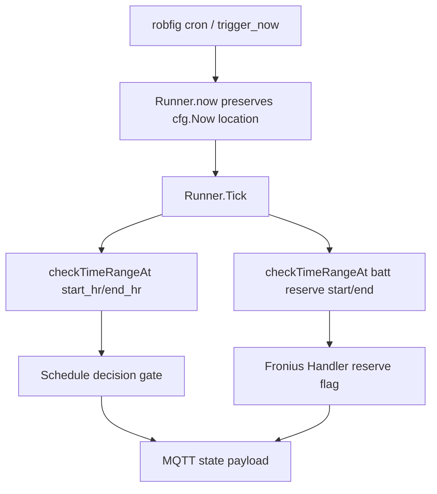

# Plan: Fix Crontab Timezone Window Evaluation

Date: 2026-05-16

Task: [115-issue-fix-crontab-timezone-window-TASK.md](./115-issue-fix-crontab-timezone-window-TASK.md)

Issue: https://github.com/atbore-phx/sbam/issues/115

## 1. Task Analysis

Goal: fix a `release/v2.0.0` regression where schedule ticks inside the intended local charge window can be evaluated as outside the window because runner time is normalized to UTC before window checks.

Acceptance criteria from the TASK:

- A local `00:00` CET/CEST tick is inside a `00:00`-`06:00` charging window.
- A local `01:00` CET/CEST tick is inside the same charging window.
- Local ticks after the configured end time, such as `07:00` and `08:00`, are outside the charging window.
- Reserve-window checks use the same corrected timezone semantics.
- Existing UTC-based behavior and invalid-time errors continue to pass.
- A regression unit test prevents the UTC/local mismatch from returning.

Non-goals:

- Do not add a timezone config key.
- Do not alter cron expression parsing semantics.
- Do not implement cross-midnight window support in this issue.
- Do not change Solcast, Fronius Solar API, Modbus register, MQTT topic, or payload schemas.

## 2. Current State

- [pkg/cmd/schedule.go](../../../pkg/cmd/schedule.go) builds `RunnerConfig` with `Now: time.Now` and uses robfig cron via `cron.New()`.
- [pkg/cmd/schedule.go](../../../pkg/cmd/schedule.go) uses `checkTimeRangeAt(time.Now(), start_hr, end_hr)` in `CheckTimeRange`, which already preserves local `time.Now()` behavior.
- [pkg/cmd/schedule.go](../../../pkg/cmd/schedule.go) constructs MQTT state payload timestamps with `time.Now().UTC()` in `makeBasePayload`.
- [pkg/cmd/schedule_runner.go](../../../pkg/cmd/schedule_runner.go) calls `r.now()` for cron ticks, MQTT trigger commands, pause checks, command payloads, and MQTT error timestamps.
- [pkg/cmd/schedule_runner.go](../../../pkg/cmd/schedule_runner.go) currently implements `func (r *Runner) now() time.Time { return r.cfg.Now().UTC() }`, which discards the configured/local location before `checkTimeRangeAt` runs.
- [pkg/cmd/schedule_runner.go](../../../pkg/cmd/schedule_runner.go) calls `checkTimeRangeAt` for both charge-window and reserve-window evaluation in `Tick` and `newCommandPayload`.
- [pkg/cmd/schedule_runner.go](../../../pkg/cmd/schedule_runner.go) implements `checkTimeRangeAt` by parsing `startHR` and `endHR`, rebuilding same-day `time.Date` values in `now.Location()`, and comparing inclusively.
- [pkg/cmd/schedule_runner_test.go](../../../pkg/cmd/schedule_runner_test.go) already contains runner helper factories, fake MQTT client helpers, payload decoders, and runner command tests.
- [pkg/cmd/schedule_cron_test.go](../../../pkg/cmd/schedule_cron_test.go) covers cron lifecycle behavior but does not validate window timezone semantics.
- [Makefile](../../../Makefile) defines `test`, `build`, `vet`, and `all`; `make test` runs `go test -cover -race ./...`.

External references:

- Go `time` package docs: https://pkg.go.dev/time
  - `time.Now()` returns current local time.
  - `Time.UTC()` returns the same instant interpreted in UTC.
  - `time.Date` uses the provided `*time.Location` for wall-clock construction.
- robfig cron v3 docs: https://pkg.go.dev/github.com/robfig/cron/v3
  - `cron.New()` interprets schedules in `time.Local` by default.
  - `cron.WithLocation` and `CRON_TZ=` are available, but this issue does not add explicit timezone configuration.

## 3. Target Architecture

Keep wall-clock window checks local to the time value supplied by the runner, while preserving UTC for serialized timestamps and pause deadlines where the existing code already expects UTC.



Package affected: `pkg/cmd`.

Expected production code shape:

- `Runner.now()` should return the configured clock value without forcing `.UTC()`.
- Timestamp serialization points should keep their current UTC behavior explicitly, either because they already call `time.Now().UTC()` or by calling `.UTC()` at the serialization boundary.
- `checkTimeRangeAt` can remain unchanged unless tests reveal a boundary bug; its use of `now.Location()` is correct once `now` is no longer UTC-normalized prematurely.

## 4. Dependency Choices

No new dependency is required.

- Use the existing Go standard library `time` package.
- Keep existing `github.com/robfig/cron/v3 v3.0.1`; no cron configuration change is required for this issue.
- Keep existing `github.com/stretchr/testify v1.11.1` for assertions in tests.

## 5. Configuration Changes

No configuration changes.

- Existing CLI flags remain unchanged: `--start_hr`, `--end_hr`, `--batt_reserve_start_hr`, `--batt_reserve_end_hr`, `--crontab`.
- Existing `config.yaml` keys remain unchanged: `start_hr`, `end_hr`, `batt_reserve_start_hr`, `batt_reserve_end_hr`, `crontab`.
- Existing environment variables remain unchanged through Viper automatic env binding.
- Home Assistant add-on schema changes: none.
- Precedence remains unchanged: CLI flags > environment variables > `config.yaml`.

Do not add a `timezone`, `tz`, `schedule_timezone`, or similar config key for this issue.

## 6. Implementation Blueprint

1. Update [pkg/cmd/schedule_runner.go](../../../pkg/cmd/schedule_runner.go)

   Change `func (r *Runner) now() time.Time` so it preserves the location returned by `r.cfg.Now()`:

   ```go
   func (r *Runner) now() time.Time {
       return r.cfg.Now()
   }
   ```

   Rationale: `checkTimeRangeAt` already constructs start/end boundaries using `now.Location()`. The bug is caused by converting local runtime time to UTC before those boundaries are built.

2. Review UTC serialization boundaries in [pkg/cmd/schedule_runner.go](../../../pkg/cmd/schedule_runner.go)

   Keep pause deadlines normalized to UTC in `setPause`, `handleIntent` pause payload `NextRun`, and `pauseStateAt`.

   In `publishError`, ensure `mqtt.ErrorPayload.Timestamp` remains UTC if serialized MQTT timestamps are expected to stay UTC. With the `Runner.now()` change, use this shape if needed:

   ```go
   Timestamp: r.now().UTC(),
   ```

   Rationale: window checks need local wall-clock interpretation, while serialized timestamps and stored pause deadlines should remain stable instants.

3. Add regression tests in [pkg/cmd/schedule_runner_test.go](../../../pkg/cmd/schedule_runner_test.go)

   Add a table-driven test using a deterministic non-UTC fixed zone, for example:

   ```go
   loc := time.FixedZone("CEST", 2*60*60)
   ```

   Test `Runner.newCommandPayload(..., runner.now())` with `RunnerConfig.Now` returning local fixed times and these expectations:

   - `2026-05-16 00:00 +0200` with `00:00`-`06:00` returns charge window active and reserve window active.
   - `2026-05-16 01:00 +0200` with `00:00`-`06:00` returns both active.
   - `2026-05-16 06:00 +0200` remains active because existing comparisons are inclusive.
   - `2026-05-16 07:00 +0200` returns both inactive.

   Use `require.NotNil` before dereferencing `ChargeWindowActive` and `ReserveWindowActive`, then `assert.Equal` or `assert.True` / `assert.False`.

   Rationale: this fails before the fix because `runner.now()` converts `00:00 +0200` to `22:00 UTC`, outside the configured window.

4. Add focused boundary/error tests in [pkg/cmd/schedule_runner_test.go](../../../pkg/cmd/schedule_runner_test.go)

   Add or extend tests for `checkTimeRangeAt` to cover:

   - exact start boundary is in range
   - exact end boundary is in range
   - immediately after end is out of range
   - invalid `startHR` returns an error containing `invalid start time`
   - invalid `endHR` returns an error containing `invalid end time`

   Rationale: these cover the expected, edge, and failure categories required by repository conventions without needing HTTP or Modbus mocks.

5. Update release-note surface if this fix is shipping through the Home Assistant add-on

   Append a bugfix bullet to [home-assistant/addons/sbam/CHANGELOG.md](../../../home-assistant/addons/sbam/CHANGELOG.md), either under a new upcoming version section or an `Unreleased` section if that convention is introduced during implementation.

   Suggested wording:

   ```markdown
   - Fixed schedule charge and reserve window evaluation so local-time cron ticks are not compared as UTC.
   ```

   Rationale: the behavior affects add-on users even though the schema and docs do not change.

## 7. Test Plan

Package: `pkg/cmd`

Expected cases:

- `Runner.newCommandPayload` reports `ChargeWindowActive=true` and `ReserveWindowActive=true` for non-UTC local `00:00` and `01:00` ticks when configured as `00:00`-`06:00`.
- Existing UTC-location calls to `checkTimeRangeAt` continue to behave correctly.

Edge cases:

- Exact start boundary is inclusive.
- Exact end boundary is inclusive.
- First time after the end boundary is out of range.
- Reserve window uses the same wall-clock semantics as charge window.

Failure cases:

- Invalid `startHR` returns a non-nil error and includes `invalid start time`.
- Invalid `endHR` returns a non-nil error and includes `invalid end time`.

Mocks:

- No `httptest.NewServer` is needed because the focused tests avoid storage/power HTTP calls.
- No `tbrandon/mbserver` is needed because the focused tests avoid Fronius Modbus calls.
- Use existing fake MQTT client helpers only if a test needs to decode published state; direct `newCommandPayload` testing should avoid MQTT entirely.

Cleanup:

- Restore any package-level test factory overrides with `defer` if a runner-level `Tick` test is added later.
- No server cleanup is required for the focused tests above.

## 8. Validation Gates

Run these commands and fix any failures before declaring implementation complete:

```bash
go test ./pkg/cmd -run 'TestRunner.*Window|TestCheckTimeRangeAt'
go test ./pkg/cmd
make test
make build
```

If the Home Assistant changelog is updated, no Docker build is required because no Dockerfile or add-on runtime file changes are planned.

## 9. Rollout / Backward Compatibility

- Defaults remain unchanged.
- Existing config files remain valid.
- CLI, env var, and YAML precedence remains unchanged.
- No migration is required.
- The runtime behavior changes only by evaluating configured charge/reserve windows in the local wall-clock location instead of UTC-normalized time.
- Add a Home Assistant add-on changelog bullet if this fix is included in an add-on release.
- README updates are not required unless the implementation discovers existing docs that explicitly state the incorrect UTC behavior.

## 10. Security Considerations

- No secrets, credentials, API keys, MQTT credentials, or network endpoints are introduced.
- No new external input parser is introduced.
- Invalid time strings must keep returning errors.
- Modbus write safety must not be relaxed. The change should only correct the existing schedule/reserve gates that determine whether charging logic runs.
- Do not broaden behavior to cross-midnight windows in this issue; doing so could unintentionally expand charging periods.

## 11. Gotchas

- `Runner.now()` is used for more than charge-window checks. Keep UTC conversion at serialization/storage boundaries rather than inside `Runner.now()`.
- `time.Time` comparisons compare instants correctly across locations, so pause deadlines can remain stored as UTC while `now` is local.
- `makeBasePayload` already uses `time.Now().UTC()` for state timestamps; do not change it unless tests or requirements explicitly demand injected timestamps.
- `checkTimeRangeAt` uses `now.Location()` already; changing it to `time.Local` would make direct tests with fixed zones less precise and could break injected-clock behavior.
- `cron.New()` defaults to `time.Local`; `CRON_TZ=` support exists in robfig cron, but deriving that schedule timezone inside the callback is out of scope because callbacks do not receive the scheduled time.
- Daylight-saving transition days can have skipped or repeated local wall-clock times; use deterministic fixed-zone tests for the regression and avoid testing ambiguous DST transition instants in this issue.

## 12. Open Questions / Risks

- RESOLVED: reserve-window evaluation is in scope.
- RESOLVED: no new timezone configuration is needed.
- RESOLVED: cross-midnight windows are out of scope.
- RISK: changing `Runner.now()` can alter `publishError` timestamps unless UTC conversion is kept at that boundary.
- RISK: users with `CRON_TZ=` different from the process local timezone may still need a separate feature if they expect windows to follow that explicit cron timezone.

## 13. Implementation Checklist

- [ ] Update `Runner.now()` to preserve configured clock location.
- [ ] Keep MQTT error timestamps UTC if necessary after the `Runner.now()` change.
- [ ] Add non-UTC local wall-clock regression tests covering charge and reserve windows.
- [ ] Add boundary and invalid-time tests for `checkTimeRangeAt`.
- [ ] Add Home Assistant add-on changelog bullet if shipping this behavior through the add-on.
- [ ] Run validation gates.

## 14. Confidence Score

Confidence: 9/10.

The root cause is localized and the existing `checkTimeRangeAt` helper already has the right location-aware shape once `Runner.now()` stops forcing UTC. The remaining caution is timestamp behavior because `Runner.now()` is also used outside the window checks; the plan addresses that by keeping UTC normalization at serialization boundaries.