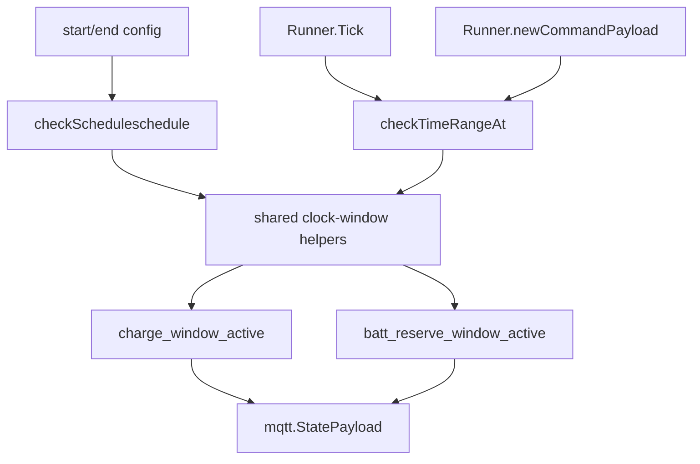

# Plan: Cross-Midnight Charge and Reserve Windows

Date: 2026-05-16
Task: [116-issue-feature-start-hr-and-end-hr-should-produce-a-cross-midnight-window-TASK.md](./116-issue-feature-start-hr-and-end-hr-should-produce-a-cross-midnight-window-TASK.md)
Issue: [#116](https://github.com/atbore-phx/sbam/issues/116)

## Task Analysis

Goal: allow schedule windows such as `start_hr: "22:00"` and `end_hr: "06:00"` to mean an overnight window that starts today and ends after midnight, while preserving existing same-day behavior.

Non-goals:

- Do not change the charging or reserve decision algorithm beyond window validation and active-window evaluation.
- Do not add or rename CLI flags, environment variables, `config.yaml` keys, or Home Assistant add-on schema fields.
- Do not change Solcast, Fronius Solar API, or Fronius Modbus register mappings.
- Do not define all-day behavior for equal start/end times; equal times remain invalid.

Acceptance criteria from the TASK:

- `22:00` to `06:00` is accepted for the charge window.
- `22:00` to `06:00` is active at `23:00` and `02:00`, and inactive at `12:00`.
- Same-day windows still work.
- Invalid time strings still fail validation.
- Equal start/end times remain invalid.
- Battery reserve windows support the same cross-midnight semantics.
- No config, env, CLI, or Home Assistant schema fields are added or renamed.

## Current State

- [pkg/cmd/schedule.go](../../../pkg/cmd/schedule.go) wires `start_hr`, `end_hr`, `batt_reserve_start_hr`, and `batt_reserve_end_hr` from Viper into `RunnerConfig`. Empty reserve start/end values default to the main charge window.
- [pkg/cmd/schedule.go](../../../pkg/cmd/schedule.go) currently validates time ordering in `checkScheduleschedule(...)` with `isStartBeforeEnd(...)`; this rejects every `start > end` range.
- [pkg/cmd/schedule.go](../../../pkg/cmd/schedule.go) also validates reserve-window containment with simple same-day comparisons: `start_hr <= batt_reserve_start_hr` and `batt_reserve_end_hr <= end_hr`. Those comparisons are not sufficient once either window can wrap over midnight.
- [pkg/cmd/schedule_runner.go](../../../pkg/cmd/schedule_runner.go) contains `checkTimeRangeAt(now, startHR, endHR) (bool, error)`. It builds `startAt` and `endAt` on the same date and checks `startAt <= now <= endAt`, so cross-midnight ranges are always inactive before midnight.
- [pkg/cmd/schedule_runner.go](../../../pkg/cmd/schedule_runner.go) uses `checkTimeRangeAt` in `Runner.Tick(...)` for both charge and reserve windows, and in `Runner.newCommandPayload(...)` for MQTT state flags.
- [pkg/cmd/schedule.go](../../../pkg/cmd/schedule.go) contains `crontabSchedule(...)`, which schedules defaults at `end_hr - 5 minutes`. For `end_hr: "06:00"`, this already produces `55 5 * * *`; keep this behavior and add a focused regression check if practical.
- [pkg/cmd/schedule_validation_test.go](../../../pkg/cmd/schedule_validation_test.go) currently expects `start_hr > end_hr` and reserve `start > end` validation failures. These cases need to be replaced with cross-midnight acceptance and equal-time rejection tests.
- [pkg/cmd/schedule_runner_test.go](../../../pkg/cmd/schedule_runner_test.go) already has local wall-clock tests for same-day windows and boundary/error tests for `checkTimeRangeAt`; extend those tables for cross-midnight behavior.
- [README.md](../../../README.md) and [home-assistant/addons/sbam/DOCS.md](../../../home-assistant/addons/sbam/DOCS.md) describe start/end options and should mention that `22:00` to `06:00` is valid.
- [home-assistant/addons/sbam/config.json](../../../home-assistant/addons/sbam/config.json) already validates the individual time strings and does not enforce ordering, so no schema change is needed.

## Target Architecture

Keep the change inside `pkg/cmd` with private helpers that all charge/reserve validation and runtime checks share.

Recommended helper model:

- Parse configured `HH:MM` values once per check into comparable clock values.
- Treat `start < end` as a same-day window.
- Treat `start > end` as a cross-midnight window.
- Treat `start == end` as invalid.
- Expand windows into one or two inclusive minute ranges for containment checks.
- Use the same `checkTimeRangeAt(...)` behavior for `Runner.Tick(...)`, MQTT command payloads, and `CheckTimeRange(...)`.



## Dependency Choices

No new dependencies are needed.

Existing dependencies to preserve:

- Go standard library `time`: use `time.Parse`, `time.Date`, `Time.Before`, `Time.After`, and `Time.Equal`. Reference: https://pkg.go.dev/time
- `github.com/robfig/cron/v3 v3.0.1`: keep current cron scheduling. Reference: https://pkg.go.dev/github.com/robfig/cron/v3
- `github.com/stretchr/testify v1.11.1`: continue using `assert` and `require` in tests.

Relevant external notes:

- `time.Parse("15:04", value)` returns an error for malformed values; use that error path instead of panicking in validation helpers.
- `time.Date(...)` uses the supplied `Location`; keep `now.Location()` so the timezone fix from issue #115 is preserved.
- `robfig/cron/v3` uses five-field standard cron specs by default and interprets schedules in `time.Local` unless configured otherwise; `CRON_TZ=` can override a single schedule.

## Configuration Changes

No new configuration surfaces.

Existing CLI flags whose semantics change only by accepting cross-midnight values:

- `--start_hr`
- `--end_hr`
- `--batt_reserve_start_hr`
- `--batt_reserve_end_hr`

Existing `config.yaml` keys whose semantics change only by accepting cross-midnight values:

- `start_hr`
- `end_hr`
- `batt_reserve_start_hr`
- `batt_reserve_end_hr`

Existing env vars keep the same Viper binding and precedence:

- `START_HR`
- `END_HR`
- `BATT_RESERVE_START_HR`
- `BATT_RESERVE_END_HR`

Home Assistant add-on:

- [home-assistant/addons/sbam/config.json](../../../home-assistant/addons/sbam/config.json): no option or schema changes. The schema validates individual `HH:MM` values and already permits `start_hr > end_hr` because ordering is not encoded there.
- `run.sh` exports: no changes.

Precedence remains CLI flags > environment variables > `config.yaml`.

## Implementation Blueprint

1. Update private schedule-window helpers in [pkg/cmd/schedule.go](../../../pkg/cmd/schedule.go).

   Add private helpers near the existing `isStartBeforeEnd` / `isStartAfterEnd` block. Prefer replacing use of the panic-based helpers in validation with non-panicking helpers.

   Suggested signatures:

   ```go
   const scheduleClockLayout = "15:04"

   func parseScheduleClock(value, field string) (time.Time, error)
   func validateScheduleWindow(startField, startValue, endField, endValue string) (time.Time, time.Time, error)
   func isCrossMidnightWindow(startTime, endTime time.Time) bool
   func isWindowContainedIn(innerStart, innerEnd, outerStart, outerEnd string) (bool, error)
   ```

   Rationale: validation should return clear `error` values for malformed times and equal start/end times. It should no longer panic through `isStartBeforeEnd` when user input is malformed.

2. Implement containment using expanded clock segments in [pkg/cmd/schedule.go](../../../pkg/cmd/schedule.go).

   Add a small private type and helpers if useful:

   ```go
   type clockSegment struct {
       startMinute int
       endMinute   int
   }

   func clockMinute(t time.Time) int
   func expandClockWindow(startMinute, endMinute int) []clockSegment
   func segmentContains(outer, inner clockSegment) bool
   ```

   Algorithm:

   - Reject `start == end` before expansion.
   - For same-day windows, expand to one segment: `[start, end]`.
   - For cross-midnight windows, expand to two segments: `[start, 1439]` and `[0, end]`.
   - `isWindowContainedIn(inner, outer)` returns true only when every inner segment is fully contained by at least one outer segment.

   Required examples:

   - Outer `22:00`-`06:00`, inner `23:00`-`05:00`: contained.
   - Outer `22:00`-`06:00`, inner `02:00`-`05:00`: contained.
   - Outer `22:00`-`06:00`, inner `02:00`-`08:00`: not contained.
   - Outer `08:00`-`18:00`, inner `10:00`-`12:00`: contained.
   - Outer `08:00`-`18:00`, inner `17:00`-`07:00`: not contained.

3. Update `checkScheduleschedule(...)` in [pkg/cmd/schedule.go](../../../pkg/cmd/schedule.go).

   Replace the charge-window `!isStartBeforeEnd(start_hr, end_hr)` check with `validateScheduleWindow("start_hr", start_hr, "end_hr", end_hr)`.

   Replace the reserve-window `!isStartBeforeEnd(...)` check with `validateScheduleWindow("batt_reserve_start_hr", batt_reserve_start_hr, "batt_reserve_end_hr", batt_reserve_end_hr)`.

   Replace the two same-day containment comparisons with a single containment check:

   ```go
   contained, err := isWindowContainedIn(batt_reserve_start_hr, batt_reserve_end_hr, start_hr, end_hr)
   ```

   Return errors that include the affected field names. Suggested messages:

   - `start_hr/end_hr must not be equal`
   - `invalid start_hr "bad": ...`
   - `batt_reserve_start_hr/batt_reserve_end_hr must be contained within start_hr/end_hr`

   Rationale: reserve containment is the behavior most likely to regress if implemented as simple `Before` / `After` comparisons.

4. Update `checkTimeRangeAt(...)` in [pkg/cmd/schedule_runner.go](../../../pkg/cmd/schedule_runner.go).

   Keep the existing signature:

   ```go
   func checkTimeRangeAt(now time.Time, startHR, endHR string) (bool, error)
   ```

   Implementation requirements:

   - Parse both times with the same helper used by validation.
   - Return an error when start and end are equal.
   - Build `startAt` and `endAt` with `now.Location()`.
   - For same-day windows, keep existing inclusive behavior: `startAt <= now <= endAt`.
   - For cross-midnight windows, return true when `now >= startAt || now <= endAt`.
   - Preserve exact boundary behavior: exactly at `start_hr` and exactly at `end_hr` are active.

   Rationale: `Runner.Tick(...)` and `Runner.newCommandPayload(...)` already call this helper for charge and reserve flags, so one fix updates schedule execution and MQTT state reporting.

5. Review `crontabSchedule(...)` in [pkg/cmd/schedule.go](../../../pkg/cmd/schedule.go).

   No behavior change is expected. Confirm the implementation still parses `end_hr`, subtracts five minutes, and builds a daily cron expression such as `55 5 * * *` for `end_hr: "06:00"`.

   Add a focused test if practical, but avoid invasive changes to the cron runner. A helper extraction is acceptable if it stays private, for example:

   ```go
   func defaultsCronForEndHR(endHR string) (string, error)
   ```

   If extracted, test `defaultsCronForEndHR("06:00") == "55 5 * * *"` and `defaultsCronForEndHR("00:03") == "58 23 * * *"`.

6. Update [pkg/cmd/schedule_validation_test.go](../../../pkg/cmd/schedule_validation_test.go).

   Required changes:

   - Replace the old `start must be before end` rejection case with an equal-time rejection case.
   - Add `TestCheckScheduleScheduleCrossMidnightChargeWindowValid` using `startHr: "22:00"`, `endHr: "06:00"`, and reserve default globals inside that outer window.
   - Add reserve containment tests covering:
     - `22:00`-`06:00` outer with `23:00`-`05:00` reserve accepted.
     - `22:00`-`06:00` outer with `02:00`-`05:00` reserve accepted.
     - `22:00`-`06:00` outer with `02:00`-`08:00` reserve rejected.
     - `08:00`-`18:00` outer with `17:00`-`07:00` reserve rejected.
   - Add malformed-time validation tests for both charge and reserve windows, asserting returned errors rather than panics.
   - Keep `withScheduleValidationGlobals(...)` cleanup behavior.

7. Update [pkg/cmd/schedule_runner_test.go](../../../pkg/cmd/schedule_runner_test.go).

   Extend `TestCheckTimeRangeAt_BoundariesAndErrors` or convert it to table-driven tests covering:

   - Same-day start boundary active.
   - Same-day end boundary active.
   - Same-day after-end inactive.
   - Cross-midnight before midnight active, e.g. `2026-05-16 23:00` with `22:00`-`06:00`.
   - Cross-midnight after midnight active, e.g. `2026-05-16 02:00` with `22:00`-`06:00`.
   - Cross-midnight daytime inactive, e.g. `12:00`.
   - Cross-midnight just before start inactive, e.g. `21:59`.
   - Cross-midnight exact start active and exact end active.
   - Equal start/end returns an error.
   - Invalid start and invalid end strings return errors containing `invalid start time` / `invalid end time`, or the updated equivalent field-specific text.

   Extend `TestRunner_NewCommandPayloadUsesLocalWallClockWindow` with a second table or subtest where `RunnerConfig` uses `StartHR: "22:00"`, `EndHR: "06:00"`, `BattReserveStartHR: "23:00"`, and `BattReserveEndHR: "05:00"`. Assert both `ChargeWindowActive` and `ReserveWindowActive` for `23:00`, `02:00`, and `12:00` local times.

8. Update [pkg/cmd/schedule_cron_test.go](../../../pkg/cmd/schedule_cron_test.go) only if `defaultsCronForEndHR(...)` is extracted.

   Add expected cases:

   - `06:00` maps to `55 5 * * *`.
   - `00:03` maps to `58 23 * * *`.
   - malformed `end_hr` returns an error.

   Rationale: cross-midnight support should not accidentally reinterpret the defaults reset time relative to `start_hr`.

9. Update user-facing documentation.

   - [README.md](../../../README.md): in the schedule flag/config description area, add a short note that time windows can span midnight, for example `--start_hr 22:00 --end_hr 06:00`.
   - [home-assistant/addons/sbam/DOCS.md](../../../home-assistant/addons/sbam/DOCS.md): add the same cross-midnight example to `start_hr`, `end_hr`, `batt_reserve_start_hr`, and `batt_reserve_end_hr` descriptions.
   - [home-assistant/addons/sbam/CHANGELOG.md](../../../home-assistant/addons/sbam/CHANGELOG.md): add an Unreleased bullet such as `Added support for cross-midnight charge and reserve windows, for example 22:00-06:00.`

   Do not change [home-assistant/addons/sbam/config.json](../../../home-assistant/addons/sbam/config.json) unless implementation discovers a schema-level issue, because it already accepts individual time strings independently.

10. Run formatting and validation.

   Run `gofmt` on changed Go files or `make fmt` if broader formatting is desired. Then run focused tests before the full gates listed below.

## Test Plan

Package `pkg/cmd` is the primary test target.

Expected cases:

- `checkScheduleschedule(...)` accepts `start_hr: "22:00"`, `end_hr: "06:00"`.
- `checkScheduleschedule(...)` accepts cross-midnight reserve windows contained within a cross-midnight charge window.
- `checkTimeRangeAt(...)` returns true at `23:00` and `02:00` for `22:00`-`06:00`.
- `Runner.newCommandPayload(...)` publishes correct charge/reserve window booleans for cross-midnight windows.
- Same-day ranges such as `00:00`-`06:00` and `08:00`-`18:00` still behave as they do today.

Edge cases:

- Exactly at `start_hr` is active.
- Exactly at `end_hr` is active.
- Just before `start_hr` is inactive.
- Just after `end_hr` is inactive.
- `end_hr` near midnight, such as `00:03`, still produces a defaults reset schedule five minutes earlier on the previous wall-clock hour if helper extraction is tested.

Failure cases:

- Equal charge start/end returns a validation error.
- Equal reserve start/end returns a validation error.
- Malformed charge start/end returns a validation error.
- Malformed reserve start/end returns a validation error.
- Reserve window that extends outside the charge window is rejected for same-day and cross-midnight outer windows.

Mocks and cleanup:

- No `httptest.NewServer` or `mbserver` is needed for the core window tests.
- Existing scheduler tests that use fake MQTT clients and injected factories should continue to use `t.Cleanup` / `defer` to restore globals such as `newStorage`, `newPower`, `newFronius`, and `newBatteryWriter`.
- Continue using `require.NotNil` before dereferencing `ChargeWindowActive` and `ReserveWindowActive`.

## Validation Gates

Focused gates:

```bash
go test ./pkg/cmd -run 'TestCheckTimeRangeAt|TestCheckScheduleSchedule|TestRunner_NewCommandPayload|TestCrontabSchedule|TestStartEndHelpers'
```

Full gates:

```bash
make test
make build
```

No Docker build is required unless implementation changes the Dockerfile or Home Assistant image build files.

## Rollout / Backward Compatibility

- Existing same-day configurations keep working.
- Existing config keys, env vars, and CLI flags keep their names and precedence.
- Existing Home Assistant add-on options and schema remain compatible.
- Users gain the ability to configure overnight tariffs directly, for example `start_hr: "22:00"` and `end_hr: "06:00"`.
- Add an Unreleased changelog entry in [home-assistant/addons/sbam/CHANGELOG.md](../../../home-assistant/addons/sbam/CHANGELOG.md).
- Add README and Home Assistant documentation notes so users know `start_hr > end_hr` is intentional and supported.

## Security Considerations

- Secrets are unaffected; no API key, MQTT credential, or Fronius credential handling changes are needed.
- Invalid time inputs must return validation errors rather than causing panics or silently broadening the active charging window.
- Modbus write safety depends on preserving the existing runner decision flow. The implementation must not add direct Fronius Modbus writes to validation, helper functions, documentation examples, or MQTT payload generation.
- A miscomputed cross-midnight window could cause charging at unintended times. The strongest mitigation is table-driven validation for inside/outside times and reserve containment.
- Home Assistant schema regex remains strict for individual `HH:MM` strings and continues to reject malformed input before sbam starts where possible.

## Gotchas

- Reserve containment is not the same as comparing two start values and two end values once either range can wrap around midnight. Use segment expansion or equivalent modulo-day logic.
- `checkTimeRangeAt(...)` must use `now.Location()` when constructing boundary times so issue #115's local wall-clock behavior is preserved.
- Equal start/end is explicitly invalid for this feature. Do not accidentally turn it into always-on behavior through `now >= start || now <= end` logic.
- `time.Parse("15:04", value)` creates a time in UTC with a dummy date. It is fine for comparing clock values, but runtime range checks should still construct boundaries with `time.Date(..., now.Location())`.
- `crontabSchedule(...)` defaults reset should stay tied to `end_hr - 5 minutes`, not to the start of a cross-midnight window.
- `robfig/cron/v3` supports `CRON_TZ=` in specs. This feature should not attempt to redesign cron timezone handling.
- Existing panic-based helpers may still be covered by tests. Prefer updating tests toward non-panicking validation helpers instead of preserving panic behavior for user input.
- The Home Assistant add-on schema allows one-digit hours, but current Go parsing may be stricter depending on `time.Parse("15:04", value)`. Do not broaden accepted formats in this feature unless tests and docs are updated deliberately.

## Open Questions / Risks

- RESOLVED: both charge and reserve windows are in scope.
- RESOLVED: equal start and end times remain invalid.
- RESOLVED: no new configuration surfaces are required.
- RISK: reserve-window containment can be implemented incorrectly for split cross-midnight intervals; table-driven tests should cover contained and outside cases.
- RISK: changing validation from panic-based helper calls to returned errors may update some test expectations, but this is consistent with the project's error-handling standards.
- RISK: users with explicit `CRON_TZ=` schedules may expect window checks to follow that timezone exactly. This plan preserves current local-time interpretation and does not add cron timezone configuration.

## Confidence Score

9/10.

The behavior is localized to `pkg/cmd` validation and window evaluation, and the runner already centralizes charge/reserve active-state checks through `checkTimeRangeAt(...)`. The main implementation risk is reserve containment across split intervals; the plan calls that out directly with concrete acceptance and rejection tests.
