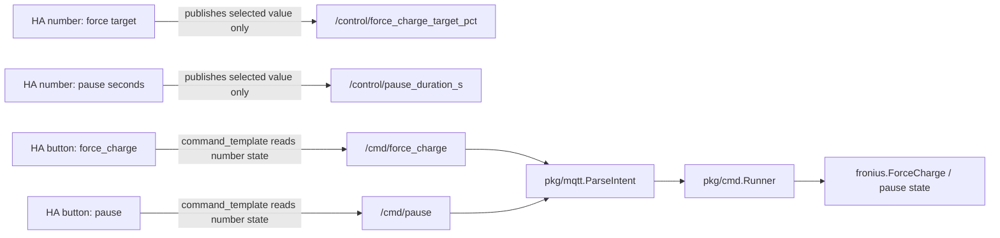

# Plan: Home Assistant Slider Controls for Force Charge and Pause

> Date: 2026-05-19
> Task: [128-issue-feature-home-assistant-slider-controls-for-force-charge-and-pause-TASK.md](128-issue-feature-home-assistant-slider-controls-for-force-charge-and-pause-TASK.md)
> Source issue: [#128](https://github.com/atbore-phx/sbam/issues/128)
> Related PR: [#127](https://github.com/atbore-phx/sbam/pull/127)

## Task Analysis

Issue #128 asks sbam to improve the Home Assistant MQTT discovery UX for manual `force_charge` and `pause` commands. Users should be able to choose a force-charge target percentage and pause duration with sliders, then press explicit send buttons that publish to the existing `PREFIX/cmd/force_charge` and `PREFIX/cmd/pause` topics.

Goals:

- Add Home Assistant MQTT `number` entities rendered as sliders for force-charge target percent and pause duration seconds.
- Keep explicit button presses as the only way to publish to sbam command topics.
- Keep ordinary force-charge requests subject to the existing `max_charge` cap.
- Add an explicit full-charge override path for the slider's `>100` value.
- Preserve direct MQTT command compatibility and existing command topics.
- Document and test the new discovery payloads, parser behavior, runner behavior, and edge cases.

Non-goals:

- Do not redesign Home Assistant dashboards beyond MQTT discovery entities.
- Do not add new configuration keys unless implementation discovers a hard compatibility blocker.
- Do not change Fronius Modbus register addresses or unrelated charging algorithm behavior.
- Do not modify Solcast or Fronius Solar API integrations.

Acceptance criteria from the TASK are covered by adding two slider entities, templated send buttons, strict command parsing for ordinary and override requests, runner tests for capped and uncapped paths, docs updates, and validation with `go test ./...`, `make test`, and `make build`.

## Current State

- [pkg/mqtt/discovery.go](../../../pkg/mqtt/discovery.go) builds retained single-component Home Assistant discovery payloads for 10 sensors, 3 binary sensors, and 5 buttons. The existing `force_charge` button publishes `{"target_pct":100,"duration_s":3600}` directly to `sbam/cmd/force_charge`; the existing `pause` button publishes `{}` directly to `sbam/cmd/pause`.
- [pkg/mqtt/discovery_test.go](../../../pkg/mqtt/discovery_test.go) verifies the discovery shape, topics, version, unique IDs, retained publication behavior, and current fixed force-charge button payload.
- [pkg/mqtt/commands.go](../../../pkg/mqtt/commands.go) parses MQTT command payloads with strict JSON decoding. `force_charge.target_pct` is currently required and must be `1..100`; `pause.until` may be omitted for indefinite pause, a future RFC3339 timestamp, or a positive Go duration.
- [pkg/mqtt/commands_test.go](../../../pkg/mqtt/commands_test.go) already covers canonical commands, strict JSON validation, payload size limits, pause duration parsing, and rejected `target_pct` values `0` and `101`.
- [pkg/mqtt/types.go](../../../pkg/mqtt/types.go) defines `Intent` with `TargetPct`, `DurationS`, `PauseUntil`, and `CommandTopic`, but no flag to bypass `max_charge`.
- [pkg/cmd/schedule_runner.go](../../../pkg/cmd/schedule_runner.go) serializes all schedule ticks and MQTT commands. `handleForceCharge` rejects target percentages outside `1..100`, then calls `resolveForceChargeTargetPct`, which caps requests using live battery capacity and `MaxCharge` before writing through `batteryWriter.ForceCharge`.
- [pkg/cmd/schedule_runner_test.go](../../../pkg/cmd/schedule_runner_test.go) covers queued command handling, capped force charge, `max_charge=0`, paused rejection, parse-error acks, and storage failure while resolving capped targets.
- [pkg/fronius/configure.go](../../../pkg/fronius/configure.go) already treats `fronius.ForceCharge(ip, 0)` as a safe defaults reset by delegating to `Setdefaults`; negative values are rejected.
- [docs/mqtt.md](../../../docs/mqtt.md) documents current MQTT discovery buttons, command topics, payload constraints, examples, and the current `force_charge.target_pct` `1..100` rule.
- [home-assistant/addons/sbam/DOCS.md](../../../home-assistant/addons/sbam/DOCS.md) and [home-assistant/addons/sbam/CHANGELOG.md](../../../home-assistant/addons/sbam/CHANGELOG.md) document add-on MQTT behavior and v2.0.0 changes.

External Home Assistant facts checked on 2026-05-19:

- MQTT button supports `command_template`, which generates the payload sent to `command_topic`: https://www.home-assistant.io/integrations/button.mqtt/
- MQTT number supports `min`, `max`, `step`, `mode: slider`, `command_topic`, `state_topic`, `retain`, `qos`, and `command_template`: https://www.home-assistant.io/integrations/number.mqtt/
- MQTT discovery accepts retained single-component discovery payloads and ignores unknown keys for compatibility: https://www.home-assistant.io/integrations/mqtt/#mqtt-discovery

## Target Architecture

Use Home Assistant MQTT `number` entities as harmless selectors and keep sbam commands behind buttons:



Discovery design:

- Add `number` entity `force_charge_target_pct` with default entity ID `number.sbam_force_charge_target_pct`, `min=0`, `max=101`, `step=1`, `mode=slider`, `unit_of_measurement="%"`, and command/state topic `<prefix>/control/force_charge_target_pct`.
- Add `number` entity `pause_duration_s` with default entity ID `number.sbam_pause_duration_s`, `min=0`, `max=86400`, `step=60`, `mode=slider`, `unit_of_measurement="s"`, and command/state topic `<prefix>/control/pause_duration_s`.
- Use the same topic for each selector's `command_topic` and `state_topic`, with `retain=true`, so the selected value is harmlessly retained by the broker and can be restored. sbam must not subscribe to these selector topics.
- Update the existing Home Assistant `force_charge` button discovery payload to use `command_template` instead of a fixed payload. The button keeps `command_topic=<prefix>/cmd/force_charge` and defaults unknown selector state to `100` for backward-compatible behavior.
- Update the existing Home Assistant `pause` button discovery payload to use `command_template`. It keeps `command_topic=<prefix>/cmd/pause` and defaults unknown selector state to `0`, which publishes `{}` for existing indefinite pause behavior.

Command contract:

- `{"target_pct":0}` becomes valid and means stop forced charging / restore defaults through `ForceCharge(..., 0)`. This matches the issue's `0..100` slider range and the existing Fronius helper behavior.
- `{"target_pct":1}` through `{"target_pct":100}` remain valid ordinary requests. They continue to be capped by `max_charge` through `resolveForceChargeTargetPct`.
- `{"target_pct":100,"ignore_max_charge":true}` is the explicit uncapped full-charge request. It writes `ForceCharge(..., 100)` without reading storage or applying `max_charge`.
- Raw `{"target_pct":101}` remains invalid. The Home Assistant slider value `101` is mapped by the button `command_template` to the explicit `ignore_max_charge` payload, avoiding accidental uncapped charge from loosely validated direct MQTT payloads.
- `{"ignore_max_charge":true}` is invalid unless `target_pct` is exactly `100`.
- Pause stays backward compatible: empty payload and `{}` mean indefinite pause; `{"until":"3600s"}` means pause until `now + 3600s`.

## Dependency Choices

No new Go modules are required.

Use existing dependencies and patterns:

- `encoding/json` with strict decoding in [pkg/mqtt/commands.go](../../../pkg/mqtt/commands.go).
- Existing MQTT client abstractions in [pkg/mqtt/client.go](../../../pkg/mqtt/client.go) and [pkg/mqtt/publisher.go](../../../pkg/mqtt/publisher.go).
- Existing `testify` assertions in package tests.
- Existing runner factory overrides for storage and battery writer tests in [pkg/cmd/schedule_runner_test.go](../../../pkg/cmd/schedule_runner_test.go).

## Configuration Changes

No new sbam configuration keys are required.

- CLI flags: none.
- `config.yaml`: none.
- Environment variables: none.
- Home Assistant add-on [home-assistant/addons/sbam/config.json](../../../home-assistant/addons/sbam/config.json): no schema changes.
- [home-assistant/addons/sbam/run.sh](../../../home-assistant/addons/sbam/run.sh): no new exports.
- Precedence remains unchanged: CLI flags > environment variables > `config.yaml` > built-in defaults.

MQTT discovery changes are data-only and controlled by existing `mqtt_enabled`, `mqtt_ha_discovery`, `mqtt_topic_prefix`, and `mqtt_ha_discovery_prefix` settings.

## Implementation Blueprint

1. Update discovery payload fields in [pkg/mqtt/discovery.go](../../../pkg/mqtt/discovery.go).
   - Add JSON fields to `discoveryPayload`: `CommandTemplate string`, `DefaultEntityID string`, `Min *float64`, `Max *float64`, `Step *float64`, `Mode string`, and `Optimistic *bool` if needed.
   - Keep pointer fields for numeric values because `min=0` must be emitted and `omitempty` would drop a plain `float64` zero.
   - Keep the existing `Retain *bool` field and use it for selector retained state and button non-retained commands.

2. Add discovery helpers in [pkg/mqtt/discovery.go](../../../pkg/mqtt/discovery.go).
   - Add `controlTopic(prefix, name string) string`, returning `normalizePrefix(prefix) + "/control/" + cleanedName`.
   - Add small pointer helpers such as `floatPtr(value float64) *float64` and `boolPtr(value bool) *bool`.
   - Add `numberPayload(base discoveryPayload, deviceID, objectID, name, defaultEntityID, commandTopic string, min, max, step float64, unit, icon string) discoveryPayload`.
   - Add `templatedButtonPayload(base discoveryPayload, deviceID, objectID, name, commandTopic, commandTemplate string) discoveryPayload` or extend `buttonPayload` with an optional command-template argument.
   - For number payloads, clear inherited `ValueTemplate` unless intentionally used, set `StateTopic` to the selector topic, set `CommandTopic` to the same selector topic, set `Retain=true`, set `Mode="slider"`, and set `QoS=1` through the existing base value.

3. Add selector discovery entities in `BuildDiscovery` in [pkg/mqtt/discovery.go](../../../pkg/mqtt/discovery.go).
   - Increase the entity slice capacity from `18` to `20`.
   - Append `number/force_charge_target_pct` and `number/pause_duration_s` before the command buttons.
   - Use `default_entity_id` values `number.sbam_force_charge_target_pct` and `number.sbam_pause_duration_s` so button templates have stable entity IDs on first discovery.
   - Use `max=101` for the force-charge selector; `101` is the explicit UI override sentinel.
   - Use `max=86400` for the pause selector and `step=60` unless tests or manual review show Home Assistant needs `step=1` for exact seconds. The command parser accepts any positive Go duration string, so either step is safe; `60` makes the slider usable.

4. Convert existing `force_charge` and `pause` buttons to templated send buttons in [pkg/mqtt/discovery.go](../../../pkg/mqtt/discovery.go).
   - Keep object IDs `force_charge` and `pause` for stable Home Assistant entities and backward-compatible button service calls.
   - Keep command topics `commandTopic(prefix, "force_charge")` and `commandTopic(prefix, "pause")`.
   - Use `retain=false` for button command messages.
   - Force-charge `command_template`:

     ```jinja
     {"target_pct":100,"ignore_max_charge":true}{"target_pct":0}{"target_pct":{{ target }}}
     ```

   - Pause `command_template`:

     ```jinja
     {}{"until":"{{ seconds }}s"}
     ```

   - Do not add visible in-app instructional text. Use names and icons only; detailed semantics belong in docs.

5. Extend command parsing in [pkg/mqtt/commands.go](../../../pkg/mqtt/commands.go).
   - Add `IgnoreMaxCharge *bool `json:"ignore_max_charge,omitempty"`` to `forceChargePayload`.
   - Change `parseForceChargePayload` validation from `1..100` to `0..100`.
   - Reject `ignore_max_charge=true` unless `target_pct == 100`.
   - Keep `duration_s` validation unchanged (`0..86400`) even though the runner currently ignores duration.
   - Keep strict JSON decoding so unknown fields still fail.
   - Update error strings to mention `target_pct must be between 0 and 100` and `ignore_max_charge requires target_pct 100`.

6. Add intent propagation in [pkg/mqtt/types.go](../../../pkg/mqtt/types.go).
   - Add `IgnoreMaxCharge bool `json:"ignore_max_charge,omitempty"`` to `Intent`.
   - In `parseIntentAt`, set `intent.IgnoreMaxCharge = forcePayload.IgnoreMaxCharge != nil && *forcePayload.IgnoreMaxCharge`.

7. Update runner force-charge handling in [pkg/cmd/schedule_runner.go](../../../pkg/cmd/schedule_runner.go).
   - Change `handleForceCharge` validation to allow `0..100`.
   - If `intent.IgnoreMaxCharge` is true, require `TargetPct == 100` defensively and set `targetPct = 100` without calling `resolveForceChargeTargetPct`.
   - If `TargetPct == 0`, set `targetPct = 0` and call `writer.ForceCharge` directly without storage lookup. This uses existing `fronius.ForceCharge(..., 0)` defaults behavior.
   - For `1..100` with no override, keep the existing capped `resolveForceChargeTargetPct` flow unchanged.
   - Publish `ChargePct` as the actual written target for all accepted paths.
   - Keep paused-state rejection before any write.

8. Update MQTT discovery tests in [pkg/mqtt/discovery_test.go](../../../pkg/mqtt/discovery_test.go).
   - Extend `discoveryPayloadView` with `DefaultEntityID`, `CommandTemplate`, `Min`, `Max`, `Step`, `Mode`, `Retain`, `Unit`, and `Icon` fields. Use pointer types for `Min`, `Max`, `Step`, and `Retain` where zero or false must be asserted.
   - Update expected entity count to at least `20`.
   - Assert the new `number/force_charge_target_pct` payload has `min=0`, `max=101`, `step=1`, `mode=slider`, `unit_of_measurement="%"`, `default_entity_id="number.sbam_force_charge_target_pct"`, retained selector topic, QoS 1, and shared device identifier.
   - Assert the new `number/pause_duration_s` payload has `min=0`, `max=86400`, `mode=slider`, `unit_of_measurement="s"`, `default_entity_id="number.sbam_pause_duration_s"`, retained selector topic, QoS 1, and shared device identifier.
   - Replace the fixed force-charge button payload assertion with assertions for `CommandTopic`, `CommandTemplate`, `retain=false`, and template substrings `number.sbam_force_charge_target_pct` and `ignore_max_charge`.
   - Assert the pause button template references `number.sbam_pause_duration_s`, emits `{}` for zero/unknown values, and emits an `until` seconds duration for positive values.
   - Add selector `controlTopic` normalization tests if the helper is exported only inside the package tests.

9. Update MQTT command parser tests in [pkg/mqtt/commands_test.go](../../../pkg/mqtt/commands_test.go).
   - Add valid cases for `{"target_pct":0}`, `{"target_pct":100,"ignore_max_charge":true}`, and ordinary `1`, `100`, and duration variants.
   - Assert parsed `Intent.IgnoreMaxCharge` is true only for the explicit override payload.
   - Keep `{"target_pct":101}` invalid.
   - Add invalid cases for `{"target_pct":-1}`, `{"target_pct":50,"ignore_max_charge":true}`, `{"target_pct":100,"ignore_max_charge":"true"}`, and unknown fields.
   - Keep pause tests for `{}`, `{"until":"1s"}`, `{"until":"86400s"}`, negative durations, zero duration, malformed strings, and past RFC3339 timestamps.

10. Update runner tests in [pkg/cmd/schedule_runner_test.go](../../../pkg/cmd/schedule_runner_test.go).
    - Add `TestRunner_ForceChargeCommandZeroSetsDefaults` or equivalent: send `{"target_pct":0}`, verify writer called once with target `0`, storage not called, accepted ack published, and state `charge_pct` is `0`.
    - Add `TestRunner_ForceChargeCommandIgnoreMaxChargeBypassesCap`: send `{"target_pct":100,"ignore_max_charge":true}`, verify writer target `100`, storage not called, accepted ack, and state `charge_pct` is `100`.
    - Keep and adjust existing `target_pct:100` capped test so ordinary full target still resolves to `35` with the current fake `MaxCharge` and capacity.
    - Add a rejected-path test for a manually constructed `mqtt.Intent{Kind: IntentForceCharge, TargetPct: 50, IgnoreMaxCharge: true}` to verify runner defense in depth, even though the parser should reject it.
    - Keep paused rejection tests first in behavior order; paused commands should not write even for `0` or override requests.

11. Update documentation in [docs/mqtt.md](../../../docs/mqtt.md).
    - Revise Home Assistant discovery entity counts to include 2 number sliders and 5 buttons.
    - Document selector topics `<prefix>/control/force_charge_target_pct` and `<prefix>/control/pause_duration_s` as Home Assistant selector state topics, not sbam command topics.
    - Update discovery button action descriptions: `force_charge` reads the force target selector, maps `101` to `ignore_max_charge`, and publishes to `cmd/force_charge`; `pause` reads the pause duration selector and publishes `{}` or `{"until":"Ns"}`.
    - Update command constraints: `target_pct` is `0..100`; `0` stops forced charge/restores defaults; `1..100` is capped by `max_charge`; `ignore_max_charge=true` is accepted only with `target_pct=100`; raw `101` is invalid.
    - Add `mosquitto_pub` examples for ordinary capped force charge, uncapped full-charge override, `target_pct:0`, pause indefinite, and pause duration.
    - Update rejected ack example text from `1 and 100` to `0 and 100` where appropriate.

12. Update Home Assistant add-on docs in [home-assistant/addons/sbam/DOCS.md](../../../home-assistant/addons/sbam/DOCS.md) and [home-assistant/addons/sbam/CHANGELOG.md](../../../home-assistant/addons/sbam/CHANGELOG.md).
    - In `DOCS.md`, mention that enabling MQTT discovery now creates force-charge and pause sliders plus send buttons.
    - Explain the `101` force-charge selector value as an explicit full-charge override that ignores `max_charge`; keep this concise and avoid dashboard redesign instructions.
    - In `CHANGELOG.md`, add a bullet under `Changes 2.0.0` for the new Home Assistant MQTT slider controls and explicit uncapped full-charge command semantics.
    - No add-on schema or runtime script changes should be made.

13. Review README impact in [README.md](../../../README.md).
    - The README mostly delegates MQTT details to [docs/mqtt.md](../../../docs/mqtt.md). Only update it if existing text becomes inaccurate after the docs changes; otherwise leave it untouched to avoid duplicate MQTT reference content.

## Test Plan

### `pkg/mqtt`

Expected cases:

- Discovery includes `number/force_charge_target_pct` and `number/pause_duration_s` with min/max/step/mode, selector topics, default entity IDs, shared device metadata, availability topic, QoS 1, and retained selector publication.
- Existing `button/force_charge` and `button/pause` remain present, keep existing command topics, and include `command_template` values that reference the selector entity IDs.
- `ParseIntent` accepts `{"target_pct":0}`, ordinary capped values `1..100`, `duration_s` values `0..86400`, explicit override `{"target_pct":100,"ignore_max_charge":true}`, pause `{}`, and pause durations like `{"until":"3600s"}`.

Edge cases:

- Force target `0`, `1`, `100`, and raw `101`.
- Pause duration `0`, `1`, `86400`, and future RFC3339 timestamps.
- Empty payloads for commands that still accept them.
- Discovery prefix and topic prefix normalization for selector topics.

Failure cases:

- `force_charge` missing `target_pct`, negative target, raw target over `100`, string target, malformed JSON, unknown fields, invalid `ignore_max_charge` type, and `ignore_max_charge=true` with target less than `100`.
- `pause.until` empty string, `0s`, negative duration, malformed duration, non-string value, and past RFC3339 timestamp.
- Payload size above `MaxPayloadBytes` remains rejected.

Mocks:

- Use existing fake MQTT client helpers for retained discovery publication checks.
- No network broker is needed for unit tests.

### `pkg/cmd`

Expected cases:

- Ordinary `force_charge` values `1..100` keep using storage-backed capping via `resolveForceChargeTargetPct`.
- `{"target_pct":100,"ignore_max_charge":true}` writes target `100` directly and publishes an accepted ack and state payload.
- `{"target_pct":0}` writes target `0` directly and publishes an accepted ack and state payload.
- Pause duration payloads still set finite pause deadlines and publish state/ack payloads.

Edge cases:

- `max_charge=0` still resolves ordinary capped requests to `0`.
- Storage unavailable still rejects ordinary capped `target_pct:100`, but must not affect explicit override or `target_pct:0` because those paths do not need capacity lookup.
- Paused runner rejects force-charge commands before any write.

Failure cases:

- Parser-rejected payloads publish rejected acks from `HandleCommand`.
- Defense-in-depth runner rejection for impossible `Intent{TargetPct:50, IgnoreMaxCharge:true}`.
- Battery writer error publishes rejected ack/error and does not publish successful state.

Mocks:

- Use existing `fakeBatteryWriter`, `fakeStorageClient`, and `newStorage` / `newBatteryWriter` overrides.
- Defer restoration of package-level factories after each test.

### `pkg/fronius`

Expected cases:

- Existing `ForceCharge(0)` tests already verify the helper delegates to defaults against the mock Modbus server.

Edge cases:

- No new Fronius register tests are required unless implementation changes `fronius.ForceCharge` itself.

Failure cases:

- Existing negative force-charge and unavailable mock server tests remain sufficient.

Mocks:

- Continue using `github.com/tbrandon/mbserver` with `defer` or existing teardown cleanup if tests are touched.

### Documentation

Expected cases:

- [docs/mqtt.md](../../../docs/mqtt.md) command examples and constraints match parser behavior exactly.
- [home-assistant/addons/sbam/DOCS.md](../../../home-assistant/addons/sbam/DOCS.md) describes the Home Assistant add-on user-facing discovery controls.
- [home-assistant/addons/sbam/CHANGELOG.md](../../../home-assistant/addons/sbam/CHANGELOG.md) includes the feature in v2.0.0 changes.

Failure cases:

- Avoid documenting new config keys or add-on schema changes, because none are planned.

## Validation Gates

Run these before marking implementation complete:

```bash
go test ./pkg/mqtt ./pkg/cmd
go test ./...
make test
make build
```

Run formatting if any Go files change:

```bash
go fmt ./pkg/mqtt ./pkg/cmd
```

No `docker build` gate is required because the Dockerfiles and add-on runtime image should not change. If implementation unexpectedly changes Docker or add-on build files, add:

```bash
docker build -t sbam:test .
```

Manual Home Assistant validation after unit tests:

- Enable `mqtt_enabled=true` and `mqtt_ha_discovery=true`.
- Confirm Home Assistant discovers the two number sliders and the `force_charge` / `pause` buttons under the same sbam device.
- Move each slider and verify only `<prefix>/control/...` selector topics are published, not `<prefix>/cmd/...`.
- Press `force_charge` with selector `80` and confirm `cmd/force_charge` receives `{"target_pct":80}` and sbam publishes an accepted ack.
- Press `force_charge` with selector `101` and confirm `cmd/force_charge` receives `{"target_pct":100,"ignore_max_charge":true}` and sbam writes target `100`.
- Press `pause` with selector `0` and confirm `{}` is published.
- Press `pause` with selector `3600` and confirm `{"until":"3600s"}` is published.

## Rollout / Backward Compatibility

- Existing MQTT command topics stay unchanged: `<prefix>/cmd/force_charge` and `<prefix>/cmd/pause`.
- Existing direct MQTT publishers using `{"target_pct":1..100}` continue to work, but now `target_pct:0` is also accepted as an explicit stop/defaults request.
- Existing ordinary `target_pct:100` remains capped by `max_charge` unless `ignore_max_charge=true` is explicitly present.
- Raw `target_pct:101` remains rejected so direct publishers do not accidentally bypass `max_charge` by sending out-of-range values.
- Existing Home Assistant button object IDs `force_charge` and `pause` remain present. Their payloads become template-driven, defaulting to legacy-like behavior when selectors are unknown: capped `target_pct:100` for force charge and `{}` for pause.
- The selector topics are new retained MQTT topics under `<prefix>/control/...`; they are not command topics and sbam should not subscribe to them.
- Discovery payload changes are retained; Home Assistant may need MQTT discovery refresh or an sbam restart to pick up changed entity configs.
- Update docs and add-on changelog as part of the implementation PR.

## Security Considerations

- Keep strict JSON decoding and `MaxPayloadBytes` enforcement to avoid broadening MQTT command input unnecessarily.
- The uncapped full-charge path must require `ignore_max_charge=true` with `target_pct=100`; do not infer it from any ordinary `1..100` request.
- `ignore_max_charge=true` bypasses `max_charge`, so it must be documented as a manual override and covered by tests.
- Slider selector retained MQTT payloads contain only numeric control values, no secrets.
- Do not log MQTT usernames, passwords, broker secrets, or Home Assistant service credentials while testing.
- Modbus writes remain serialized through `Runner`; do not introduce direct writes from MQTT subscription callbacks.
- Keep paused-state rejection ahead of force-charge writes so remote commands cannot bypass an intentional pause.

## Gotchas

- Home Assistant MQTT `number` entities publish when their value changes. To satisfy “slider changes do not execute commands,” their command topics must be harmless selector topics, not sbam `cmd/*` topics.
- Button `command_template` relies on Home Assistant entity IDs. Set `default_entity_id` for the new number entities and document that renaming those entities can break the generated button templates until discovery is reset or the template is updated.
- `min=0` requires pointer fields in Go discovery payload structs; plain numeric fields with `omitempty` will silently omit zero.
- Existing `discoveryPayload` inherits `StateTopic` from `base`. Clear or intentionally override it for buttons and numbers so Home Assistant does not try to parse the sbam JSON state payload as a number selector.
- `fronius.ForceCharge(..., 0)` currently calls `Setdefaults`; do not duplicate Modbus default-writing logic in the runner.
- `duration_s` is parsed for `force_charge` but currently unused by the runner. Do not expand duration semantics in this feature unless separately requested.
- `make test` runs with `-race`; keep tests deterministic and restore package-level factories with `defer`.
- Home Assistant discovery accepts unknown keys, so unit tests must assert the exact fields we rely on rather than assuming Home Assistant will reject bad config.

## Open Questions / Risks

- RESOLVED: Home Assistant MQTT supports `number` slider mode and MQTT button `command_template`, so the preferred slider plus explicit send-button UX is viable.
- RESOLVED: Pause slider value `0` maps to `{}` for existing indefinite pause behavior.
- RESOLVED: Pause slider maximum is `86400` seconds.
- RESOLVED: Force selector value `101` maps to `target_pct=100` with `ignore_max_charge=true`, an explicit payload convention for uncapped full charge.
- RESOLVED: Force selector value `0` maps to `target_pct=0`, using existing Fronius defaults behavior.
- DEFERRED: Manual Home Assistant validation is still required because discovery payloads can be syntactically valid while entity IDs, templates, or retained selector behavior are awkward in the UI.
- DEFERRED: If users have already renamed Home Assistant entities, the default entity IDs used by templates may not match. The implementation should document this and prefer manual validation before release.

## Confidence Score

9/10.

The implementation path is concrete, uses existing packages and tests, and Home Assistant supports the needed MQTT fields. The remaining risk is Home Assistant runtime behavior around `command_template` references to newly discovered `number` entity IDs; manual validation in a Home Assistant instance is the best way to raise confidence further.