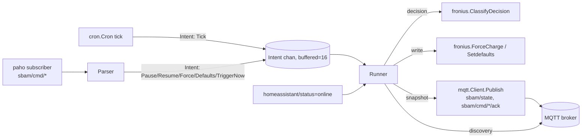

# PLAN: MQTT feed (v2.0.0)

> Feature slug: `64-issue-mqtt-feed`
> TASK: [64-issue-mqtt-feed-TASK.md](64-issue-mqtt-feed-TASK.md)
> Issue: https://github.com/atbore-phx/sbam/issues/64
> Milestone: [v2.0.0](https://github.com/atbore-phx/sbam/milestone/7)
> Created: 2026-05-01

---

## 0. Reconciliation Notes (2026-05-10)

This plan has been reconciled against the current codebase, the parent issue,
and the sub-issues #84-#91. These notes supersede older blueprint details when
they conflict.

- Closed/implemented: #84, #85, #86, and #90 are closed on GitHub. #86 closed
  via PR #108 and provides `ParseIntent` / `PublishAck` in `pkg/mqtt`.
- #84 shipped more than the original scaffold sketch: selectable reconnect
  strategy (`custom` default, `paho` opt-in), retained availability, TLS, typed
  state/error/availability publishers, and Paho/Mochi tests.
- #85 shipped `BuildDiscovery(cfg Config, version string)`,
  `mqtt_ha_discovery_prefix`, deterministic hashed HA identifiers, retained
  discovery publication, additional state fields/entities, and partial runtime
  wiring in `schedule.go`, `config.yaml`, the add-on, and README.
- #86's implemented ack contract is `{ "ts", "command", "accepted", "error" }`,
  not the early parent `{ "status", "error", "ts" }` sketch.
- The v2.0.0 command surface is narrowed to `trigger_now`, `force_charge`,
  `set_defaults`, `pause`, and `resume`. `set_reserve` is deferred to >= v2.1;
  keep the existing `IntentSetReserve` type only as a future placeholder.
- The remaining runner work should fix the current pause mismatch: HA discovery
  publishes `{}` for the pause button, so the runner/wiring issue should make
  `{}` an indefinite pause and accept `{"until":"<RFC3339-or-duration>"}` for
  auto-resume.
- #88/#89/#91 are now narrower than originally planned because #85 already
  landed some config, add-on, and README surfaces. The remaining work is command
  subscription/ack routing, single-writer runner integration, add-on Mosquitto
  service auto-discovery, and complete docs/migration examples.

## 1. Task Analysis

**Goal.** Ship a first-class, opt-in MQTT feed for the `schedule` subcommand
that publishes machine-readable state, accepts validated inbound commands
through a single-goroutine `Intent` channel, and emits Home Assistant MQTT
Discovery payloads. Default behaviour is unchanged for v1.x users.

**Non-goals.** Custom HA Python integration; REST control API; multi-broker
fan-out; the `set_reserve` MQTT command and persistence; MQTT 5 RESPONSE_TOPIC
routing; metrics exposition.

**Acceptance criteria.** Reproduced verbatim in
[64-issue-mqtt-feed-TASK.md](64-issue-mqtt-feed-TASK.md#acceptance-criteria);
the implementer MUST keep them ticked through PR review.

---

## 2. Current State

| Concern | File | Current state after #84/#85/#86/#90 |
| --- | --- | --- |
| CLI root + viper init | [pkg/cmd/root.go](../../../pkg/cmd/root.go) | `viper.AutomaticEnv()` and `bindFlags(cmd)` still provide flag > env > yaml > default. |
| Schedule subcommand | [pkg/cmd/schedule.go](../../../pkg/cmd/schedule.go) | MQTT flags/config, `mqtt.InitWithCleanup`, retained state publication, and HA status discovery re-publication are present. Cron still calls `schedule(...)` directly, and no single-writer runner exists yet. |
| MQTT client scaffold | [pkg/mqtt/client.go](../../../pkg/mqtt/client.go), [pkg/mqtt/paho.go](../../../pkg/mqtt/paho.go), [pkg/mqtt/noop.go](../../../pkg/mqtt/noop.go) | `Client`, noop, Paho, retained availability, TLS, topic helpers, and `New(cfg, version...)` exist. |
| Reconnect strategy | [pkg/mqtt/reconnect.go](../../../pkg/mqtt/reconnect.go), [pkg/mqtt/reconnect_custom.go](../../../pkg/mqtt/reconnect_custom.go), [pkg/mqtt/reconnect_paho.go](../../../pkg/mqtt/reconnect_paho.go) | Custom jittered reconnect is default; Paho auto-reconnect is opt-in via `Config.ReconnectStrategy`. |
| Discovery payloads | [pkg/mqtt/discovery.go](../../../pkg/mqtt/discovery.go) | `BuildDiscovery(cfg, version)` emits sensors, binary sensors, and buttons under configurable `mqtt_ha_discovery_prefix`. |
| Command parser + ack | [pkg/mqtt/commands.go](../../../pkg/mqtt/commands.go) | `ParseIntent` and `PublishAck` support `trigger_now`, `force_charge`, `set_defaults`, `pause`, and `resume`. `set_reserve` is not parsed. |
| Charge decision | [pkg/fronius/classify.go](../../../pkg/fronius/classify.go), [pkg/fronius/schedule.go](../../../pkg/fronius/schedule.go) | `ClassifyDecision` is extracted and returns `Decision`, reason, `PowerState`, and error; `SetFroniusChargeBatteryMode` calls it. |
| Startup dump + redaction | [src/utils/startup.go](../../../src/utils/startup.go) | `mqtt_password` and `mqtt_tls_client_cert_key` are redacted. |
| HA add-on schema | [home-assistant/addons/sbam/config.json](../../../home-assistant/addons/sbam/config.json) | Version is `2.0.0`; non-TLS MQTT options exist. `services: ["mqtt:need"]` is still missing. |
| HA add-on entrypoint | [home-assistant/addons/sbam/run.sh](../../../home-assistant/addons/sbam/run.sh) | Non-TLS MQTT env vars are exported. Mosquitto service auto-discovery is still missing. |
| README/add-on docs | [README.md](../../../README.md), [home-assistant/addons/sbam/DOCS.md](../../../home-assistant/addons/sbam/DOCS.md), [home-assistant/addons/sbam/CHANGELOG.md](../../../home-assistant/addons/sbam/CHANGELOG.md) | MQTT text exists, but #91 still needs full payload schemas, command examples, and migration note; add-on docs contain duplicated MQTT option bullets. |
| Tests | [pkg/mqtt](../../../pkg/mqtt), [pkg/cmd/precedence_test.go](../../../pkg/cmd/precedence_test.go), [src/utils/startup_test.go](../../../src/utils/startup_test.go) | MQTT package tests cover scaffold/discovery/commands. Cmd precedence currently covers `mqtt_ha_discovery_prefix`; #88 should broaden coverage across all MQTT keys. |

---

## 3. Target Architecture



New / modified packages:

- `pkg/mqtt/` (implemented): `Client` interface + `paho`, `noop` impls +
  discovery payloads + command parser + ack publisher.
- `pkg/fronius/` (modified): extract `ClassifyDecision`; existing
  `SetFroniusChargeBatteryMode` calls it.
- `pkg/cmd/` (modified): `schedule.go` wires MQTT config and will build the
  runner; the new runner file owns the single-goroutine loop and consumes
  `pkg/mqtt.Intent` values.
- `src/utils/` (modified): two new entries in `SecretKeys`.
- `home-assistant/addons/sbam/` (modified): `config.json` schema (+ `services`),
  `run.sh` exports + Mosquitto auto-discovery, `DOCS.md`, and `CHANGELOG.md`.

---

## 4. Dependency Choices

Already present in [go.mod](../../../go.mod):

| Module                                       | Version (latest @ planning time) | Purpose                                              | Godoc                                                                  |
| -------------------------------------------- | -------------------------------- | ---------------------------------------------------- | ---------------------------------------------------------------------- |
| `github.com/eclipse/paho.mqtt.golang`        | `v1.5.x`                         | Production MQTT client.                              | https://pkg.go.dev/github.com/eclipse/paho.mqtt.golang                 |
| `github.com/mochi-mqtt/server/v2`            | `v2.7.x` (test-only)             | In-process MQTT broker for `pkg/mqtt` Paho tests.    | https://pkg.go.dev/github.com/mochi-mqtt/server/v2                     |

No other new dependencies are planned for the reconciliation work. Continue
using `cobra`, `viper`, `zap`, `cron/v3`, `simonvetter/modbus`, `testify`, and
`mbserver`.

---

## 5. Configuration Changes

Standalone `sbam schedule` now has twelve MQTT keys. Defaults live in
[config.yaml](../../../config.yaml), flag bindings in
[pkg/cmd/schedule.go](../../../pkg/cmd/schedule.go), and redaction in
[src/utils/startup.go](../../../src/utils/startup.go).

| Key | Flag | Env | YAML default | Standalone notes |
| --- | --- | --- | --- | --- |
| `mqtt_enabled` | `--mqtt_enabled` | `MQTT_ENABLED` | `false` | Master switch; noop when false. |
| `mqtt_broker` | `--mqtt_broker` | `MQTT_BROKER` | `""` | `tcp://`, `tls://`, `ws://`, `wss://` accepted by the Paho layer. |
| `mqtt_client_id` | `--mqtt_client_id` | `MQTT_CLIENT_ID` | `""` | Empty auto-generates `sbam-<hostname>`. |
| `mqtt_username` | `--mqtt_username` | `MQTT_USERNAME` | `""` | Optional. |
| `mqtt_password` | `--mqtt_password` | `MQTT_PASSWORD` | `""` | Secret; redacted. |
| `mqtt_tls_ca_file` | `--mqtt_tls_ca_file` | `MQTT_TLS_CA_FILE` | `""` | Standalone TLS CA bundle. |
| `mqtt_tls_client_cert` | `--mqtt_tls_client_cert` | `MQTT_TLS_CLIENT_CERT` | `""` | Standalone mTLS client cert. |
| `mqtt_tls_client_cert_key` | `--mqtt_tls_client_cert_key` | `MQTT_TLS_CLIENT_CERT_KEY` | `""` | Secret; redacted. |
| `mqtt_tls_insecure_skip` | `--mqtt_tls_insecure_skip` | `MQTT_TLS_INSECURE_SKIP` | `false` | Development only; logs warning. |
| `mqtt_topic_prefix` | `--mqtt_topic_prefix` | `MQTT_TOPIC_PREFIX` | `sbam` | State, error, availability, and command prefix. |
| `mqtt_ha_discovery` | `--mqtt_ha_discovery` | `MQTT_HA_DISCOVERY` | `true` | Only active when MQTT is enabled. |
| `mqtt_ha_discovery_prefix` | `--mqtt_ha_discovery_prefix` | `MQTT_HA_DISCOVERY_PREFIX` | `homeassistant` | HA discovery config root prefix. |

Precedence remains **flag > env > yaml > default** through
[`bindFlags`](../../../pkg/cmd/root.go). #88 should extend
[precedence_test.go](../../../pkg/cmd/precedence_test.go) to cover all MQTT
keys, not only `mqtt_ha_discovery_prefix`.

Home Assistant add-on configuration is intentionally smaller than standalone
configuration:

- Expose `mqtt_enabled`, `mqtt_broker`, `mqtt_client_id`, `mqtt_username`,
  `mqtt_password`, `mqtt_topic_prefix`, `mqtt_ha_discovery`, and
  `mqtt_ha_discovery_prefix`.
- Do not expose TLS keys in the add-on UI for v2.0.0. TLS remains available to
  standalone binary users through the twelve-key table above.
- #89 must add `services: ["mqtt:need"]` and Mosquitto auto-discovery in
  [run.sh](../../../home-assistant/addons/sbam/run.sh). Manual `mqtt_broker`,
  `mqtt_username`, and `mqtt_password` values always win.

---

## 6. Implementation Blueprint

The remaining implementation order starts from the current codebase, not the
original greenfield sketch.

### Step 1 — Account for `pkg/mqtt` parser work (sub-issue #86)

Current files: [pkg/mqtt/commands.go](../../../pkg/mqtt/commands.go) and
[pkg/mqtt/commands_test.go](../../../pkg/mqtt/commands_test.go).

#86 is closed; before #87 consumes the parser, account for the implemented
scope and the one pause-payload follow-up below. The parser currently supports:

- `cmd/trigger_now`, `cmd/force_charge`, `cmd/set_defaults`, `cmd/pause`, and
  `cmd/resume` under any prefix ending in `/cmd/<name>`.
- Strict JSON, payload size <= 4096 bytes, `target_pct` in `[1,100]`, and
  `duration_s` in `[0,86400]`.
- Ack payloads with `ts`, `command`, `accepted`, and optional `error`.

Small reconciled change for #87/#88: allow `pause` with an empty payload or
`{}` to mean indefinite pause, while keeping the existing `until` payload for
auto-resume. This makes the already-generated HA pause button usable.

Do not add `set_reserve` parser support for v2.0.0.

### Step 2 — Schedule runner refactor (sub-issue #87)

Create [pkg/cmd/schedule_runner.go](../../../pkg/cmd/schedule_runner.go) (or a
similarly named file) and move the current `schedule(...)` workflow behind a
single goroutine that owns Modbus access.

Recommended shape:

```go
type RunnerConfig struct { /* grouped schedule + MQTT config */ }

type Runner struct {
    cfg    RunnerConfig
    inbox  chan mqtt.Intent // cap 16
    mqtt   mqtt.Client
    paused atomic.Pointer[time.Time] // nil = not paused, zero time = indefinite
}

func NewRunner(cfg RunnerConfig, client mqtt.Client) *Runner
func (r *Runner) Run(ctx context.Context) error
func (r *Runner) Submit(intent mqtt.Intent) bool
```

Behaviour:

- `Run` is the only path that calls Fronius Modbus write helpers.
- Cron callbacks submit `mqtt.Intent{Kind: mqtt.IntentTriggerNow}` or a
  private tick wrapper; they do not run the charge workflow directly.
- `pause {}` sets an indefinite pause; `pause {"until":"1h"}` sets a deadline;
  `resume` clears both. Paused ticks publish state with `paused=true` and skip
  Modbus writes.
- `force_charge` validates `TargetPct`, calls `fronius.ForceCharge`, publishes
  an ack, and publishes a state snapshot.
- `set_defaults` calls `fronius.Setdefaults`, publishes an ack, and publishes a
  state snapshot.
- `trigger_now` runs the same schedule path as a cron tick and publishes an ack
  when it originated from MQTT.
- Non-fatal storage/power/Fronius errors publish `mqtt.PublishError` and state
  with `last_decision=skip`; they do not panic.

State payloads should continue the fields introduced by #85:

```json
{
  "battery_soc_pct": 47,
  "battery_capacity_wh": 9600,
  "forecast_today_wh": 21500,
  "pw_net_wh": -1200,
  "charge_pct": 35,
  "last_decision": "forecast_charge",
  "last_decision_reason": "Net Power ...",
  "charge_window_active": true,
  "batt_reserve_window_active": true,
  "paused": false,
  "next_run": "2026-05-01T13:00:00+02:00",
  "ts": "2026-05-01T12:34:56+02:00"
}
```

### Step 3 — Finish `schedule` wiring (sub-issue #88)

[pkg/cmd/schedule.go](../../../pkg/cmd/schedule.go) already has the MQTT flags,
Viper reads, `mqtt.Config`, startup redaction, `mqtt.InitWithCleanup`, and basic
state publication. Do not duplicate those pieces.

Remaining #88 work:

1. Replace direct cron calls to `schedule(...)` with `runner.Submit(...)`.
2. Subscribe to `<mqtt_topic_prefix>/cmd/+` after the MQTT client connects.
3. For every command message, call `mqtt.ParseIntent`, publish a rejected ack
   immediately when parsing fails, and submit accepted intents to the runner.
4. Let the runner publish accepted/error acks after command execution.
5. Re-publish discovery and the latest state on `homeassistant/status=online`.
6. Extend `pkg/cmd/precedence_test.go` to cover all twelve MQTT keys.
7. Preserve `mqtt_enabled=false` as a no-connect, no-extra-INFO, no-Modbus-diff
   path.

### Step 4 — Home Assistant add-on finish (sub-issue #89)

Current add-on files already have `version: 2.0.0`, the non-TLS MQTT options,
env exports, a changelog entry, and initial docs. Remaining #89 work:

- Add `services: ["mqtt:need"]` to
  [home-assistant/addons/sbam/config.json](../../../home-assistant/addons/sbam/config.json).
- In [run.sh](../../../home-assistant/addons/sbam/run.sh), when
  `MQTT_ENABLED=true` and `MQTT_BROKER` is empty, resolve HA Mosquitto with
  `bashio::services 'mqtt'` and export broker/credentials. Manual values win.
- Keep TLS options out of the add-on UI for v2.0.0 unless a dedicated issue
  asks to support external TLS brokers in HA add-on mode.
- Remove duplicated MQTT option bullets from
  [DOCS.md](../../../home-assistant/addons/sbam/DOCS.md) and document the
  Mosquitto auto-fill behavior.
- Run the local add-on build script if available in the development environment.

### Step 5 — README + project structure polish (sub-issue #91)

Current README has a short MQTT section. Expand it with:

- Enablement examples for CLI/env/YAML.
- Topic map: availability, state, error, command, ack, and HA discovery config.
- `sbam/state` JSON schema matching the #85 fields.
- `mosquitto_pub` examples for `trigger_now`, `pause`, `resume`,
  `force_charge`, and `set_defaults`.
- Migration from v1.x: no action required while `mqtt_enabled=false`; opt-in
  users configure the new MQTT keys.

Update [.github/copilot-instructions.md](../../../.github/copilot-instructions.md)
only for newly added source/test files. `pkg/mqtt` is already listed; add the
runner files when #87 creates them.

---

## 7. Test Plan

For each new or changed file, keep the repo rule of at least one expected, one
edge, and one failure case. All HTTP/Modbus/MQTT test servers must be closed
with `defer` cleanup.

Already implemented and covered:

- `pkg/fronius/classify_test.go`: covers the shipped decision enum and keeps
  existing Modbus tests green.
- `pkg/mqtt/mqtt_test.go`: covers noop behavior, Paho client behavior,
  reconnect strategies, TLS branches, publishers, and in-process broker paths.
- `pkg/mqtt/discovery_test.go`: covers `BuildDiscovery(cfg, version)`, prefix
  defaults, templates, retained discovery publication, and version handling.
- `pkg/mqtt/commands_test.go`: covers canonical commands, parser failures,
  payload bounds, ack topics, ack JSON, nil client, publish failure, and marshal
  failure.
- `src/utils/startup_test.go`: covers MQTT secret redaction.

Remaining #87/#88 tests:

- Runner expected: one tick performs exactly one schedule workflow and publishes
  one retained state snapshot.
- Runner edge: `pause {}` then tick publishes `paused=true` and performs no
  Modbus writes; `resume` restores normal ticks.
- Runner edge: `pause {"until":"1h"}` blocks ticks until the deadline, then
  auto-resumes.
- Runner command expected: `force_charge` and `set_defaults` execute exactly
  once and publish accepted acks.
- Runner failure: invalid/out-of-range command payloads publish rejected acks
  and never reach Fronius code.
- Runner concurrency: many concurrent cron/MQTT submissions are serialized by
  the runner; run focused tests with `go test -race ./pkg/cmd`.
- Wiring: `<prefix>/cmd/+` messages call `mqtt.ParseIntent`; parse failures get
  immediate acks; accepted commands are submitted to the runner.
- Precedence: extend [pkg/cmd/precedence_test.go](../../../pkg/cmd/precedence_test.go)
  to cover all twelve MQTT keys.

Remaining #89/#91 checks:

- Add-on `config.json` includes `services: ["mqtt:need"]`; non-TLS MQTT options
  still render with password masking.
- `run.sh` exports manual MQTT values unchanged and fills broker/credentials
  from `bashio::services 'mqtt'` only when the broker is empty.
- README topic maps and examples match `pkg/mqtt` helper topics and the actual
  `AckPayload` / `StatePayload` JSON.

---

## 8. Validation Gates

The implementer MUST run and pass, in order:

```bash
go mod tidy
make test                       # `go test -cover ./...`
go test -race ./pkg/...         # race detector specifically for runner
make build                      # CGO_ENABLED=0 binary in bin/sbam
docker build -f Dockerfile -t sbam:dev .
docker build -f home-assistant/addons/sbam/Dockerfile \
  -t sbam-addon:dev home-assistant/addons/sbam/
```

CI workflows under `.github/workflows/` must remain green. If any
workflow needs the new test-only dependency cached, document the change
in the PR description (no new workflow file is required).

---

## 9. Rollout / Backward Compatibility

- Default config changes nothing observable: `mqtt_enabled=false`. All
  existing v1.x deployments produce byte-identical Modbus traffic.
- The twelve standalone MQTT keys are additive; existing `config.yaml`, env vars, and
  CLI invocations are untouched.
- HA add-on `version` is already `2.0.0`; users see a normal add-on update.
- HA add-on `CHANGELOG.md` `## 2.0.0` entry must contain:
  - "Added: MQTT feed (opt-in, off by default)."
  - "Added: Home Assistant MQTT Discovery sensors, paused
    binary_sensor, command buttons."
  - "Added: MQTT options (`mqtt_*`); see DOCS for details."
  - "Note: no breaking changes for users who do not enable
    `mqtt_enabled`."
- README MQTT section + a `Migration from v1.x` callout.

---

## 10. Security Considerations

- **Secrets.** `mqtt_password` and `mqtt_tls_client_cert_key` MUST be in
  `SecretKeys` so `DumpStartupParams` redacts them. HA add-on schema
  uses `password?`. Never log raw payloads at INFO; redact at DEBUG too
  for these two keys.
- **TLS.** When the broker URL scheme is `tls://`, build `tls.Config`
  from `mqtt_tls_ca_file`; `InsecureSkipVerify` only when
  `mqtt_tls_insecure_skip=true` AND log a `WARN` on connect.
- **Input validation (OWASP A03).** Inbound payloads are untrusted:
  - Reject payloads > 4 KiB (`MaxPayloadBytes`) before `json.Unmarshal`.
  - Strict numeric ranges: `target_pct ∈ [1,100]`, `duration_s ∈ [0,86400]`.
  - `set_reserve` is not accepted in v2.0.0; add its validation only if a
    future issue reintroduces it.
  - Topic match must be exact (`<prefix>/cmd/<name>`); reject `+`/`#`
    in command names.
- **DoS resilience.** `Inbox` is buffered (cap 16) and `Submit` is
  non-blocking; floods drop excess intents with a `WARN` log instead of
  blocking the Paho receive goroutine.
- **No code execution paths.** Commands map to a fixed switch; no
  reflection, no `exec`, no template evaluation against user input.

---

## 11. Gotchas

- `simonvetter/modbus` keeps a module-level client (see
  [pkg/fronius/modbus.go](../../../pkg/fronius/modbus.go)). The
  single-goroutine `Runner` is the **only** thing that may call Modbus write
  helpers. Document this invariant in the runner file created by #87.
- Paho's `Token.Wait()` blocks forever if the network is half-open; always
  use `Token.WaitTimeout(...)` or wrap with `ctx.Done()`.
- `paho.NewClient` does not validate the broker URL scheme until
  `Connect`; pre-validate in `NewPaho` to fail fast.
- `viper.AutomaticEnv` lowercases keys but uppercases env names; the twelve
  standalone MQTT keys must use snake_case to map cleanly (`mqtt_topic_prefix`
  → `MQTT_TOPIC_PREFIX`).
- HA Discovery `unique_id` MUST be globally unique; the implemented builder
  hashes `fronius_ip`, then falls back to client ID/topic prefix, and appends
  the entity object ID.
- Bashio `bashio::services 'mqtt'` returns empty when the user has no
  Mosquitto add-on; the conditional in `run.sh` MUST tolerate that.
- `cron/v3` triggers callbacks in its own goroutines; the callback must
  stay tiny (`r.Submit(Intent{Kind: IntentTick})`) so cron's pool is
  never blocked by Modbus I/O.
- Solcast and Fronius Solar API requests stay synchronous inside the
  runner — they MUST run on the runner goroutine, not in the cron pool,
  to preserve serialisation.
- LWT (`sbam/availability=offline`) requires the broker to be configured
  with the will at `Connect` time; setting it after `Connect` is a no-op.

---

## 12. Open Questions / Risks (carried from TASK)

- **R1** (Paho ↔ in-process broker flakiness on slow CI) — DEFERRED;
  mitigate with short keepalive in tests.
- **R2** (HA Mosquitto auto-discovery vs external broker) — RESOLVED:
  external `mqtt_broker` always wins over `bashio::services` lookup.
- **R3** (semantics of pause mid-cycle) — RESOLVED: an in-flight cycle
  finishes; subsequent ticks short-circuit. Document this in the #87 runner
  implementation.
- **R4** (`mochi-mqtt/server/v2` test-only dep) — RESOLVED: kept as a
  regular dependency; `go mod tidy` will mark it as `// indirect` if
  unused outside tests, otherwise it stays direct.
- **OQ1** (`sbam/state` field names + units) — RESOLVED in §5 and §6:
  `_pct` for percentages, `_wh` for energy, `_w` would be reserved for
  power if added later.
- **OQ2** (`set_reserve`) — DEFERRED to ≥ v2.1; v2.0.0 keeps the placeholder
  intent type but exposes no MQTT command for it.

---

## 13. Confidence Score

**8/10.**

Raisers (would push to 9–10):

- A short spike against a real Fronius gen24+ to confirm that
  `fronius.ForceCharge` invoked from a non-cron goroutine produces
  identical Modbus register writes as the current code path.
- Confirmation from the issue author / @atbore-phx on the exact
  `sbam/state` JSON field names (so v2.0.0 doesn't need a breaking
  rename in v2.1).
- A check that `mochi-mqtt/server/v2`'s default port allocator works
  inside the GitHub Actions runner used by `.github/workflows/test.yml`.

If any of these is blocking at implementation time, raise it before finishing
#87/#88, because those are the remaining behavior-changing steps behind the
`mqtt_enabled=false` default.
