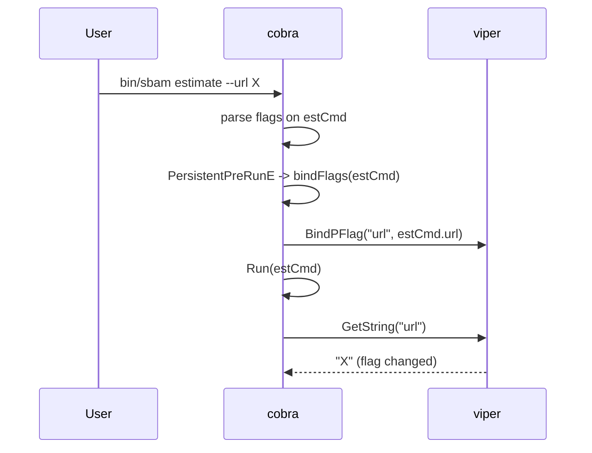

# PLAN: Restore CLI flag precedence over env vars and config.yaml

> Slug: `68-issue-cli-flags-precedence` · Created: 2026-04-27
> TASK: [68-issue-cli-flags-precedence-TASK.md](68-issue-cli-flags-precedence-TASK.md)
> Source issue: https://github.com/atbore-phx/sbam/issues/68
> Target release (informational): v1.6.0

---

## 1. Task Analysis

**Goal.** Make Viper honor its documented precedence (`flag > env > config > default`) for every sbam subcommand. Today, CLI flags are silently ignored when the same key exists in `config.yaml`.

**Non-goals.** No flag/env/key renames. No new flags. No changes to Solcast, Fronius Solar API, Modbus, cron logic, Home Assistant add-on schema, or `run.sh`.

**Acceptance Criteria (from TASK).**
- Flag overrides env and yaml for every viper-bound key in `pkg/cmd/{estimate,schedule,configure}.go`.
- Env overrides yaml when no flag is given.
- Default applies when none of flag/env/yaml is set.
- The `defaults` binding in `configure.go` references `cfgCmd`, not `scdCmd`.
- `make test` and `make build` pass; new tests cover expected, edge, and failure cases.

---

## 2. Current State

Relevant files (all paths workspace-relative):

- [pkg/cmd/root.go](../../../pkg/cmd/root.go) — `init()` calls `viper.AutomaticEnv()`, `viper.SetConfigName("config")`, `viper.AddConfigPath(".")`, `viper.ReadInConfig()`. `Execute()` runs `rootCmd.Execute()`.
- [pkg/cmd/estimate.go](../../../pkg/cmd/estimate.go) — `init()` registers flags on `estCmd` and calls `viper.BindPFlag("url", estCmd.Flags().Lookup("url"))` etc.
- [pkg/cmd/schedule.go](../../../pkg/cmd/schedule.go) — `init()` registers the same global keys (`url`, `apikey`, `fronius_ip`, `defaults`, `cache_forecast`, `cache_file_prefix`, `cache_time`, …) on `scdCmd` and calls `viper.BindPFlag(...)` again with `scdCmd`'s flags.
- [pkg/cmd/configure.go](../../../pkg/cmd/configure.go) — `init()` registers `fronius_ip`, `defaults`, `force_charge`, `power` on `cfgCmd`, but binds `defaults` to `scdCmd.Flags().Lookup("defaults")` (latent bug: at the moment `configure.go`'s `init` runs, `scdCmd` may not have its flags yet — file init order is alphabetical: `configure.go` → `estimate.go` → `root.go` → `schedule.go`).
- [main.go](../../../main.go) and [main_test.go](../../../main_test.go) — bootstrap.
- [Makefile](../../../Makefile) — `make test` runs `go test -cover ./...`.

**Root cause.** `viper.BindPFlag(key, pflag)` stores a pointer to a single `pflag.Flag`. Each subcommand's `init()` overwrites the previous binding for the **shared** key. The last `init()` to run wins (alphabetically: `schedule.go`). Therefore, when the user runs `estimate --url X`, viper looks at `scdCmd`'s `url` flag, which is **not** changed for that invocation, so viper falls through to env / yaml / default. Same for `apikey`, `fronius_ip`, `defaults`, `cache_forecast`, `cache_file_prefix`, `cache_time`.

The maintainer's note in the issue ("init function of cmd/root.go is called after the flags") is partially correct — the deeper problem is the **shared global viper key** being bound to the wrong subcommand's flag.

---

## 3. Target Architecture

Move the per-command `viper.BindPFlag(...)` calls **out of `init()`** and into a `PersistentPreRunE` (or `PreRunE`) hook on each subcommand. The hook runs **after** cobra has parsed args for the **selected** subcommand and **before** `Run`. This guarantees the binding active during `Run` points at the executing subcommand's flag set.

Add a small helper in `pkg/cmd/root.go`:

```go
// bindFlags binds every defined flag of cmd to viper using the flag's name as
// the viper key. Called from each subcommand's PersistentPreRunE so the
// currently executing subcommand owns the binding.
func bindFlags(cmd *cobra.Command) error {
    var firstErr error
    cmd.Flags().VisitAll(func(f *pflag.Flag) {
        if firstErr != nil {
            return
        }
        if err := viper.BindPFlag(f.Name, f); err != nil {
            firstErr = err
        }
    })
    return firstErr
}
```

Each subcommand declares:

```go
PersistentPreRunE: func(cmd *cobra.Command, args []string) error {
    return bindFlags(cmd)
},
```

Data flow:



Other surfaces unchanged.

---

## 4. Dependency Choices

No new modules. Reuse:

- `github.com/spf13/cobra` (already in `go.mod`) — `PersistentPreRunE`, `Command.Flags().VisitAll`.
- `github.com/spf13/viper` (already in `go.mod`) — `BindPFlag`, `Reset`, `AutomaticEnv`.
- `github.com/spf13/pflag` (transitive via cobra) — `*pflag.Flag`.
- `github.com/stretchr/testify` (already in `go.mod`) — assertions.

---

## 5. Configuration Changes

None. All current flags, env vars, and config keys keep their names and defaults.

Documented precedence (to be repeated in README/DOCS): `CLI flag > env var > config.yaml > cobra default`.

---

## 6. Implementation Blueprint

Execute steps in order. Each step lists the target file, the change, and the rationale.

### Step 1 — Add `bindFlags` helper in `pkg/cmd/root.go`

File: [pkg/cmd/root.go](../../../pkg/cmd/root.go)

- Add import `"github.com/spf13/pflag"`.
- Add the helper:

  ```go
  func bindFlags(cmd *cobra.Command) error {
      var firstErr error
      cmd.Flags().VisitAll(func(f *pflag.Flag) {
          if firstErr != nil {
              return
          }
          if err := viper.BindPFlag(f.Name, f); err != nil {
              firstErr = err
          }
      })
      return firstErr
  }
  ```

- Keep `init()` exactly as today for `viper.AutomaticEnv()` + `ReadInConfig()`. Do **not** move config reading.

Rationale: a single, well-named helper reused by every subcommand; keeps each subcommand's binding scoped to its own pflag set.

### Step 2 — Wire `PersistentPreRunE` on each subcommand and remove the broken init bindings

File: [pkg/cmd/estimate.go](../../../pkg/cmd/estimate.go)

- Add `PersistentPreRunE: func(cmd *cobra.Command, args []string) error { return bindFlags(cmd) },` to `estCmd`.
- **Delete** every `viper.BindPFlag(...)` call inside `init()`.

File: [pkg/cmd/schedule.go](../../../pkg/cmd/schedule.go)

- Add the same `PersistentPreRunE` to `scdCmd`.
- **Delete** every `viper.BindPFlag(...)` call inside `init()`.

File: [pkg/cmd/configure.go](../../../pkg/cmd/configure.go)

- Add the same `PersistentPreRunE` to `cfgCmd`.
- **Delete** every `viper.BindPFlag(...)` call inside `init()` (this also removes the latent bug where `defaults` was bound to `scdCmd`).

Rationale: per-invocation binding scoped to the executing subcommand restores correct precedence and removes ordering fragility between file-level `init()` blocks.

### Step 3 — Confirm `viper.AutomaticEnv()` covers every key

File: [pkg/cmd/root.go](../../../pkg/cmd/root.go)

- `AutomaticEnv()` is already called. Verify (via tests, Step 5) that env vars with the exact key name (uppercase) override yaml. If a user sets `URL=...`, viper resolves it.
- No code change expected. If tests reveal a casing mismatch, add `viper.SetEnvKeyReplacer(strings.NewReplacer("-", "_"))` — kept as a contingency, not required.

### Step 4 — Update documentation

Files:

- [README.md](../../../README.md) — add a short "Configuration precedence" subsection: `CLI flag > env var > config.yaml > built-in default`.
- [home-assistant/addons/sbam/DOCS.md](../../../home-assistant/addons/sbam/DOCS.md) — same one-liner so add-on users know the rule.
- [home-assistant/addons/sbam/CHANGELOG.md](../../../home-assistant/addons/sbam/CHANGELOG.md) — append an entry: "Fix CLI flag precedence over env vars and config.yaml (#68)".

Rationale: the bug spawned because the documented behavior was implicit. Make it explicit.

### Step 5 — Add unit tests in `pkg/cmd/`

File (new): `pkg/cmd/precedence_test.go`

Test layout (no `t.Parallel()`; mutates global viper state):

- `TestPrecedence_FlagBeatsEnvAndYaml` — for each of `estCmd`, `scdCmd`, `cfgCmd`, build a fresh root command, write a temp `config.yaml` in a temp dir (chdir there with `t.Chdir`), `t.Setenv(...)` an env value, pass `--url=fromflag` (or relevant flag) on `os.Args`, run `cmd.Execute()` up to but not into the side-effecting `Run` (use a hook command or split the body), assert `viper.GetString("url") == "fromflag"`.
- `TestPrecedence_EnvBeatsYaml` — same setup, no flag passed, env set, yaml set → env wins.
- `TestPrecedence_YamlBeatsDefault` — no flag, no env, yaml set → yaml wins.
- `TestPrecedence_DefaultWhenNothingSet` — no flag, no env, no yaml → cobra default wins.
- `TestPrecedence_PerSubcommandFlagSet` — register `url` on two subcommands; running one with `--url=A` and the other with `--url=B` resolves to the executing one.
- Use `defer viper.Reset()` after each test; restore `os.Args` with `defer`.

Strategy to avoid invoking `Run` (which makes real HTTP/Modbus calls): swap each subcommand's `Run`/`RunE` for a no-op in the test scope, or expose a small `bindFlagsForTest(cmd)` that mirrors what `PersistentPreRunE` does and call it after `cmd.ParseFlags(args)` on a freshly built cobra tree. The simpler path is the latter: build a minimal cobra tree in the test, attach the same flags, call `bindFlags`, assert viper values. This isolates the precedence logic from the side-effecting `Run`.

Mocks:

- No `httptest`/`mbserver` needed for the precedence tests.
- If a future test needs Solcast, use `httptest.NewServer` and `defer server.Close()` per repo convention ([pkg/power/power_test.go](../../../pkg/power/power_test.go)).

### Step 6 — Extend `main_test.go` with one E2E precedence test

File: [main_test.go](../../../main_test.go)

- Add `TestExecute_FlagOverridesYaml`:
  - `t.Chdir(t.TempDir())`
  - Write `config.yaml` with `url: http://from-yaml/` and other required minimal keys.
  - `os.Args = []string{"sbam", "estimate", "--url=http://from-flag/", "--apikey=k", "--fronius_ip=127.0.0.1"}`.
  - Replace `estCmd.RunE`/`Run` with a probe that records `viper.GetString("url")` into a package-level test hook variable, OR run the real `Execute()` and assert the recorded URL via a tiny seam exposed only to tests (e.g. an internal `var lastResolvedURL string` populated inside `estCmd.Run` when a build tag or env var is set — kept minimal).
  - Assert the recorded URL is `http://from-flag/`.
  - `defer viper.Reset()`, restore `os.Args`.

If exposing a test seam in production code is undesirable, prefer a focused `pkg/cmd/` test that builds a fresh command tree (Step 5 already covers this) and reduce `main_test.go` to a smoke test asserting that `cmd.Execute()` does not error when `--version` is passed alongside a populated yaml — proving init order does not break `Execute`. Decide during implementation; do not add intrusive seams.

---

## 7. Test Plan

For every change, ensure expected / edge / failure coverage:

- **`pkg/cmd/precedence_test.go`** (new):
  - Expected: flag wins over env and yaml.
  - Edge: env wins when no flag; yaml wins when no env; default wins when nothing.
  - Edge: shared key across subcommands resolves per executing subcommand.
  - Failure: required flag missing → existing `CheckEstimate` / `checkScheduleschedule` / `checkConfigure` still returns the right error.

- **`pkg/cmd/configure_test.go`** (new, small):
  - Expected: after running `cfgCmd`, `viper.GetBool("defaults")` reflects the flag passed to `cfgCmd` (not `scdCmd`'s flag).
  - Failure: `--force_charge` without `--power` still triggers the existing log/return path.

- **`main_test.go`** (extended):
  - Expected: a flag-overrides-yaml E2E run resolves to the flag value.
  - Existing `TestMain` continues to pass.

- Mocks/cleanup:
  - `defer viper.Reset()` after every test that touches viper.
  - `defer func(){ os.Args = old }()` in tests mutating `os.Args`.
  - `t.Setenv` for env precedence tests (auto-restored).
  - `t.Chdir(t.TempDir())` for yaml-precedence tests so `viper.AddConfigPath(".")` reads the temp file.

- Do not run tests with `t.Parallel()` in `pkg/cmd/` (global viper state).

---

## 8. Validation Gates

The implementer MUST run and pass:

```bash
make test
make build
go test -run Precedence ./pkg/cmd/...
go test -run TestExecute ./...
```

No `docker build` is required (Dockerfile unchanged).

---

## 9. Rollout / Backward Compatibility

- No breaking changes to flags, env vars, config keys, defaults, or Home Assistant schema.
- Update [home-assistant/addons/sbam/CHANGELOG.md](../../../home-assistant/addons/sbam/CHANGELOG.md) with: `- Fix CLI flag precedence over env vars and config.yaml (#68).`
- Update [README.md](../../../README.md) with an explicit precedence note.
- Update [home-assistant/addons/sbam/DOCS.md](../../../home-assistant/addons/sbam/DOCS.md) with the same precedence note.
- Targeted release: `v1.6.0` (informational; do not touch version files — the Makefile derives version from git tags at build time).

---

## 10. Security Considerations

- No new input surfaces. Existing `apikey` continues to flow through the same channels.
- `bindFlags` only re-binds existing flags; it cannot introduce new keys or write to disk.
- No change to Modbus write paths; the `configure.go` fix removes a latent misbinding but does not add new write capability.
- OWASP relevance: nil — pure wiring fix.

---

## 11. Gotchas

- Cobra `init()` runs once per process. Tests that re-execute `cmd.Execute()` reuse the same `*cobra.Command` instances. Resetting viper (`viper.Reset()`) does **not** reset cobra's parsed-flag state. Either re-build a small command tree in the test (preferred for unit tests) or call `cmd.ResetFlags()` carefully.
- `viper.AutomaticEnv()` is case-sensitive on the OS level; on Linux/macOS env vars are uppercase. Viper uppercases the key when looking it up. Verify with a test using `URL=...` for the `url` key.
- `viper.AddConfigPath(".")` reads `./config.yaml`. Use `t.Chdir(t.TempDir())` so tests can write a controlled file.
- `pflag.Flag.Changed` is what viper inspects to decide flag precedence; do not use `--flag=` (empty value) accidentally — that still sets `Changed=true` and overrides yaml with an empty string.
- Init order across files in the same package is alphabetical by file name. Do not depend on it. The PLAN explicitly removes that dependency.

---

## 12. Open Questions / Risks

- **Init order dependency** — RESOLVED by moving bindings into `PersistentPreRunE`.
- **Latent `defaults` misbinding in `configure.go`** — RESOLVED by deletion of init bindings + reliance on `bindFlags(cfgCmd)`.
- **Test seams in `main_test.go`** — DEFERRED: prefer pkg/cmd unit tests over intrusive production seams.
- **Env key replacer** — DEFERRED: only add `SetEnvKeyReplacer` if a test demonstrates a need; current keys are flat lowercase identifiers.

---

## 13. Confidence Score

**9 / 10.** The change is small, localized to `pkg/cmd/`, and backed by a clear root-cause analysis. The only risk that prevents a 10 is the test ergonomics around cobra's one-shot `init()` and viper's global state — manageable with `viper.Reset()` and per-test fresh command trees, but easy to get subtly wrong.

To raise to 10:

- Confirm the maintainer is fine with the `PersistentPreRunE` approach (vs. `OnInitialize`).
- Decide upfront whether `main_test.go` should grow a test seam or stay a smoke test.

---

## Revision history

- 2026-04-27: Initial PLAN authored from issue #68 and clarification interview.
