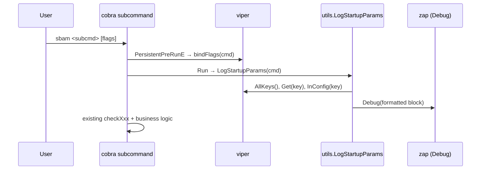

# Plan: Display effective startup parameters in debug logs

> Slug: `70-issue-display-startup-parameters` · Created: 2026-04-28
> Source issue: [#70](https://github.com/atbore-phx/sbam/issues/70)
> TASK: [70-issue-display-startup-parameters-TASK.md](70-issue-display-startup-parameters-TASK.md)

## 1. Task Analysis

**Goal.** When any sbam subcommand starts, after viper has been populated and
flags have been bound, emit a single multi-line **debug** log entry that lists
every effective parameter the subcommand will operate with, annotated with its
resolution source (`flag | env | yaml | default`). Secrets render as the
fixed literal `***`.

**Non-goals.** No new flags / env vars / config keys. No change to viper
precedence (already handled by issue [#68](https://github.com/atbore-phx/sbam/issues/68)).
No new top-level command. No persistence of the dump.

**Acceptance criteria** (verbatim summary from TASK):

- Debug dump emitted by `schedule`, `configure`, `estimate`.
- `apikey` is rendered as `***`.
- Source labels are `flag | env | yaml | default`, validated by tests
  mirroring [pkg/cmd/precedence_test.go](../../../pkg/cmd/precedence_test.go).
- One shared helper, no per-subcommand bespoke code.
- Adding a new (non-secret) flag to any subcommand makes it appear in the dump
  without editing the helper.
- Without `DEBUG=true`, no dump is emitted; existing behavior unchanged.

## 2. Current State

- Logger init at info/debug based on `DEBUG=true`:
  [src/utils/log.go](../../../src/utils/log.go).
- Error helpers in same package: [src/utils/error.go](../../../src/utils/error.go).
- Cobra root + viper bootstrap (config.yaml loading, `AutomaticEnv`,
  `bindFlags`): [pkg/cmd/root.go](../../../pkg/cmd/root.go).
- Subcommands all use `PersistentPreRunE: func(cmd, args) error { return bindFlags(cmd) }`
  and then read effective values via `viper.GetXxx`:
  - [pkg/cmd/schedule.go](../../../pkg/cmd/schedule.go)
  - [pkg/cmd/configure.go](../../../pkg/cmd/configure.go)
  - [pkg/cmd/estimate.go](../../../pkg/cmd/estimate.go)
- Precedence test patterns (`resetViper`, `writeConfig`, `newFlagCmd`):
  [pkg/cmd/precedence_test.go](../../../pkg/cmd/precedence_test.go).
- No env prefix is used; `viper.AutomaticEnv()` maps `key` → `KEY` (uppercase).

Implication: after `bindFlags(cmd)` runs in `PersistentPreRunE`, every pflag
of the executing subcommand is bound to viper. `viper.AllKeys()` then returns
the union of (bound flags ∪ keys present in `config.yaml` ∪ `viper.SetDefault`
keys), which is the right enumeration set for the dump.

## 3. Target Architecture

**New package members under `src/utils/`:**

- `SecretKeys` — package-level `map[string]struct{}` registry of viper key
  names whose values must be redacted. Initial contents: `{"apikey": {}}`.
- `DumpStartupParams(cmd *cobra.Command) string` — returns the formatted
  multi-line block. Pure function (no logging side effects) so tests can
  assert on the string directly.
- `LogStartupParams(cmd *cobra.Command)` — convenience wrapper that calls
  `DumpStartupParams` and emits the result via `Log.Debug`. Subcommands call
  this from their `Run`.

**Source detection algorithm** (per key, in this order, first match wins):

1. `flag` — `cmd.Flags().Lookup(key) != nil && cmd.Flags().Changed(key)`.
2. `env` — `os.LookupEnv(strings.ToUpper(key))` returns `ok`.
3. `yaml` — `viper.InConfig(key)` is true.
4. `default` — otherwise.

This mirrors viper's actual precedence (flag > env > config > default), and
matches the assertions already exercised by
[pkg/cmd/precedence_test.go](../../../pkg/cmd/precedence_test.go).

**Output format** (single zap debug entry, multi-line, fixed-width columns):

```
effective startup parameters (subcommand: schedule)
  apikey            = ***                source=flag
  batt_reserve_...  = ""                  source=default
  crontab           = "0 0 0 0 0"         source=default
  end_hr            = "00:55"             source=default
  fronius_ip        = "192.168.1.10"      source=env
  pw_consumption    = 12000               source=yaml
  ...
```

Rules:

- Keys are sorted alphabetically for deterministic output.
- Subcommand name comes from `cmd.Name()`.
- Values are rendered with `fmt.Sprintf("%#v", v)` so strings get quoted and
  bools/numbers render as their Go literal — sufficient for debug logs and
  trivially testable.
- Column widths are computed from the longest key in the set so the block
  stays aligned regardless of key population.

**Data flow:**



## 4. Dependency Choices

No new modules. Uses only the existing stack:

- `github.com/spf13/cobra` — already imported by `pkg/cmd/*`.
- `github.com/spf13/viper` — already imported.
- `github.com/spf13/pflag` — already imported transitively via cobra; used for
  `pflag.Flag` introspection in tests if needed.
- `go.uber.org/zap` (sugared) — already exposed as `utils.Log`.
- `github.com/stretchr/testify` — already used in tests.

`src/utils` does not currently import cobra/viper. We accept adding
`github.com/spf13/cobra` and `github.com/spf13/viper` imports to
`src/utils/startup.go` (a tiny widening of the package's surface). This is
acceptable because the helper is conceptually a CLI utility and there is no
circular dependency: `pkg/cmd` already imports `src/utils`, and `src/utils`
will not import `pkg/cmd`.

## 5. Configuration Changes

Configuration changes introduced by this implementation:

- **New env var:** `LOG_TYPE` — controls log encoding. Allowed values: `console` (default) or `json`.
- **Home Assistant add-on:** `home-assistant/addons/sbam/config.json` adds the `log_type` option (default `console`) and the add-on `run.sh` exports it as `LOG_TYPE` so the container respects the selected encoding.

No new `config.yaml` keys or CLI flags are required for this change (the logger is controlled via env / HA add-on option today).

## 6. Implementation Blueprint

### Step 1 — Create `src/utils/startup.go`

New file with the helper. Public API:

```go
package utils

import (
    "fmt"
    "os"
    "sort"
    "strings"

    "github.com/spf13/cobra"
    "github.com/spf13/viper"
)

// SecretKeys is the registry of viper keys whose values must be redacted in
// any user-visible dump. Append to this map when introducing a new flag that
// carries sensitive material.
var SecretKeys = map[string]struct{}{
    "apikey": {},
}

const redacted = "***"

// SourceOf returns one of "flag", "env", "yaml", "default" describing where
// the effective value of key was resolved from. cmd may be nil; in that case
// the "flag" check is skipped.
func SourceOf(cmd *cobra.Command, key string) string { ... }

// DumpStartupParams returns a deterministic, multi-line, human-friendly block
// listing every viper key reachable from the executing subcommand together
// with its effective value and resolution source. Secret keys are redacted.
// The function never panics on nil/empty inputs.
func DumpStartupParams(cmd *cobra.Command) string { ... }

// LogStartupParams emits DumpStartupParams via Log.Debug. Safe to call from
// any subcommand's Run; produces no output when zap level is above Debug.
func LogStartupParams(cmd *cobra.Command) { Log.Debug("\n" + DumpStartupParams(cmd)) }
```

Implementation notes for `DumpStartupParams`:

- Keys = `viper.AllKeys()` (deduplicated by viper itself), sorted.
- Compute `maxKeyLen := max(len(key))` for column alignment.
- For each key:
  - `value := viper.Get(key)`.
  - If `_, secret := SecretKeys[key]; secret` then render `redacted` instead
    of the value.
  - Else render `fmt.Sprintf("%#v", value)`.
  - Append `source=<SourceOf(cmd, key)>`.
- Header line: `effective startup parameters (subcommand: <cmd.Name()>)`.
  When `cmd == nil`, omit the parenthesised suffix.
- Return the assembled string with `\n` separators (no trailing newline).

Implementation notes for `SourceOf`:

- `flag`: requires `cmd != nil && cmd.Flags().Lookup(key) != nil && cmd.Flags().Changed(key)`.
- `env`: `_, ok := os.LookupEnv(strings.ToUpper(key)); ok`. (No prefix today;
  matches viper's `AutomaticEnv()` mapping.)
- `yaml`: `viper.InConfig(key)`.
- `default`: fallthrough.

### Step 2 — Wire the helper into the three subcommands

For each of [pkg/cmd/schedule.go](../../../pkg/cmd/schedule.go),
[pkg/cmd/configure.go](../../../pkg/cmd/configure.go), and
[pkg/cmd/estimate.go](../../../pkg/cmd/estimate.go), insert one line at the
top of `Run` (or immediately after the last `viper.GetXxx` call but before
the `checkXxx` validation) so that the dump reflects the values the
subcommand will actually use:

```go
Run: func(cmd *cobra.Command, args []string) {
    // ... existing viper.GetXxx assignments ...
    u.LogStartupParams(cmd)
    // ... existing checkXxx + business logic ...
},
```

Placement rationale: `bindFlags` already ran in `PersistentPreRunE`, and the
local variables have just been pulled from viper, so the dump is guaranteed
to reflect what the subcommand will use. No business behavior changes.

### Step 3 — Tests for the helper (`src/utils/startup_test.go`)

New file. Borrow `resetViper` / `writeConfig` patterns from
[pkg/cmd/precedence_test.go](../../../pkg/cmd/precedence_test.go) (copy
locally to avoid `pkg/cmd` ↔ `src/utils` test cycles).

Test cases:

1. **`TestDumpStartupParams_Expected`** — happy path with mixed sources.
   - YAML: `url: from-yaml`.
   - Env: `FRONIUS_IP=from-env`.
   - Flag: cobra command with `--apikey=secret-value` set.
   - Defaults: a bool flag left untouched.
   - Assert the returned string contains:
     - `apikey            = ***` and `source=flag`
     - `fronius_ip        = "from-env"` and `source=env`
     - `url               = "from-yaml"` and `source=yaml`
     - the bool flag with `source=default`
   - Assert the `apikey` raw value never appears.
2. **`TestDumpStartupParams_NumericAndBoolDefaults`** — edge case with zero
   values; assert each renders as Go literal and source is `default`.
3. **`TestDumpStartupParams_NoFlagsNoConfig`** — failure-mode resilience.
   Pass `cmd == nil` and an empty viper; assert the function returns the
   header line only and does not panic.
4. **`TestDumpStartupParams_AutoDiscoversNewFlag`** — auto-discovery
   guarantee. Register a brand-new flag `--probe_only` on a probe command,
   call `bindFlags(cmd)` (re-implemented locally as a 4-line helper to avoid
   importing `pkg/cmd`), call `DumpStartupParams(cmd)`, assert
   `probe_only` appears with `source=default` (or `flag` if explicitly set).
   This proves the helper does not need to be edited when subcommands grow.
5. **`TestSecretKeys_RedactsRegisteredKey`** — register a temporary secret
   key (`SecretKeys["new_secret"] = struct{}{}`; restore via `t.Cleanup`),
   set its value via `viper.Set`, assert the dump renders `***`.
6. **`TestLogStartupParams_DoesNotPanic`** — smoke test that the wrapper
   runs against a real cobra command without panicking.

All tests use `t.Cleanup(viper.Reset)` and never call `t.Parallel()` (global
viper state, same convention as the existing precedence tests).

### Step 4 — Existing test sweep

Re-run the existing suite to confirm no regression. No source files outside
`src/utils/` and `pkg/cmd/{schedule,configure,estimate}.go` are touched.

## 7. Test Plan

| Package        | Expected                                | Edge                                                    | Failure                                              | Mocks                                            |
| -------------- | --------------------------------------- | ------------------------------------------------------- | ---------------------------------------------------- | ------------------------------------------------ |
| `src/utils`    | Mixed source dump with redacted secret  | Zero-valued numeric/bool keys; auto-discovery of a new flag | `cmd==nil` + empty viper returns header, no panic | None (in-process viper + cobra)                  |
| `pkg/cmd`      | Existing precedence tests still pass    | n/a                                                     | n/a                                                  | Existing patterns                                |
| `pkg/fronius`  | Unchanged                               | Unchanged                                               | Unchanged                                            | `tbrandon/mbserver` (existing)                   |
| `pkg/power`    | Unchanged                               | Unchanged                                               | Unchanged                                            | `httptest.NewServer` (existing)                  |
| `pkg/storage`  | Unchanged                               | Unchanged                                               | Unchanged                                            | `httptest.NewServer` (existing)                  |

`defer` cleanup reminder: every test that mutates `viper` must register
`t.Cleanup(viper.Reset)`; every test that mutates `SecretKeys` must restore
the original map via `t.Cleanup`.

## 8. Validation Gates

The implementer MUST run and pass, in order:

1. `make test` — full suite green.
2. `go test ./src/utils/...` — focused run of new tests.
3. `go test ./pkg/cmd/...` — regression check against precedence tests.
4. `make build` — `bin/sbam` builds with `CGO_ENABLED=0`.
5. Manual smoke (optional but recommended):
   - `DEBUG=true ./bin/sbam schedule --fronius_ip=1.2.3.4 --apikey=foo --url=http://x` → confirm the dump appears once and `apikey=***`.
   - Without `DEBUG=true`, confirm no dump appears.
  - `DEBUG=true ./bin/sbam schedule --fronius_ip=1.2.3.4 --apikey=foo --url=http://x` → confirm the dump appears once and `apikey=***`.
  - `LOG_TYPE=json DEBUG=true ./bin/sbam schedule --fronius_ip=1.2.3.4 --apikey=foo --url=http://x` → confirm logs are JSON encoded and keys + sources appear in structured fields; `apikey` must be redacted.
  - `LOG_TYPE=console DEBUG=true ./bin/sbam schedule --fronius_ip=1.2.3.4 --apikey=foo --url=http://x` → confirm console-encoded (human friendly) output with level coloring when terminal supports it.
  - Without `DEBUG=true`, confirm no startup parameter dump appears.

No `docker build` is required because the Dockerfile is unchanged.

## 9. Rollout / Backward Compatibility

- Defaults: feature is opt-in via the existing `DEBUG=true` env var. Default
  production behavior is unchanged.
- Migration: none. No flag, env, yaml, or HA schema changes.
 - Defaults: feature is opt-in via the existing `DEBUG=true` env var. Default
   production behavior is unchanged.
 - Migration: Home Assistant add-on now exposes `log_type` (default `console`). The add-on's `run.sh` exports `LOG_TYPE` into the container; operators may need to reconfigure the add-on option if they expect JSON logs.
- Documentation:
  - Add a one-line note to [README.md](../../../README.md) under the
    debugging / troubleshooting section explaining that `DEBUG=true` now also
    prints the effective startup parameters. *(Optional; only if such a
    section already exists. Otherwise skip.)*
  - Append a `CHANGELOG.md` entry to
    [home-assistant/addons/sbam/CHANGELOG.md](../../../home-assistant/addons/sbam/CHANGELOG.md)
    under the next version stub: *"Debug logs now include the effective
    startup parameters of the executing subcommand."*

## 10. Security Considerations

- Secrets: enforced via `SecretKeys` registry. `apikey` is redacted; new
  secret-bearing flags MUST be added to `SecretKeys` in the same change that
  introduces them. This is called out in the package doc comment of
  `src/utils/startup.go`.
- Log injection: all values are rendered through `fmt.Sprintf("%#v", v)`,
  which Go-quotes strings, so embedded newlines and ANSI sequences are
  escaped — no log-forging vector.
- Data exposure scope: dump is debug-only and goes to stderr (zap default),
  never written to disk by sbam itself.
- OWASP A09 (logging & monitoring): improves observability without weakening
  confidentiality.

## 11. Gotchas

- **Order in `Run`**: `LogStartupParams(cmd)` MUST be called *after* the
  `viper.GetXxx` block but *before* `checkXxx`, so that what the user sees
  matches what the subcommand will actually run with — and so that an early
  validation failure still produces the dump.
- **Env mapping**: `os.LookupEnv(strings.ToUpper(key))` is correct only while
  no `viper.SetEnvPrefix` is in effect. If a prefix is added later,
  `SourceOf` must be updated accordingly.
- **`viper.AllKeys()` includes config-only keys**: keys that exist in
  `config.yaml` but are not consumed by the current subcommand will also be
  printed. This is intentional and useful (it surfaces "stale" config), but
  the implementer should mention it in the helper's doc comment.
- **Single `init()` per package** ([pkg/cmd/root.go](../../../pkg/cmd/root.go)
  consolidated registration in init): do NOT add new `init()` functions in
  `pkg/cmd`; the helper call belongs in `Run`, not `init`.
- **Test isolation**: tests that mutate the global `viper` or `SecretKeys`
  must restore state with `t.Cleanup` and must NOT use `t.Parallel`.

## 12. Open Questions / Risks

- *Auto-discovery of keys* — RESOLVED in TASK (use `viper.AllKeys()` after
  `bindFlags`).
- *Env-only keys without a backing flag* — DEFERRED. Currently every public
  knob has a flag; if that ever changes, extend `DumpStartupParams` to also
  walk a registry of expected env names.
- *Log destination / format split* — DEFERRED. Keeping a single zap Debug
  call is sufficient for the issue's stated need.

## 13. Confidence Score

**9 / 10.** The change is small, fully local, mirrors patterns already
present in the codebase ([pkg/cmd/precedence_test.go](../../../pkg/cmd/precedence_test.go),
[src/utils/log.go](../../../src/utils/log.go)), and introduces no new
dependencies. The single point of remaining residual risk is the
`os.LookupEnv` / `viper.AutomaticEnv` mapping if a future `SetEnvPrefix` is
introduced — explicitly called out in §11.
