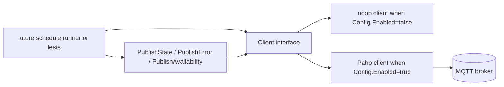

# PLAN: pkg/mqtt scaffold

> Feature slug: `84-issue-mqtt-scaffold`
> TASK: [84-issue-mqtt-scaffold-TASK.md](84-issue-mqtt-scaffold-TASK.md)
> Issue: https://github.com/atbore-phx/sbam/issues/84
> Parent issue: https://github.com/atbore-phx/sbam/issues/64
> Created: 2026-05-03

---

## 1. Task Analysis

Goal: create the initial `pkg/mqtt` package for the v2.0.0 MQTT feed. The package must expose typed payloads, a small `Client` interface, a noop implementation for disabled MQTT, a Paho-backed implementation for enabled MQTT, and typed publish helpers for state, error, and availability messages.

Non-goals for this issue:

- Do not wire MQTT into `pkg/cmd`, `config.yaml`, environment variables, or the Home Assistant add-on.
- Do not implement Home Assistant discovery payload generation beyond defining `DiscoveryEntity`.
- Do not implement the MQTT command parser or schedule runner refactor.
- Do not comment on, close, or otherwise mutate the GitHub issue.

Acceptance criteria from the TASK:

- `mqtt_enabled=false` -> `New(cfg)` returns a noop client, creates zero broker connections, and emits zero new log lines.
- `mqtt_enabled=true` -> connects with LWT (`<base>/availability=offline`, retained, QoS 1), auto-reconnect from 1s to 60s with jitter, and TLS support with optional `mqtt_tls_ca_file`.
- In-process broker tests exercise state publish round-trip, retained availability, reconnect after broker stop/start, and bad credentials.
- `pkg/mqtt` imports none of `pkg/cmd`, `pkg/fronius`, `pkg/power`, or `pkg/storage`.
- `make test` and `make build` pass with `CGO_ENABLED=0` build behavior intact.

---

## 2. Current State

There is currently no `pkg/mqtt` package in the workspace.

Relevant existing patterns to mirror:

| Concern | File | Pattern to follow |
| --- | --- | --- |
| Module and dependencies | [go.mod](../../../go.mod) | Go 1.26 module `sbam`; existing deps are direct in grouped `require` blocks. Add Paho and Mochi through `go get` and commit `go.mod`/`go.sum`. |
| Build gates | [Makefile](../../../Makefile) | `make test` runs `go test -cover ./...`; `make build` uses `CGO_ENABLED=0` and outputs `bin/sbam`. |
| Logger | [src/utils/log.go](../../../src/utils/log.go) | Shared zap sugared logger is `utils.Log`; use warn logs for swallowed publish errors, but do not log from noop construction/operations. |
| Config precedence | [pkg/cmd/root.go](../../../pkg/cmd/root.go) | Cobra/viper binding exists, but this issue must not touch it. Later wiring keeps flag > env > yaml. |
| Startup redaction | [src/utils/startup.go](../../../src/utils/startup.go) | Secret registry exists, but no new config keys are registered in this issue. Later integration adds MQTT secrets. |
| Test style | [pkg/power/power_test.go](../../../pkg/power/power_test.go) | Tests use `testify/assert`, local mock servers, and `defer` cleanup. |
| Parent MQTT blueprint | [64-issue-mqtt-feed-PLAN.md](../64-issue-mqtt-feed/64-issue-mqtt-feed-PLAN.md) | Defines the broader MQTT topic schema and config key set. Issue 84 implements only the package scaffold subset. |

---

## 3. Target Architecture

`pkg/mqtt` is a leaf package. It may import standard library packages, `sbam/src/utils`, Paho, and test-only Mochi packages. It must not import the CLI or business packages.



Public surface after this issue:

- `type Config struct` models the parent #64 MQTT keys.
- `type Client interface` abstracts connect, disconnect, publish, subscribe, and connection state.
- `func New(cfg Config) (Client, error)` returns noop or Paho implementation.
- `func NewNoop() Client` returns the disabled/test implementation.
- `func NewPaho(cfg Config) (*Paho, error)` validates enabled MQTT config and builds the Paho wrapper.
- `func PublishState(ctx context.Context, client Client, prefix string, payload StatePayload)` logs and swallows errors.
- `func PublishError(ctx context.Context, client Client, prefix string, payload ErrorPayload)` logs and swallows errors.
- `func PublishAvailability(ctx context.Context, client Client, prefix string, online bool)` logs and swallows errors.

Topic rules:

- Empty or whitespace prefix defaults to `sbam`.
- Leading/trailing `/` characters are trimmed from the prefix.
- Publish topics are `<prefix>/state`, `<prefix>/error`, and `<prefix>/availability`.
- State and availability are retained QoS 1.
- Error is not retained QoS 1.

---

## 4. Dependency Choices

Add these modules:

| Module | Version | Scope | URL | Rationale |
| --- | --- | --- | --- | --- |
| `github.com/eclipse/paho.mqtt.golang` | `v1.5.1` | production | https://pkg.go.dev/github.com/eclipse/paho.mqtt.golang | Stable MQTT v3.1.1 client with `ClientOptions`, TLS config, will support, publish/subscribe tokens, and `WaitTimeout`. |
| `github.com/mochi-mqtt/server/v2` | `v2.7.9` | tests | https://pkg.go.dev/github.com/mochi-mqtt/server/v2 | Embedded MQTT broker with TCP/net listeners, retained messages, auth hooks, and v3.1.1 compatibility for Paho integration tests. |

Implementation command:

```bash
go get github.com/eclipse/paho.mqtt.golang@v1.5.1 github.com/mochi-mqtt/server/v2@v2.7.9
go mod tidy
```

Notes:

- Go does not have test-only dependencies in `go.mod`; Mochi may appear as a direct or indirect module after `go mod tidy` depending on imports.
- Keep dependency additions limited to these two modules and their transitive dependencies.

---

## 5. Configuration Changes

No repository configuration files change in issue 84.

Do not edit:

- [config.yaml](../../../config.yaml)
- [pkg/cmd/root.go](../../../pkg/cmd/root.go)
- [pkg/cmd/schedule.go](../../../pkg/cmd/schedule.go)
- [src/utils/startup.go](../../../src/utils/startup.go)
- [home-assistant/addons/sbam/config.json](../../../home-assistant/addons/sbam/config.json)
- [home-assistant/addons/sbam/run.sh](../../../home-assistant/addons/sbam/run.sh)

The new package `Config` should still model the eventual config key set from #64 so later wiring can pass values through without reshaping the package API:

| Future key | `Config` field | Type | Package default behavior |
| --- | --- | --- | --- |
| `mqtt_enabled` | `Enabled` | `bool` | `false` returns noop. |
| `mqtt_broker` | `Broker` | `string` | Required only when `Enabled=true`. |
| `mqtt_client_id` | `ClientID` | `string` | Empty defaults to `sbam-<hostname>`. |
| `mqtt_username` | `Username` | `string` | Optional. |
| `mqtt_password` | `Password` | `string` | Optional; never log. |
| `mqtt_tls_ca_file` | `TLSCAFile` | `string` | Optional PEM CA bundle for TLS schemes. |
| `mqtt_tls_client_cert` | `TLSClientCert` | `string` | Optional mTLS cert path. |
| `mqtt_tls_client_cert_key` | `TLSClientCertKey` | `string` | Optional mTLS key path; never log. |
| `mqtt_tls_insecure_skip` | `TLSInsecureSkip` | `bool` | Optional dev-only TLS behavior; warn when used. |
| `mqtt_topic_prefix` | `TopicPrefix` | `string` | Empty defaults to `sbam`. |
| `mqtt_ha_discovery` | `HADiscovery` | `bool` | Stored for later, unused by this issue except type compatibility. |

Precedence remains a later `pkg/cmd` concern: flag > env > yaml > default.

---

## 6. Implementation Blueprint

### Step 1: add dependencies

Target files:

- [go.mod](../../../go.mod)
- `go.sum`

Actions:

1. Run `go get github.com/eclipse/paho.mqtt.golang@v1.5.1 github.com/mochi-mqtt/server/v2@v2.7.9`.
2. Run `go mod tidy`.
3. Confirm no unrelated dependency churn beyond required transitive modules.

Rationale: Paho is needed by production code; Mochi is needed by package tests.

### Step 2: create `pkg/mqtt/types.go`

Target file: `pkg/mqtt/types.go`

Define the core typed data structures:

```go
package mqtt

import "time"

type Config struct {
    Enabled          bool
    Broker           string
    ClientID         string
    Username         string
    Password         string
    TLSCAFile        string
    TLSClientCert    string
    TLSClientCertKey string
    TLSInsecureSkip  bool
    TopicPrefix      string
    HADiscovery      bool
}

type StatePayload struct {
    BatterySOCPct       float64   `json:"battery_soc_pct"`
    BatteryCapacityWh   float64   `json:"battery_capacity_wh"`
    ForecastTodayWh     float64   `json:"forecast_today_wh"`
    LastDecision        string    `json:"last_decision"`
    LastDecisionReason  string    `json:"last_decision_reason,omitempty"`
    Paused              bool      `json:"paused"`
    NextRun             *time.Time `json:"next_run,omitempty"`
    Timestamp           time.Time `json:"ts"`
}

type ErrorPayload struct {
    Error     string    `json:"error"`
    Source    string    `json:"source,omitempty"`
    Timestamp time.Time `json:"ts"`
}

type AckPayload struct {
    Status    string    `json:"status"`
    Error     string    `json:"error,omitempty"`
    Timestamp time.Time `json:"ts"`
}

type IntentKind string

const (
    IntentPause       IntentKind = "pause"
    IntentResume      IntentKind = "resume"
    IntentForceCharge IntentKind = "force_charge"
    IntentSetDefaults IntentKind = "set_defaults"
    IntentSetReserve  IntentKind = "set_reserve"
    IntentTriggerNow  IntentKind = "trigger_now"
)

type Intent struct {
    Kind          IntentKind `json:"kind"`
    TargetPct     int        `json:"target_pct,omitempty"`
    DurationS     int        `json:"duration_s,omitempty"`
    PwBattReserve float64    `json:"pw_batt_reserve,omitempty"`
}

type DiscoveryEntity struct {
    Component string `json:"component"`
    ObjectID  string `json:"object_id"`
    Topic     string `json:"topic"`
    Payload   []byte `json:"payload"`
}
```

Implementation notes:

- `Intent` and `DiscoveryEntity` are only skeletal carrier types here. Do not implement command parsing or discovery builders in this issue.
- Keep field names aligned with #64 so later runner/discovery work does not need payload renames.
- Use `time.Time` for required timestamps and `*time.Time` for optional timestamps so JSON marshals non-nil values as RFC3339 and omits absent optional values.

### Step 3: create `pkg/mqtt/client.go`

Target file: `pkg/mqtt/client.go`

Define the interface, factory, shared constants, and topic helper signatures:

```go
package mqtt

import "context"

type MessageHandler func(topic string, payload []byte)

type Client interface {
    Connect(ctx context.Context) error
    Disconnect(ctx context.Context) error
    Publish(ctx context.Context, topic string, qos byte, retained bool, payload []byte) error
    Subscribe(ctx context.Context, topic string, qos byte, handler MessageHandler) error
    IsConnected() bool
}

const (
    defaultTopicPrefix = "sbam"
    qosAtLeastOnce     = byte(1)
)

func New(cfg Config) (Client, error) {
    if !cfg.Enabled {
        return NewNoop(), nil
    }
    return NewPaho(cfg)
}

func normalizePrefix(prefix string) string
func stateTopic(prefix string) string
func errorTopic(prefix string) string
func availabilityTopic(prefix string) string
```

Behavior:

- `New(Config{Enabled:false})` must return a noop and no error.
- `New` must not log when returning noop.
- Topic helpers trim whitespace and `/`; empty result becomes `sbam`.

Rationale: callers get one stable constructor and topic construction stays centralized.

### Step 4: create `pkg/mqtt/noop.go`

Target file: `pkg/mqtt/noop.go`

Define the disabled/test client:

```go
type Noop struct{}

func NewNoop() *Noop
func (n *Noop) Connect(ctx context.Context) error
func (n *Noop) Disconnect(ctx context.Context) error
func (n *Noop) Publish(ctx context.Context, topic string, qos byte, retained bool, payload []byte) error
func (n *Noop) Subscribe(ctx context.Context, topic string, qos byte, handler MessageHandler) error
func (n *Noop) IsConnected() bool
```

Behavior:

- Every method returns `nil` except `IsConnected`, which returns `false`.
- Methods must not log.
- Methods must not inspect or mutate network state.

Rationale: default behavior stays inert and future integration can depend on a real `Client` without special casing disabled MQTT.

### Step 5: create `pkg/mqtt/paho.go`

Target file: `pkg/mqtt/paho.go`

Define the production client around Paho:

```go
import paho "github.com/eclipse/paho.mqtt.golang"

type Paho struct {
    cfg       Config
    client    paho.Client
    closeOnce sync.Once
    closed    atomic.Bool
    reconnect atomic.Bool
}

func NewPaho(cfg Config) (*Paho, error)
func (p *Paho) Connect(ctx context.Context) error
func (p *Paho) Disconnect(ctx context.Context) error
func (p *Paho) Publish(ctx context.Context, topic string, qos byte, retained bool, payload []byte) error
func (p *Paho) Subscribe(ctx context.Context, topic string, qos byte, handler MessageHandler) error
func (p *Paho) IsConnected() bool
```

Validation and options:

- `NewPaho` returns an error when `cfg.Broker` is empty.
- Accept broker schemes `tcp`, `tls`, `ssl`, `ws`, and `wss`; reject everything else before creating the client.
- Default `cfg.TopicPrefix` through the topic helpers rather than mutating caller input.
- Default empty `cfg.ClientID` to `sbam-<hostname>` using `os.Hostname`; if hostname fails, use `sbam`.
- Build options with `paho.NewClientOptions().AddBroker(cfg.Broker)`.
- Set username/password only when non-empty.
- Set `SetWill(availabilityTopic(cfg.TopicPrefix), "offline", 1, true)`.
- Set `SetOrderMatters(false)` so callbacks do not risk blocking the Paho router.
- Set bounded connect/write behavior: `SetConnectTimeout(5*time.Second)`, `SetWriteTimeout(5*time.Second)`, `SetKeepAlive(30*time.Second)`, `SetPingTimeout(10*time.Second)`.
- Do not rely on Paho's built-in auto-reconnect for jitter. Set `SetAutoReconnect(false)` and implement the package reconnect loop described below.
- Set `SetConnectionLostHandler` to start the package reconnect loop unless `Disconnect` has been called.
- Set `SetOnConnectHandler` to publish retained `online` availability through the raw Paho client.

TLS behavior:

- Build `*tls.Config` for `tls`, `ssl`, and `wss` schemes.
- If `TLSCAFile` is set, read it, append PEM certs to `x509.SystemCertPool()` (or a new pool if system pool fails), and return an error if no certs append.
- If either `TLSClientCert` or `TLSClientCertKey` is set, require both and load them with `tls.LoadX509KeyPair`.
- If `TLSInsecureSkip` is true, set `InsecureSkipVerify` and log one warn when building the client. Do not log certificate/key contents.

Context/token handling:

- Implement a small helper `waitToken(ctx context.Context, token paho.Token) error`.
- If the context has a deadline, wait only until that deadline.
- Otherwise use a package default operation timeout of 5 seconds.
- Prefer `paho.WaitTokenTimeout(token, timeout)` where possible because Paho documents a subtle `WaitTimeout` nil-error case.
- Return context errors when `ctx.Done()` wins.

Reconnect loop:

- Because Paho v1.5.1 backoff doubles but does not add jitter, implement a package-owned reconnect loop to satisfy the issue acceptance criteria.
- On connection loss, start at 1 second, double up to 60 seconds, and apply +/-20 percent jitter before each reconnect attempt.
- Only one reconnect loop may run at a time; guard with `atomic.Bool` or a mutex.
- Stop reconnecting after `Disconnect` sets `closed=true`.
- Each reconnect attempt calls `p.client.Connect()` and uses `waitToken` with a short timeout.
- Log reconnect failures at warn level without secrets.
- Successful reconnect clears the reconnect guard; the `OnConnectHandler` publishes `online` availability.

Rationale: this satisfies the explicit jittered reconnect criterion while still using Paho for protocol implementation.

### Step 6: create `pkg/mqtt/publisher.go`

Target file: `pkg/mqtt/publisher.go`

Define typed publish helpers:

```go
func PublishState(ctx context.Context, client Client, prefix string, payload StatePayload)
func PublishError(ctx context.Context, client Client, prefix string, payload ErrorPayload)
func PublishAvailability(ctx context.Context, client Client, prefix string, online bool)
```

Behavior:

- Marshal payloads with `encoding/json`.
- If `Timestamp` is zero on `StatePayload`, `ErrorPayload`, or `AckPayload`, fill it with `time.Now()` before marshaling.
- `PublishState` publishes to `stateTopic(prefix)` with QoS 1 and retained true.
- `PublishError` publishes to `errorTopic(prefix)` with QoS 1 and retained false.
- `PublishAvailability(true)` publishes `online` to `availabilityTopic(prefix)` with QoS 1 and retained true.
- `PublishAvailability(false)` publishes `offline` to `availabilityTopic(prefix)` with QoS 1 and retained true.
- These helpers never return errors. On marshal or publish failure, log `utils.Log.Warnw` with topic, retained, qos, and error, but no raw secrets or full payloads.
- These helpers are allowed to import `sbam/src/utils`.

Rationale: future schedule code can call MQTT publishing without letting MQTT errors affect charging decisions.

### Step 7: create tests in `pkg/mqtt/mqtt_test.go`

Target file: `pkg/mqtt/mqtt_test.go`

Use one package-level test file unless the implementation becomes clearer split into `noop_test.go`, `paho_test.go`, and `publisher_test.go`. If split, keep all files under `pkg/mqtt`.

Recommended allow-all broker helper:

```go
func startAllowAllBroker(t *testing.T, addr string) (*mqttserver.Server, string) {
    t.Helper()
    if addr == "" {
        addr = "127.0.0.1:0"
    }

    ln, err := net.Listen("tcp", addr)
    require.NoError(t, err)

    server := mqttserver.New(nil)
    require.NoError(t, server.AddHook(new(auth.AllowHook), nil))

    listener := listeners.NewNet("tcp", ln)
    require.NoError(t, server.AddListener(listener))
    go func() { _ = server.Serve() }()
    t.Cleanup(func() { assert.NoError(t, server.Close()) })
    return server, listener.Address()
}
```

Use imports aliased like `mqttserver "github.com/mochi-mqtt/server/v2"`, `github.com/mochi-mqtt/server/v2/hooks/auth`, and `github.com/mochi-mqtt/server/v2/listeners`. For bad-credential tests, create a second helper that installs `auth.Hook` with an explicit ledger instead of `auth.AllowHook`.

Required tests:

1. `TestNewDisabledReturnsNoop`
   - Arrange `Config{Enabled:false}`.
   - Use `zaptest/observer` by temporarily replacing `utils.Log` to verify no log entries are emitted.
   - Assert returned client is `*Noop`, `IsConnected()==false`, and all methods return nil.
   - Assert no broker helper was started.

2. `TestPahoPublishStateRoundTrip`
   - Start Mochi with allow-all auth and `defer`/`t.Cleanup` close.
   - Create `Config{Enabled:true, Broker:"tcp://" + addr, TopicPrefix:"sbam", ClientID:"test-publisher"}`.
   - Connect client with a 2-5 second context.
   - Subscribe a second Paho test subscriber or the same client to `sbam/state`.
   - Call `PublishState` with a representative payload.
   - Assert received JSON contains `battery_soc_pct`, `battery_capacity_wh`, `forecast_today_wh`, `last_decision`, `paused`, and `ts`.

3. `TestPahoRetainedAvailability`
   - Connect the package client and publish `PublishAvailability(ctx, client, "sbam", true)`.
   - Connect a fresh subscriber after publication.
   - Subscribe to `sbam/availability` and assert retained payload `online` arrives.
   - Disconnect unexpectedly in a focused LWT test if practical; otherwise assert Paho options include will topic/payload through `client.OptionsReader()` in a package-internal test.

4. `TestPahoReconnectAfterBrokerRestart`
   - Start broker on a reusable loopback address.
   - Connect package client.
   - Close broker to trigger connection lost.
   - Restart broker on the same address.
   - Wait up to a bounded deadline for `client.IsConnected()` to become true again.
   - Publish/subscribe a small message after reconnect to prove the client works.
   - Keep delays short by making reconnect constants overrideable in tests, e.g. unexported package vars `initialReconnectDelay` and `maxReconnectDelay` set/reset by the test.

5. `TestPahoBadCredentials`
   - Start Mochi with an auth ledger requiring a known username/password.
   - Connect with wrong credentials.
   - Assert `Connect` returns an error within the context deadline and `IsConnected()==false`.

6. `TestInvalidTLSCAFile`
   - Use `Config{Enabled:true, Broker:"tls://127.0.0.1:8883", TLSCAFile:"/missing/file"}`.
   - Assert `NewPaho` returns an error before any network connection.

7. `TestTopicNormalization`
   - Inputs: `""`, `"sbam"`, `"/sbam/"`, `" site/sbam "`.
   - Assert expected state/error/availability topics.

8. `TestPublisherSwallowsErrors`
   - Use a fake `Client` whose `Publish` returns an error.
   - Replace `utils.Log` with a zap observer.
   - Call `PublishState`, `PublishError`, and `PublishAvailability`.
   - Assert no panic/no returned error and warn logs are emitted for failures.

Import-boundary test:

- Add a test or validation command that greps package imports, or use `go list -deps ./pkg/mqtt` in validation, to ensure `pkg/cmd`, `pkg/fronius`, `pkg/power`, and `pkg/storage` are absent.

---

## 7. Test Plan

Expected cases:

- Disabled config returns noop and produces no logs.
- Enabled config connects to an in-process broker.
- State payload publishes to `<prefix>/state` as retained QoS 1 JSON.
- Availability publishes to `<prefix>/availability` as retained QoS 1 `online` or `offline`.

Edge cases:

- Empty prefix defaults to `sbam`.
- Prefix with whitespace or slashes normalizes predictably.
- Empty client ID defaults from hostname.
- `TLSCAFile` omitted for plaintext `tcp://` broker succeeds.
- Reconnect loop sees a broker disappear and reappear on the same address.

Failure cases:

- Enabled config with empty broker fails in `NewPaho`.
- Unsupported broker scheme fails in `NewPaho`.
- Invalid TLS CA file fails before network I/O.
- Bad credentials fail to connect and do not mark the client connected.
- Publish errors are swallowed by typed helpers and logged at warn.
- Context timeout on connect/publish/subscribe returns promptly from `Paho` methods.

Mocks and test servers:

- Use `github.com/mochi-mqtt/server/v2` as the in-process broker.
- Use `github.com/mochi-mqtt/server/v2/hooks/auth` for allow-all and bad-credential tests.
- Use `github.com/mochi-mqtt/server/v2/listeners` with TCP or net listeners.
- Always `defer broker.Close()` or `t.Cleanup` broker close.
- Use `testify/assert` and `testify/require`.

---

## 8. Validation Gates

Run and pass these commands in order:

```bash
go mod tidy
go test ./pkg/mqtt -count=1
go test -race ./pkg/mqtt -count=1
go test ./pkg/... -count=1
make test
make build
```

Also run an import-boundary check:

```bash
go list -deps ./pkg/mqtt | grep -E 'sbam/pkg/(cmd|fronius|power|storage)' && exit 1 || true
```

Docker builds are not required for issue 84 because no Dockerfile or Home Assistant add-on files change.

---

## 9. Rollout / Backward Compatibility

- The new package is not wired into any command in this issue, so existing runtime behavior is unchanged.
- `New(Config{Enabled:false})` is inert by design, preserving the future default `mqtt_enabled=false` behavior.
- The package models future config fields but does not register flags, read Viper, export environment variables, or alter HA schema.
- Later integration issues must update README, Home Assistant docs, startup redaction, and project structure when they wire this package into runtime paths.
- Implementing issue 84 will add `pkg/mqtt` source files; the implementer should update `.github/copilot-instructions.md` Project Structure during the implementation prompt because source files outside `docs/implementations/**` will be added.

---

## 10. Security Considerations

- Treat broker configuration as sensitive. Never log `Password` or `TLSClientCertKey` values.
- TLS CA and client certificate files must be read from explicit paths only; do not expand shell syntax or execute anything from config values.
- `TLSInsecureSkip` is dangerous and should log a warn when used, but it remains a supported field for development/test setups.
- MQTT message payloads are untrusted when received. This issue only defines subscription plumbing; command parsing and payload validation are deferred to #86.
- Publish helpers should log payload byte length or topic metadata, not full payloads, to avoid leaking operational details unnecessarily.
- Reconnect loops must use bounded timers and respect `Disconnect` to avoid goroutine leaks.

---

## 11. Gotchas

- Paho v1.5.1 exposes `SetAutoReconnect` and `SetMaxReconnectInterval`, but its backoff implementation does not appear to add jitter. The issue explicitly requires jitter, so implement package-owned reconnect timing.
- Paho `Token.Wait()` can block indefinitely; use `WaitTokenTimeout` or context-aware token waiting.
- Paho defaults `OrderMatters=true`; set it false so callbacks do not block message routing.
- Paho package-level loggers default to no-op. Do not enable Paho DEBUG/WARN globally in production code for this issue.
- Mochi denies clients unless an auth hook permits them. Tests need `auth.AllowHook` for happy paths and an auth ledger/hook for bad credentials.
- Retained-message tests often need a fresh subscriber connected after publication to prove retention, not just a subscriber already online.
- Reconnect tests should avoid fixed public ports. Use `127.0.0.1:0` for first allocation, capture the selected address, and rebind that address for restart tests.
- If `x509.SystemCertPool()` returns nil or an error in minimal containers, create a new cert pool and append the configured CA file.
- Use `*time.Time` for optional timestamps such as `NextRun`; this avoids zero-time JSON surprises and still marshals non-nil values as RFC3339.

---

## 12. Open Questions / Risks

- `Config` fields and state payload shape: RESOLVED by parent #64 and user clarification on 2026-05-03.
- Issue 84 package-only scope: RESOLVED by user clarification on 2026-05-03.
- Paho jittered reconnect: RESOLVED by planning a package-owned reconnect loop instead of relying solely on Paho auto-reconnect.
- Mochi restart flakiness on CI: DEFERRED risk. Mitigate with bounded test deadlines, loopback-only listeners, and reduced reconnect delays under test.
- Future `Intent` ownership: DEFERRED risk. Issue 84 defines lightweight MQTT carrier types because the issue asks for them; #87 may adapt or map them into runner-owned intent types later.

---

## 13. Confidence Score

8/10.

This is a narrow package scaffold with clear acceptance criteria, but the reconnect-after-broker-restart test has some CI-flakiness risk because it depends on timing, listener rebinding, and Paho connection-loss detection. Confidence would rise to 9/10 after a short implementation spike proves the custom reconnect loop against Mochi on this workspace; if that test flakes during implementation, do the spike before continuing with the rest of the package.
