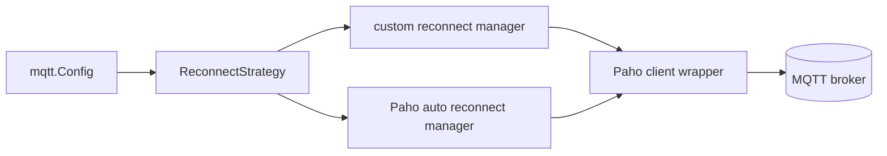

# PLAN: pkg/mqtt selectable reconnect strategy

> Feature slug: `84-issue-mqtt-scaffold`
> TASK: [84-issue-mqtt-scaffold-TASK.md](84-issue-mqtt-scaffold-TASK.md)
> Issue: https://github.com/atbore-phx/sbam/issues/84
> Parent issue: https://github.com/atbore-phx/sbam/issues/64
> Updated: 2026-05-05

---

## 1. Task Analysis

Issue 84 originally created the `pkg/mqtt` scaffold for the v2.0.0 MQTT feed: typed payloads, a small `Client` interface, noop behavior when MQTT is disabled, a Paho-backed client when enabled, typed publish helpers, TLS support, retained availability, and in-process broker tests.

That scaffold has already been implemented in this workspace. The remaining work for this refreshed plan is to evolve the implemented `pkg/mqtt` client so reconnect behavior is selectable:

- Keep the existing custom jittered reconnect loop as the default strategy.
- Add Paho's built-in `SetAutoReconnect(true)` behavior as an opt-in strategy.
- Exercise both strategies in tests so the project can compare behavior and later remove the weaker option with a small, obvious code change.

Non-goals remain unchanged from issue 84:

- Do not wire MQTT into `pkg/cmd`, `config.yaml`, environment variables, startup dumps, Docker, or the Home Assistant add-on.
- Do not implement Home Assistant discovery payload generation beyond the existing carrier type.
- Do not implement the MQTT command parser or schedule runner refactor.
- Do not comment on, close, or otherwise mutate the GitHub issue.

Acceptance criteria for this refresh:

- `Config{Enabled:false}` still returns a noop client with zero broker connections and zero disabled-mode logs.
- Default reconnect behavior remains custom jittered reconnect from 1 second to 60 seconds.
- Opt-in Paho reconnect sets Paho `AutoReconnect=true` and `MaxReconnectInterval=60s` without starting the custom reconnect loop.
- Tests prove both reconnect strategy selection paths and at least one broker restart path per strategy, or explicitly document any CI timing limitation in the test name and plan notes.
- `pkg/mqtt` still imports none of `pkg/cmd`, `pkg/fronius`, `pkg/power`, or `pkg/storage`.
- `make test` and `make build` stay green.

---

## 2. Current State

`pkg/mqtt` exists and is already wired as a leaf package.

| Concern | File | Current behavior |
| --- | --- | --- |
| Public interface and topic helpers | [pkg/mqtt/client.go](../../../pkg/mqtt/client.go) | Defines `Client`, `New(cfg)`, noop selection, and state/error/availability topic helpers. |
| MQTT config and payload types | [pkg/mqtt/types.go](../../../pkg/mqtt/types.go) | Defines `Config`, state/error/ack payloads, intent carrier types, and `DiscoveryEntity`. No reconnect strategy field exists yet. |
| Paho implementation | [pkg/mqtt/paho.go](../../../pkg/mqtt/paho.go) | Always calls `opts.SetAutoReconnect(false)` and starts a package-owned custom reconnect loop from `ConnectionLostHandler`. |
| Noop implementation | [pkg/mqtt/noop.go](../../../pkg/mqtt/noop.go) | All operations are inert and log-free. |
| Publish helpers | [pkg/mqtt/publisher.go](../../../pkg/mqtt/publisher.go) | Publish state/error/availability and swallow/log publish errors at warn. |
| MQTT tests | [pkg/mqtt/mqtt_test.go](../../../pkg/mqtt/mqtt_test.go) | Tests noop, topic normalization, round-trip publish, retained availability, custom reconnect after broker restart, bad credentials, TLS branches, token waits, and publisher warnings. |
| Dependencies | [go.mod](../../../go.mod) | Already includes `github.com/eclipse/paho.mqtt.golang v1.5.1` and `github.com/mochi-mqtt/server/v2 v2.7.9`. |
| Parent MQTT blueprint | [64-issue-mqtt-feed-PLAN.md](../64-issue-mqtt-feed/64-issue-mqtt-feed-PLAN.md) | Broader MQTT feed plan expects opt-in MQTT, Paho, HA discovery, commands, and later runtime wiring. This issue stays package-only. |

Important observation: the previous issue-84 PLAN said `pkg/mqtt` did not exist. That is now stale. This plan is intentionally incremental and should not recreate the scaffold from scratch.

---

## 3. Target Architecture

Keep `pkg/mqtt` as a leaf package, but separate reconnect policy from the rest of the Paho client setup.



Public surface additions:

```go
type ReconnectStrategy string

const (
    ReconnectStrategyCustom ReconnectStrategy = "custom"
    ReconnectStrategyPaho   ReconnectStrategy = "paho"
)

type Config struct {
    // existing fields...
    ReconnectStrategy ReconnectStrategy
}
```

Rules:

- Empty `Config.ReconnectStrategy` means `ReconnectStrategyCustom`.
- `ReconnectStrategyCustom` preserves the existing package-owned loop with jittered exponential backoff.
- `ReconnectStrategyPaho` delegates post-connect reconnect behavior to Paho via `SetAutoReconnect(true)` and `SetMaxReconnectInterval(reconnectMaxDelay)`.
- Invalid strategy values return an error from `NewPaho` before building the Paho client.
- Initial `Connect(ctx)` remains bounded by the caller's context. Do not enable Paho `SetConnectRetry(true)` in this issue because that changes initial connection semantics and can keep the connect token pending until the broker appears.

Internal separation goal:

- Keep custom-loop state in a custom reconnect component rather than on the root `Paho` struct where practical.
- Keep Paho-auto behavior in its own small component or helper.
- Keep common client setup, TLS, auth, LWT, `OnConnectHandler`, publish, subscribe, and token waiting strategy-agnostic.

---

## 4. Dependency Choices

No new dependencies are required.

Existing dependencies remain sufficient:

| Module | Version | Scope | URL | Use |
| --- | --- | --- | --- | --- |
| `github.com/eclipse/paho.mqtt.golang` | `v1.5.1` | production | https://pkg.go.dev/github.com/eclipse/paho.mqtt.golang | MQTT client, `ClientOptions.SetAutoReconnect`, `SetMaxReconnectInterval`, `SetReconnectingHandler`, `WaitTokenTimeout`. |
| `github.com/mochi-mqtt/server/v2` | `v2.7.9` | tests | https://pkg.go.dev/github.com/mochi-mqtt/server/v2 | In-process broker tests for round-trip, retained messages, restart, and credentials. |

Relevant Paho API notes from the docs:

- `SetAutoReconnect` controls automatic reconnection after connection loss; the `ConnectionLostHandler` is still called.
- `SetMaxReconnectInterval` caps the wait between reconnect attempts.
- `SetOnConnectHandler` runs on the initial connection and automatic reconnects.
- `SetConnectRetry` affects the initial `Connect` call and should remain disabled for this package until a separate requirement asks for it.
- `WaitTokenTimeout` avoids the subtle `Token.WaitTimeout` nil-error case already guarded in this codebase.

---

## 5. Configuration Changes

No repository runtime configuration surfaces change in this issue.

Do not edit:

- [config.yaml](../../../config.yaml)
- [pkg/cmd/root.go](../../../pkg/cmd/root.go)
- [pkg/cmd/schedule.go](../../../pkg/cmd/schedule.go)
- [src/utils/startup.go](../../../src/utils/startup.go)
- [home-assistant/addons/sbam/config.json](../../../home-assistant/addons/sbam/config.json)
- [home-assistant/addons/sbam/run.sh](../../../home-assistant/addons/sbam/run.sh)

Package-only config addition:

| Future key | `Config` field | Type | Default | Notes |
| --- | --- | --- | --- | --- |
| Deferred, likely `mqtt_reconnect_strategy` | `ReconnectStrategy` | `ReconnectStrategy` | `custom` | Package field only in issue 84. Later CLI/config wiring can expose `custom` or `paho` if needed. |

Precedence remains a later `pkg/cmd` concern: flag > env > yaml > default.

---

## 6. Implementation Blueprint

### Step 1: add reconnect strategy types

Target file: [pkg/mqtt/types.go](../../../pkg/mqtt/types.go)

Add:

```go
type ReconnectStrategy string

const (
    ReconnectStrategyCustom ReconnectStrategy = "custom"
    ReconnectStrategyPaho   ReconnectStrategy = "paho"
)
```

Extend `Config`:

```go
ReconnectStrategy ReconnectStrategy
```

Rationale: this keeps selection package-local and gives tests and future integration code a stable, typed selector. The zero value remains meaningful because an empty strategy maps to the custom default.

### Step 2: centralize strategy normalization

Target file: `pkg/mqtt/reconnect.go` (new) or [pkg/mqtt/paho.go](../../../pkg/mqtt/paho.go) if the change stays small.

Preferred helper:

```go
func normalizeReconnectStrategy(strategy ReconnectStrategy) (ReconnectStrategy, error) {
    switch ReconnectStrategy(strings.ToLower(strings.TrimSpace(string(strategy)))) {
    case "", ReconnectStrategyCustom:
        return ReconnectStrategyCustom, nil
    case ReconnectStrategyPaho:
        return ReconnectStrategyPaho, nil
    default:
        return "", fmt.Errorf("unsupported mqtt reconnect strategy %q", strategy)
    }
}
```

Rationale: invalid strategy values should fail fast in `NewPaho`, before network I/O. Keep the error message deterministic for tests.

If adding `reconnect.go`, the implementation prompt must update `.github/copilot-instructions.md` Project Structure because source files outside `docs/implementations/**` will be added.

### Step 3: separate reconnect manager behavior

Target files:

- [pkg/mqtt/paho.go](../../../pkg/mqtt/paho.go)
- `pkg/mqtt/reconnect_custom.go` (new, preferred)
- `pkg/mqtt/reconnect_paho.go` (new, preferred)

Preferred internal interface:

```go
type reconnectManager interface {
    configure(opts *paho.ClientOptions, client *Paho)
    stop()
    strategy() ReconnectStrategy
}
```

Update `Paho`:

```go
type Paho struct {
    cfg         Config
    client      paho.Client
    closeOnce   sync.Once
    closed      atomic.Bool
    reconnecter reconnectManager
}
```

Move custom-specific fields out of `Paho` and into the custom manager where practical:

- `closeCh`
- `reconnect atomic.Bool`
- `randMu`
- `rand`

Rationale: the root `Paho` wrapper should own MQTT operations. Reconnect-specific state should live beside the strategy that uses it. This is the easiest shape to remove later.

### Step 4: preserve custom reconnect as default

Target file: `pkg/mqtt/reconnect_custom.go` or [pkg/mqtt/paho.go](../../../pkg/mqtt/paho.go)

The custom manager should preserve current behavior:

- `opts.SetAutoReconnect(false)`.
- `opts.SetConnectionLostHandler` logs sanitized broker and starts exactly one custom reconnect loop unless `Paho.closed` is true.
- Loop starts at `reconnectBaseDelay`, doubles up to `reconnectMaxDelay`, and applies `reconnectJitterFactor`.
- Loop uses `waitToken(context.WithTimeout(...), p.client.Connect())` for each attempt.
- `stop()` closes the manager's `closeCh` once and clears the active reconnect guard.
- Existing helper behavior for `nextReconnectDelay`, `jitterDelay`, `waitReconnectDelay`, and sanitized broker logging is preserved.

Rationale: this path satisfies the original issue 84 requirement for jittered reconnect. It should remain the default until real-world evidence says otherwise.

### Step 5: add Paho auto-reconnect strategy

Target file: `pkg/mqtt/reconnect_paho.go` or [pkg/mqtt/paho.go](../../../pkg/mqtt/paho.go)

The Paho manager should configure only Paho-native reconnect behavior:

```go
opts.SetAutoReconnect(true)
opts.SetConnectRetry(false)
opts.SetMaxReconnectInterval(reconnectMaxDelay)
opts.SetConnectionLostHandler(func(client paho.Client, err error) {
    if p.closed.Load() {
        return
    }
    utils.Log.Warnw("mqtt connection lost", "broker", sanitizeBroker(p.cfg.Broker), "strategy", ReconnectStrategyPaho, "error", err)
})
opts.SetReconnectingHandler(func(client paho.Client, opts *paho.ClientOptions) {
    utils.Log.Warnw("mqtt reconnecting", "broker", sanitizeBroker(p.cfg.Broker), "strategy", ReconnectStrategyPaho)
})
```

Do not start the custom reconnect loop from this strategy.

Keep the existing common `SetOnConnectHandler` in [pkg/mqtt/paho.go](../../../pkg/mqtt/paho.go), because Paho calls it on initial connect and automatic reconnect. It should continue publishing retained `online` availability for both strategies.

Rationale: this gives a clean comparison of Paho's native behavior without mixing it with the custom loop.

### Step 6: update `NewPaho` wiring

Target file: [pkg/mqtt/paho.go](../../../pkg/mqtt/paho.go)

In `NewPaho`:

1. Validate broker and scheme as today.
2. Normalize `cfg.ReconnectStrategy`.
3. Store the normalized strategy back into `cfg.ReconnectStrategy` so tests can inspect `client.cfg.ReconnectStrategy`.
4. Build the common Paho options exactly as today: broker, client ID, order, timeouts, keepalive, ping timeout, LWT, auth, TLS, and `OnConnectHandler`.
5. Instantiate the selected reconnect manager and call `manager.configure(opts, p)` before `paho.NewClient(opts)`.
6. Assign `p.reconnecter = manager`.

In `Disconnect`:

- Set `closed=true` first, as today.
- Call `p.reconnecter.stop()` before `p.client.Disconnect(...)`.
- Keep idempotent `closeOnce` behavior and context-bounded waiting.

Rationale: common MQTT setup remains single-source, while reconnect behavior is selected in one obvious place.

### Step 7: keep publish/subscribe behavior unchanged

Target files:

- [pkg/mqtt/client.go](../../../pkg/mqtt/client.go)
- [pkg/mqtt/noop.go](../../../pkg/mqtt/noop.go)
- [pkg/mqtt/publisher.go](../../../pkg/mqtt/publisher.go)

No behavior changes expected.

Only touch these files if type additions require formatting or tests expose a compile issue. `New(cfg)` should keep returning noop when disabled and `NewPaho(cfg)` when enabled.

### Step 8: document removal paths in code tests or plan comments

Do not add broad comments in production code. A short test comment is acceptable if it clarifies why both strategies exist temporarily.

Removal path if Paho wins later:

- Change empty strategy default to `ReconnectStrategyPaho` if desired.
- Delete `reconnect_custom.go` and custom-only tests.
- Remove `ReconnectStrategyCustom` if no runtime compatibility promise exists yet.

Removal path if custom wins later:

- Delete `reconnect_paho.go` and Paho-strategy tests.
- Remove `ReconnectStrategyPaho` if no runtime compatibility promise exists yet.
- Keep `opts.SetAutoReconnect(false)` in the custom path.

Because this issue does not expose the field through CLI/config, removing either strategy later should not require user-facing migration work.

---

## 7. Test Plan

Use `testify/assert` and `testify/require`. Keep the existing `testBroker.Crash()` pattern that stops active broker-side clients before closing the Mochi server, because closing Mochi with active clients can block.

Expected cases:

- `TestNewPahoReconnectStrategyDefaultsToCustom`: `Config{Broker:"tcp://example.com:1883"}` normalizes to `ReconnectStrategyCustom` and Paho options have `AutoReconnect=false`.
- `TestNewPahoConfiguresPahoAutoReconnect`: `Config{Broker:"tcp://example.com:1883", ReconnectStrategy: ReconnectStrategyPaho}` produces Paho options with `AutoReconnect=true` and `MaxReconnectInterval==reconnectMaxDelay`.
- `TestReconnectAfterBrokerRestart` becomes table-driven with `ReconnectStrategyCustom` and `ReconnectStrategyPaho`, using the existing Mochi restart helper and proving `client.IsConnected()` eventually returns true and a post-reconnect publish succeeds.

Edge cases:

- Empty reconnect strategy defaults to custom.
- Case and whitespace around a strategy string normalize predictably if the helper accepts them.
- `Disconnect` while a custom reconnect delay is pending exits the loop and does not attempt another connect.
- `Disconnect` with Paho strategy remains idempotent and does not panic if Paho is in reconnect mode.

Failure cases:

- Invalid reconnect strategy returns a deterministic `NewPaho` error before network I/O.
- Bad credentials still fail connect and leave `IsConnected()==false` for both strategy values where practical.
- Broker restart test has bounded deadlines and fails clearly instead of hanging.

Focused test additions or updates:

1. [pkg/mqtt/mqtt_test.go](../../../pkg/mqtt/mqtt_test.go)
   - Add a table for strategy normalization.
   - Add options-reader assertions for custom vs Paho auto reconnect.
   - Convert broker restart test to table-driven by strategy.
   - Keep existing TLS, token, publisher, noop, and topic tests green.

2. New `pkg/mqtt/reconnect_test.go` is acceptable if the existing test file becomes too dense.
   - If added, update `.github/copilot-instructions.md` Project Structure during implementation.

CI timing guidance:

- Paho auto-reconnect timing is less directly controlled than the custom loop. Use bounded `assert.Eventually` windows and do not add sleeps.
- If the Paho integration restart test flakes locally, keep the option-configuration unit test required and mark the integration test with a focused helper that explains the timing dependency. Prefer making the test robust over skipping it.

Import-boundary validation:

```bash
go list -deps ./pkg/mqtt | grep -E 'sbam/pkg/(cmd|fronius|power|storage)' && exit 1 || true
```

---

## 8. Validation Gates

Run and pass these commands in order:

```bash
go test ./pkg/mqtt -count=1
go test -race ./pkg/mqtt -count=1
go test ./pkg/... -count=1
make test
make build
go list -deps ./pkg/mqtt | grep -E 'sbam/pkg/(cmd|fronius|power|storage)' && exit 1 || true
```

Docker builds are not required for this issue because no Dockerfile or Home Assistant add-on files change.

---

## 9. Rollout / Backward Compatibility

- Runtime behavior outside `pkg/mqtt` is unchanged because this issue does not wire MQTT into commands or config files.
- Default package behavior remains the current custom jittered reconnect loop.
- Existing tests and callers that do not set `ReconnectStrategy` should continue to behave as they do today.
- The new `Config.ReconnectStrategy` field is additive and zero-value compatible.
- Later runtime wiring can decide whether to expose `mqtt_reconnect_strategy=custom|paho`; this issue should not make that user-facing commitment.

Documentation required during implementation:

- Update `.github/copilot-instructions.md` Project Structure if new source files such as `pkg/mqtt/reconnect.go`, `pkg/mqtt/reconnect_custom.go`, `pkg/mqtt/reconnect_paho.go`, or `pkg/mqtt/reconnect_test.go` are added.
- No README, HA docs, or config docs are required because there is no user-facing config key yet.

---

## 10. Security Considerations

- Continue sanitizing broker URLs before logging so username/password in broker URLs are not emitted.
- Continue never logging `Config.Password` or `Config.TLSClientCertKey`.
- Paho strategy logs should include strategy and sanitized broker only, not payloads or credentials.
- Do not enable Paho global debug loggers in production code.
- Keep operation waits bounded through `waitToken`; Paho auto reconnect may let publish tokens complete after reconnect, so tests should avoid assuming a publish failed merely because the broker was briefly down.
- Do not enable `SetConnectRetry(true)` here. It permits publishing before initial connection is established and can change failure behavior for bad credentials or missing broker cases.

---

## 11. Gotchas

- Paho `NewClientOptions()` defaults `AutoReconnect` to true. The custom path must explicitly keep `SetAutoReconnect(false)`.
- `SetAutoReconnect(false)` still calls the `ConnectionLostHandler`; the custom path depends on that callback.
- `SetAutoReconnect(true)` also calls the `ConnectionLostHandler`; the Paho path must log only and must not start the custom loop.
- Paho `SetOnConnectHandler` runs on initial connect and automatic reconnect, which is exactly where the existing retained `online` availability publish belongs.
- Paho's built-in reconnect behavior does not expose the same jitter controls as the custom loop. That is acceptable because the goal is to compare strategies, not make Paho imitate the custom loop.
- Mochi broker shutdown can hang with active clients. Keep using the existing crash helper pattern that stops broker-side clients before closing the server.
- Reconnect tests should avoid fixed ports. Continue reserving a loopback address with `127.0.0.1:0`, then restart Mochi on the selected address.
- Do not use `time.Sleep` in tests. Use `assert.Eventually` with clear timeouts.

---

## 12. Open Questions / Risks

- Paho auto-reconnect timing under Mochi restart: DEFERRED risk. Mitigate with bounded eventually assertions and keep option-level tests mandatory.
- Which strategy should win long term: DEFERRED by design. This plan keeps both selectable so later evidence can decide.
- Whether to expose `mqtt_reconnect_strategy` through cobra/viper/HA add-on: DEFERRED to a later integration issue. Issue 84 stays package-only.
- Original issue 84 jittered reconnect acceptance: RESOLVED by keeping custom strategy as default.

---

## 13. Confidence Score

8/10.

The codebase already has a working custom reconnect implementation and strong MQTT tests, so the implementation shape is clear. The remaining uncertainty is Paho auto-reconnect timing in an in-process broker restart test. Confidence rises to 9/10 if a quick implementation spike shows the Paho strategy reconnects reliably against Mochi within the existing test timeout window.

---

## Revision History

- 2026-05-03: Initial issue-84 scaffold plan created before `pkg/mqtt` existed.
- 2026-05-05: Refreshed after issue 84 had been implemented. Scope changed to selectable reconnect strategies: default custom jittered reconnect plus opt-in Paho auto-reconnect, with clear separation and removal guidance.