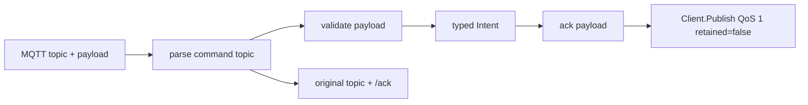

# PLAN: MQTT command parser and ack publisher

> Feature slug: `86-issue-mqtt-command-parser-ack-publisher`
> TASK: [86-issue-mqtt-command-parser-ack-publisher-TASK.md](86-issue-mqtt-command-parser-ack-publisher-TASK.md)
> Issue: https://github.com/atbore-phx/sbam/issues/86
> Parent issue: https://github.com/atbore-phx/sbam/issues/64
> Created: 2026-05-10

---

## 1. Task Analysis

Goal: implement the parser and acknowledgement layer for inbound MQTT command topics in `pkg/mqtt`.

The implementation must:

- Add a pure `ParseIntent(topic string, payload []byte) (Intent, error)` API or a name-compatible equivalent if current package conventions require it.
- Support canonical command topics `cmd/trigger_now`, `cmd/force_charge`, `cmd/set_defaults`, `cmd/pause`, and `cmd/resume` under any normalized topic prefix.
- Validate JSON payloads and range-check all command-specific values before returning an accepted intent.
- Bound input payloads with `MaxPayloadBytes = 4096`.
- Publish ack payloads on the original command topic plus `/ack`, using the issue #86 JSON contract: `ts`, `command`, `accepted`, and optional `error`.
 - Avoid panics for attacker-controlled topics or payloads.

Non-goals for this issue:

- No real MQTT subscriber wiring into the schedule runner.
- No Modbus, Fronius, Solcast, cron, CLI flag, config, Docker, or Home Assistant add-on changes.
- No `set_reserve` parser support, despite the older parent plan mentioning it. Keep existing `IntentSetReserve` if present, but do not expose it through issue #86 parsing.
- No new goroutine lifecycle or `goleak` dependency.

Acceptance criteria are copied from the TASK and resolved into the test plan below.

---

## 2. Current State

Relevant current files:

| Area | File | Current behavior |
| --- | --- | --- |
| MQTT package types | [pkg/mqtt/types.go](../../../pkg/mqtt/types.go) | Defines `Config`, `StatePayload`, `ErrorPayload`, `AckPayload`, `IntentKind`, and `Intent`. `Intent` lacks pause deadline data. `AckPayload` previously used a `status` field; updated for this feature. |
| MQTT client contract | [pkg/mqtt/client.go](../../../pkg/mqtt/client.go) | Defines `Client`, `MessageHandler`, topic prefix normalization, `stateTopic`, `errorTopic`, and `availabilityTopic`. No command topic parser exists. |
| Discovery command topics | [pkg/mqtt/discovery.go](../../../pkg/mqtt/discovery.go) | Defines private `commandTopic(prefix, name)` used by Home Assistant button discovery. Canonical command topics are `<prefix>/cmd/<name>`. |
| Publisher helpers | [pkg/mqtt/publisher.go](../../../pkg/mqtt/publisher.go) | Provides `PublishState`, `PublishError`, `PublishAvailability`, `PublishDiscovery`, and private `publishJSON`; no ack publisher exists. |
| MQTT tests and fakes | [pkg/mqtt/mqtt_test.go](../../../pkg/mqtt/mqtt_test.go) | Contains `fakeMQTTClient`, `publishCall`, in-process broker helpers, and existing publisher tests. Reuse these for ack tests. |

Module dependencies are already present; no new modules required.

---

## 3. Target Architecture

Keep the implementation inside `pkg/mqtt`.



Target public surface:

```go
const MaxPayloadBytes = 4096

var (
    ErrUnknownCommand  = errors.New("unknown command")
    ErrPayloadTooLarge = errors.New("payload too large")
    ErrInvalidPayload  = errors.New("invalid payload")
)

func ParseIntent(topic string, payload []byte) (Intent, error)
func PublishAck(ctx context.Context, client Client, topic string, intent Intent, parseErr error) error
```

Target type adjustments in [pkg/mqtt/types.go](../../../pkg/mqtt/types.go):

```go
type AckPayload struct {
    Timestamp time.Time `json:"ts"`
    Command   string    `json:"command"`
    Accepted  bool      `json:"accepted"`
    Error     string    `json:"error,omitempty"`
}

type Intent struct {
    Kind          IntentKind `json:"kind"`
    TargetPct     int16      `json:"target_pct,omitempty"`
    DurationS     int        `json:"duration_s,omitempty"`
    PauseUntil    *time.Time `json:"pause_until,omitempty"`
    PwBattReserve float64    `json:"pw_batt_reserve,omitempty"`
}
```

Keep `IntentSetReserve` in place for parent-feature compatibility, but issue #86 parsing must return `ErrUnknownCommand` for `cmd/set_reserve` unless the issue is explicitly broadened later.

---

## 4. Dependency Choices

No new Go modules.

Use only standard library packages for the parser and ack builder; existing project modules (Testify, Paho, Zap) are already present for tests and logging.

---

## 5. Implementation Blueprint

Step 1: Update MQTT types (`pkg/mqtt/types.go`)
- Update `AckPayload` and add `PauseUntil` to `Intent`.

Step 2: Add command parser (`pkg/mqtt/commands.go`)
- Implement `ParseIntent` and internal `parseIntentAt` with strict JSON decoding and payload size bounds. Accept only canonical command names.

Step 3: Add ack builder/publisher (`pkg/mqtt/commands.go`)
- Implement `buildAck` and `PublishAck` returning errors on publish failures and keeping ack topic conventions.

Step 4: Add tests (`pkg/mqtt/commands_test.go`)
- Table-driven tests for canonical commands, edge cases, failure cases, and ack publishing using `fakeMQTTClient`.

Step 5: Update repo docs (`.github/copilot-instructions.md`) to include the new source files under `pkg/mqtt`.

---

## 6. Test Plan

Package: `pkg/mqtt`

Expected cases:
- Every canonical command parses to the expected `IntentKind`.
- `force_charge` sets `TargetPct` and optional `DurationS`.
- `pause` sets `PauseUntil` from RFC3339 and duration payloads.
- Accepted ack payloads contain `ts`, canonical `command`, `accepted=true`, and no `error`.

Edge cases:
- `force_charge` boundary values: `target_pct=1`, `target_pct=100`, `duration_s=0`, `duration_s=86400`.
- `pause` deadline barely after `now`.
- Empty payload vs `{}` for no-argument commands.
- Nested topic prefixes such as `site/sbam/cmd/pause`.
    - Payload exactly `MaxPayloadBytes` bytes.

Failure cases:
- Blank or malformed topic.
- Unknown command sub-topic.
- Payload larger than `MaxPayloadBytes`.
- Malformed JSON, JSON arrays, JSON null, wrong field types, and unknown fields.
- Missing required `target_pct` or `until`.
- Out-of-range `target_pct` and `duration_s`.
- Past pause deadline, zero duration, and negative duration.
- Nil MQTT client and client publish failure in `PublishAck`.

Mocks:
- Reuse `fakeMQTTClient` and `publishCall` in [pkg/mqtt/mqtt_test.go].

---

## 7. Validation Gates

Run these before considering implementation complete:

```bash
go test ./pkg/mqtt -run 'TestParseIntent|TestBuildAck|TestPublishAck'
make test
make build
```

---

## 8. Rollout / Backward Compatibility

- Runtime behavior is unchanged until subscriber wiring calls `ParseIntent` and `PublishAck`.
 

---

## 9. Confidence

Confidence: 9/10. The package already contains the necessary structure and fakes to implement and test the parser and ack helper.
