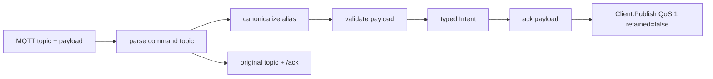

# PLAN: MQTT command parser and ack publisher

> Feature slug: `86-issue-mqtt-command-parser-ack-publisher`
> TASK: [86-issue-mqtt-command-parser-ack-publisher-TASK.md](86-issue-mqtt-command-parser-ack-publisher-TASK.md)
> Issue: https://github.com/atbore-phx/sbam/issues/86
> Parent issue: https://github.com/atbore-phx/sbam/issues/64
> Created: 2026-05-10

---

## 1. Task Analysis

Goal: implement the parser and acknowledgement layer for inbound MQTT command topics in `pkg/mqtt`.

The implementation must:

- Add a pure `ParseIntent(topic string, payload []byte) (Intent, error)` API or a name-compatible equivalent if current package conventions require it.
- Support canonical command topics `cmd/trigger_now`, `cmd/force_charge`, `cmd/set_defaults`, `cmd/pause`, and `cmd/resume` under any normalized topic prefix.
- Support legacy aliases `cmd/refresh`, `cmd/charge`, and `cmd/stop` and map them to canonical intents.
- Validate JSON payloads and range-check all command-specific values before returning an accepted intent.
- Bound input payloads with `MaxPayloadBytes = 4096`.
- Publish ack payloads on the original command topic plus `/ack`, using the issue #86 JSON contract: `ts`, `command`, `accepted`, and optional `error`.
- Avoid panics for attacker-controlled topics or payloads.

Non-goals for this issue:

- No real MQTT subscriber wiring into the schedule runner.
- No Modbus, Fronius, Solcast, cron, CLI flag, config, Docker, or Home Assistant add-on changes.
- No `set_reserve` parser support, despite the older parent plan mentioning it. Keep existing `IntentSetReserve` if present, but do not expose it through issue #86 parsing.
- No new goroutine lifecycle or `goleak` dependency.

Acceptance criteria are copied from the TASK and resolved into the test plan below.

---

## 2. Current State

Relevant current files:

| Area | File | Current behavior |
| --- | --- | --- |
| MQTT package types | [pkg/mqtt/types.go](../../../pkg/mqtt/types.go) | Defines `Config`, `StatePayload`, `ErrorPayload`, `AckPayload`, `IntentKind`, and `Intent`. `Intent` lacks pause deadline data. `AckPayload` still uses `status` rather than issue #86's `command` and `accepted` fields. |
| MQTT client contract | [pkg/mqtt/client.go](../../../pkg/mqtt/client.go) | Defines `Client`, `MessageHandler`, topic prefix normalization, `stateTopic`, `errorTopic`, and `availabilityTopic`. No command topic parser exists. |
| Discovery command topics | [pkg/mqtt/discovery.go](../../../pkg/mqtt/discovery.go) | Defines private `commandTopic(prefix, name)` used by Home Assistant button discovery. Canonical command topics are `<prefix>/cmd/<name>`. |
| Publisher helpers | [pkg/mqtt/publisher.go](../../../pkg/mqtt/publisher.go) | Provides `PublishState`, `PublishError`, `PublishAvailability`, `PublishDiscovery`, and private `publishJSON`; no ack publisher exists. |
| Init/subscription shape | [pkg/mqtt/init.go](../../../pkg/mqtt/init.go) | Demonstrates `Client.Subscribe` handler shape for `homeassistant/status`, but no command subscription. |
| Paho wrapper | [pkg/mqtt/paho.go](../../../pkg/mqtt/paho.go) | `Publish` validates blank topics, copies through to Paho, and returns token/context errors. `Subscribe` copies payload bytes before invoking handlers. |
| MQTT tests and fakes | [pkg/mqtt/mqtt_test.go](../../../pkg/mqtt/mqtt_test.go) | Contains `fakeMQTTClient`, `publishCall`, in-process broker helpers, and existing publisher tests. Reuse these for ack tests. |
| Discovery tests | [pkg/mqtt/discovery_test.go](../../../pkg/mqtt/discovery_test.go) | Asserts command button topics and publish helper conventions. |
| Scheduler caller fake | [pkg/cmd/schedule_test.go](../../../pkg/cmd/schedule_test.go) | Shows another simple fake MQTT `Client` used by scheduler tests. |
| Module dependencies | [go.mod](../../../go.mod) | Already includes Paho, mochi MQTT broker, Cobra, Viper, Testify, Zap, cron, Modbus, and mbserver. No dependency is needed for this issue. |

Issue #86 has no comments as of 2026-05-10. The issue body is authoritative where it conflicts with the older umbrella plan in [64-issue-mqtt-feed-PLAN.md](../64-issue-mqtt-feed/64-issue-mqtt-feed-PLAN.md), especially around ack payload shape and the narrowed command set.

---

## 3. Target Architecture

Keep the implementation inside `pkg/mqtt`.



Target public surface:

```go
const MaxPayloadBytes = 4096

var (
    ErrUnknownCommand  = errors.New("unknown command")
    ErrPayloadTooLarge = errors.New("payload too large")
    ErrInvalidPayload  = errors.New("invalid payload")
)

func ParseIntent(topic string, payload []byte) (Intent, error)
func PublishAck(ctx context.Context, client Client, topic string, intent Intent, parseErr error) error
```

Target type adjustments in [pkg/mqtt/types.go](../../../pkg/mqtt/types.go):

```go
type AckPayload struct {
    Timestamp time.Time `json:"ts"`
    Command   string    `json:"command"`
    Accepted  bool      `json:"accepted"`
    Error     string    `json:"error,omitempty"`
}

type Intent struct {
    Kind          IntentKind `json:"kind"`
    TargetPct     int16      `json:"target_pct,omitempty"`
    DurationS     int        `json:"duration_s,omitempty"`
    PauseUntil    *time.Time `json:"pause_until,omitempty"`
    PwBattReserve float64    `json:"pw_batt_reserve,omitempty"`
}
```

Keep `IntentSetReserve` in place for parent-feature compatibility, but issue #86 parsing must return `ErrUnknownCommand` for `cmd/set_reserve` unless the issue is explicitly broadened later.

Private helper shape in new [pkg/mqtt/commands.go](../../../pkg/mqtt/commands.go):

```go
type commandTopicInfo struct {
    RawName      string
    Canonical    IntentKind
    AckTopic     string
    KnownCommand bool
}

func parseCommandTopic(topic string) commandTopicInfo
func parseIntentAt(topic string, payload []byte, now time.Time) (Intent, error)
func buildAck(topic string, intent Intent, parseErr error, now time.Time) (string, AckPayload, error)
```

`parseIntentAt` exists only to keep pause deadline tests deterministic; `ParseIntent` should call it with `time.Now().UTC()`.

---

## 4. Dependency Choices

No new Go modules.

Use only standard library packages:

- `bytes` or `strings` for whitespace trimming and topic parsing.
- `context` for `PublishAck`.
- `encoding/json` for strict payload decoding and ack marshaling.
- `errors` and `fmt` for sentinel errors with `errors.Is` support.
- `time` for `time.RFC3339`, `time.Parse`, `time.ParseDuration`, and UTC ack timestamps.

External references checked during planning:

- Go `time.ParseDuration` accepts signed duration strings with units such as `s`, `m`, and `h`: https://pkg.go.dev/time#ParseDuration
- Go `time.RFC3339` layout is `2006-01-02T15:04:05Z07:00`: https://pkg.go.dev/time#RFC3339
- `encoding/json.Decoder.DisallowUnknownFields` rejects unknown object keys when decoding into structs: https://pkg.go.dev/encoding/json#Decoder.DisallowUnknownFields

Do not add `go.uber.org/goleak`; this issue should not introduce goroutines.

---

## 5. Configuration Changes

No configuration changes.

- New CLI flags: none.
- New `config.yaml` keys: none.
- New environment variables: none.
- Home Assistant add-on schema changes: none.
- Viper precedence remains unchanged and irrelevant to this parser-only task.

---

## 6. Implementation Blueprint

### Step 1: Update existing MQTT payload types

File: [pkg/mqtt/types.go](../../../pkg/mqtt/types.go)

Changes:

1. Replace `AckPayload` fields with the issue #86 contract:

   ```go
   Timestamp time.Time `json:"ts"`
   Command   string    `json:"command"`
   Accepted  bool      `json:"accepted"`
   Error     string    `json:"error,omitempty"`
   ```

2. Add `PauseUntil *time.Time `json:"pause_until,omitempty"`` to `Intent`.
3. Keep all existing `IntentKind` constants, including `IntentSetReserve`, for compatibility.

Rationale: `AckPayload` already exists and has no current references beyond its type definition, so updating it is lower-risk than creating a parallel ack payload type. `PauseUntil` lets the parser return a validated deadline without requiring a later runner to reparse raw MQTT payloads.

### Step 2: Add command topic parsing and validation

File: [pkg/mqtt/commands.go](../../../pkg/mqtt/commands.go)

Add:

```go
const MaxPayloadBytes = 4096

var (
    ErrUnknownCommand  = errors.New("unknown command")
    ErrPayloadTooLarge = errors.New("payload too large")
    ErrInvalidPayload  = errors.New("invalid payload")
)

func ParseIntent(topic string, payload []byte) (Intent, error)
```

Topic parsing rules:

1. Trim leading and trailing whitespace and `/`.
2. Accept both bare `cmd/<name>` and prefixed `<prefix>/cmd/<name>` topics, including nested prefixes like `site/sbam/cmd/pause`.
3. Reject blank topics, topics without `/cmd/`, topics ending in `/cmd`, ack topics such as `sbam/cmd/pause/ack`, and topics with extra path segments after the command name.
4. Map aliases before payload validation:
   - `refresh` -> `IntentTriggerNow`
   - `charge` -> `IntentForceCharge`
   - `stop` -> `IntentSetDefaults`
5. Return `ErrUnknownCommand` for unknown names, including `set_reserve` in this issue.

Payload validation rules:

1. Reject `len(payload) > MaxPayloadBytes` before JSON decoding.
2. For `trigger_now`, `set_defaults`, and `resume`, accept only empty payload or `{}` after whitespace trimming.
3. For `force_charge`, decode a strict JSON object with:
   - required `target_pct` as integer in `[1,100]`
   - optional `duration_s` as integer in `[0,86400]`
   - no unknown fields
4. For `pause`, decode a strict JSON object with required string `until`:
   - First try `time.Parse(time.RFC3339, until)`.
   - If RFC3339 parsing fails, try `time.ParseDuration(until)`.
   - Duration values must be positive; use `now.Add(duration)` as the deadline.
   - The final deadline must be after `now`.
5. Wrap all malformed payload failures with `ErrInvalidPayload` so callers can use `errors.Is(err, ErrInvalidPayload)`.

Implementation detail:

```go
func ParseIntent(topic string, payload []byte) (Intent, error) {
    return parseIntentAt(topic, payload, time.Now().UTC())
}
```

Keep `parseIntentAt` unexported and call it from tests in package `mqtt` for deterministic pause deadline cases.

### Step 3: Add ack builder and publisher

File: [pkg/mqtt/commands.go](../../../pkg/mqtt/commands.go)

Add:

```go
func PublishAck(ctx context.Context, client Client, topic string, intent Intent, parseErr error) error
```

Behavior:

1. Build the ack topic from the original command topic by appending `/ack` to the normalized original topic.
   - `sbam/cmd/force_charge` -> `sbam/cmd/force_charge/ack`
   - `sbam/cmd/charge` -> `sbam/cmd/charge/ack`
   - `sbam/cmd/nope` -> `sbam/cmd/nope/ack`
2. For accepted commands (`parseErr == nil`):
   - `accepted=true`
   - `command=string(intent.Kind)`
   - omit `error`
3. For rejected known or alias commands:
   - `accepted=false`
   - `command` is the canonical command name resolved from the topic, even if payload parsing failed
   - `error` is stable and human-readable
4. For unknown commands:
   - `accepted=false`
   - `command` is the raw sub-topic name
   - `error="unknown command"`
5. Publish with QoS 1 and `retained=false`, matching the issue and existing `qosAtLeastOnce` convention.
6. Return errors for nil `client`, invalid ack topic, JSON marshal failure, or `client.Publish` failure.
7. Log publish failures with the same structured fields used in [pkg/mqtt/publisher.go](../../../pkg/mqtt/publisher.go), but do not swallow errors from `PublishAck`.

Suggested helper:

```go
func buildAck(topic string, intent Intent, parseErr error, now time.Time) (string, AckPayload, error)
```

Tests can call `buildAck` directly for timestamp and alias behavior without needing a broker.

### Step 4: Add command parser and ack tests

New file: [pkg/mqtt/commands_test.go](../../../pkg/mqtt/commands_test.go)

Use package `mqtt` rather than `mqtt_test` so tests can call unexported deterministic helpers such as `parseIntentAt` and `buildAck`.

Test groups:

1. `TestParseIntentCanonicalCommands`
   - `sbam/cmd/trigger_now` with empty payload.
   - `sbam/cmd/trigger_now` with `{}`.
   - `sbam/cmd/set_defaults` with empty payload.
   - `sbam/cmd/resume` with `{}`.
   - `sbam/cmd/force_charge` with `{"target_pct":50,"duration_s":3600}`.
   - `sbam/cmd/pause` with future RFC3339 `until`.
   - `sbam/cmd/pause` with duration `1h`.
2. `TestParseIntentLegacyAliases`
   - `sbam/cmd/refresh` returns `IntentTriggerNow`.
   - `sbam/cmd/charge` returns `IntentForceCharge`.
   - `sbam/cmd/stop` returns `IntentSetDefaults`.
3. `TestParseIntentTopicValidation`
   - blank topic.
   - missing `cmd` segment.
   - `sbam/cmd`.
   - `sbam/cmd/pause/ack`.
   - `sbam/cmd/nope` returns `ErrUnknownCommand`.
4. `TestParseIntentForceChargeValidation`
   - accepts `target_pct=1`, `target_pct=100`, `duration_s=0`, `duration_s=86400`.
   - rejects missing `target_pct`.
   - rejects `target_pct=0` and `target_pct=101`.
   - rejects negative `duration_s` and `duration_s=86401`.
   - rejects malformed JSON, wrong field types, arrays, and unknown fields.
5. `TestParseIntentPauseValidation`
   - accepts future RFC3339 and positive duration strings.
   - rejects past RFC3339, invalid timestamp, `0s`, and negative durations.
6. `TestParseIntentEmptyObjectOnlyCommands`
   - accepts empty payload and `{}`.
   - rejects `[]`, `null`, `{"extra":true}`, and malformed JSON.
7. `TestParseIntentPayloadLimit`
   - accepts payload length exactly `MaxPayloadBytes` if it is otherwise valid.
   - rejects `MaxPayloadBytes+1` with `ErrPayloadTooLarge`.
8. `TestBuildAckPayloads`
   - accepted canonical command omits `error`.
   - alias topic publishes to alias ack topic while payload command is canonical.
   - unknown command publishes `accepted=false` and `error="unknown command"`.
   - timestamp is RFC3339 when marshaled.
9. `TestPublishAck`
   - uses `fakeMQTTClient` from [pkg/mqtt/mqtt_test.go](../../../pkg/mqtt/mqtt_test.go).
   - asserts topic, QoS, retained flag, and JSON payload.
   - verifies nil client and publish error are returned.

Use `assert.ErrorIs`, `assert.Equal`, `assert.Contains`, `require.NoError`, and `require.Len`, matching existing Testify style.

### Step 5: Update repository instructions after source file additions

File: [.github/copilot-instructions.md](../../../.github/copilot-instructions.md)

When implementing this PLAN, update the Project Structure block under `pkg/mqtt/` to include:

- `commands.go` - MQTT command topic parser, payload validation, and ack publisher
- `commands_test.go` - command parser and ack tests

This prompt only created files under `docs/implementations/**`, which the repository instructions explicitly exclude from the Project Structure list. The implementation step will add source files and should update the structure then.

---

## 7. Test Plan

Package: `pkg/mqtt`

Expected cases:

- Every canonical command parses to the expected `IntentKind`.
- Every legacy alias parses to the expected canonical `IntentKind`.
- `force_charge` sets `TargetPct` and optional `DurationS`.
- `pause` sets `PauseUntil` from RFC3339 and duration payloads.
- Accepted ack payloads contain `ts`, canonical `command`, `accepted=true`, and no `error`.

Edge cases:

- `force_charge` boundary values: `target_pct=1`, `target_pct=100`, `duration_s=0`, `duration_s=86400`.
- `pause` deadline barely after `now`.
- Empty payload vs `{}` for no-argument commands.
- Nested topic prefixes such as `site/sbam/cmd/pause`.
- Payload exactly `MaxPayloadBytes` bytes.
- Alias ack topic remains alias-specific, e.g. `site/sbam/cmd/charge/ack`, while payload command is `force_charge`.

Failure cases:

- Blank or malformed topic.
- Unknown command sub-topic.
- Payload larger than `MaxPayloadBytes`.
- Malformed JSON, JSON arrays, JSON null, wrong field types, and unknown fields.
- Missing required `target_pct` or `until`.
- Out-of-range `target_pct` and `duration_s`.
- Past pause deadline, zero duration, and negative duration.
- Nil MQTT client and client publish failure in `PublishAck`.

Mocks:

- Reuse `fakeMQTTClient` and `publishCall` in [pkg/mqtt/mqtt_test.go](../../../pkg/mqtt/mqtt_test.go).
- Do not start a real broker for parser or ack helper tests; the ack publisher only needs the `Client` interface.
- No `httptest` or `mbserver` needed because this issue touches no HTTP or Modbus code.

Cleanup:

- No servers should be started.
- No goroutines should be introduced by production code or tests.
- If tests temporarily stub time through a package variable instead of `parseIntentAt`, restore it with `t.Cleanup`.

---

## 8. Validation Gates

Run these before considering implementation complete:

```bash
go test ./pkg/mqtt -run 'TestParseIntent|TestBuildAck|TestPublishAck'
make test
make build
```

If `.github/copilot-instructions.md` is updated for Project Structure, no extra validation is required beyond normal tests and review of the markdown diff.

Docker build is not required for this issue because Dockerfile and Home Assistant add-on files are out of scope.

---

## 9. Rollout / Backward Compatibility

- Runtime behavior is unchanged until later subscriber wiring calls `ParseIntent` and `PublishAck`.
- Existing MQTT connect, publish, discovery, availability, reconnect, and noop behavior must remain unchanged.
- `AckPayload` currently has no usages, so changing its JSON shape should not break current runtime code.
- Keep `IntentSetReserve` in `types.go` for compatibility with the umbrella MQTT design, but do not parse `cmd/set_reserve` in this issue.
- README, Home Assistant add-on docs, and changelog updates are not required for this parser-only issue unless implementation broadens scope.
- Later runner/subscriber work must wire every received command through `ParseIntent` first, then publish `PublishAck` for accepted and rejected commands.

---

## 10. Security Considerations

- MQTT command topics and payloads are attacker-controlled input.
- Never panic on malformed topics, malformed JSON, unknown fields, wrong JSON types, oversized payloads, or numeric edge cases.
- Check `len(payload) > MaxPayloadBytes` before JSON decoding to bound memory and CPU work.
- Use strict JSON object decoding for command payloads. `Decoder.DisallowUnknownFields` avoids silently accepting misspelled fields such as `target_percent`.
- Reject `force_charge` values outside `[1,100]`; `target_pct=0` must not be treated as a shortcut for defaults.
- Reject pause deadlines that are not in the future. This avoids a caller thinking the system is paused when the parsed deadline has already expired.
- Ack payload error strings should be stable and non-sensitive. Do not echo full attacker payloads into logs or ack errors.
- This issue performs no Modbus writes. The security boundary is validating input before later code can dispatch to Modbus operations.

---

## 11. Gotchas

- `encoding/json.Unmarshal` ignores unknown fields by default; use `json.Decoder.DisallowUnknownFields` for strict command payloads.
- JSON unmarshaling into plain `int` fields cannot distinguish a missing required field from an explicit zero. Use pointer fields for required numeric inputs before range checking.
- `time.ParseDuration` accepts negative durations; reject `duration <= 0` for pause deadlines.
- `time.Time` with `omitempty` is awkward because struct zero values may still marshal; use `*time.Time` for `Intent.PauseUntil`.
- `time.Parse(time.RFC3339, ...)` returns a time with no monotonic clock; compare with `deadline.After(now)` rather than `==`.
- Nested topic prefixes are already valid through `normalizePrefix`; command parsing should search for the final `/cmd/<name>` pattern rather than assume the topic has exactly three segments.
- Ack topics for aliases must preserve the alias in the topic, even though the ack payload reports the canonical command.
- Existing publisher helpers mostly log and swallow publish errors; `PublishAck` should return errors because command handlers need to know whether an ack failed.
- The parent plan mentions `status: ok|error` ack payloads, but issue #86 supersedes that with `accepted: true|false` and `command`.

---

## 12. Open Questions / Risks

- RESOLVED: Slug is `86-issue-mqtt-command-parser-ack-publisher`.
- RESOLVED: Scope is parser and ack APIs only; subscriber wiring is deferred.
- RESOLVED: Legacy aliases ack under the alias topic and report the canonical command in payload.
- RESOLVED: Use `MaxPayloadBytes = 4096`.
- RESOLVED: No `goleak` dependency for this parser-only feature.
- DEFERRED: Later subscriber work must decide whether command ack publication lives in the subscriber handler or the single-goroutine schedule runner. This PLAN keeps `PublishAck` reusable for either placement.
- DEFERRED: The exact caller behavior when `PublishAck` itself fails belongs to subscriber/runner integration, not this parser-only issue.

---

## 13. Confidence Score

Confidence: 9/10.

The current package already has the right client interface, topic helpers, typed `Intent`, `AckPayload`, publisher conventions, and fake MQTT client tests. The only mild risk is choosing the ack helper signature that later runner wiring will like. Keeping `PublishAck(ctx, client, originalTopic, intent, parseErr)` and a testable `buildAck` helper should make that integration straightforward without broadening this issue.
