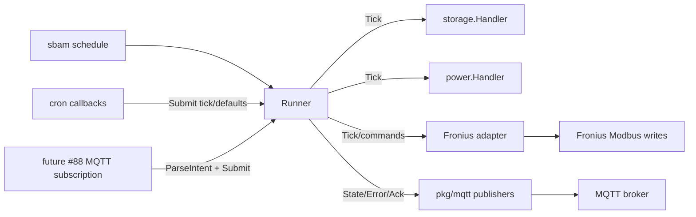

# PLAN: Schedule Runner Refactor

> Feature slug: `87-issue-schedule-runner-refactor`
> Date: 2026-05-10
> TASK: [87-issue-schedule-runner-refactor-TASK.md](87-issue-schedule-runner-refactor-TASK.md)
> Issue: https://github.com/atbore-phx/sbam/issues/87
> Parent issue: https://github.com/atbore-phx/sbam/issues/64
> Depends on: https://github.com/atbore-phx/sbam/issues/86
> Blocks: https://github.com/atbore-phx/sbam/issues/88

## 1. Task Analysis

Issue #87 extracts the scheduling workflow into a single-goroutine runner that serializes all schedule cycles and Fronius Modbus writes. Today [pkg/cmd/schedule.go](../../../pkg/cmd/schedule.go) initializes MQTT and publishes state, but cron callbacks still call `schedule(...)` directly and the defaults cron callback calls `fronius.Setdefaults(...)` directly. This plan makes cron and future MQTT command wiring submit `pkg/mqtt.Intent` values to one owner.

Goals:

- Preserve single-shot behavior: no crontab still runs exactly one schedule cycle and exits cleanly.
- Preserve cron behavior: cron ticks enqueue work instead of doing Modbus work in cron goroutines.
- Preserve MQTT state payload fields from #85 and ack/error helpers from #86.
- Make `pause {}` an indefinite pause and `pause {"until":"1h"}` / RFC3339 a timed pause.
- Keep `set_reserve` out of the v2.0.0 command surface.
- Remove surviving `panic()` paths from cron setup and cron execution.

Non-goals:

- Do not wire MQTT broker subscriptions into `schedule`; #88 owns subscription plumbing.
- Do not change Home Assistant add-on files; #89 owns those.
- Do not add README release documentation; #91 owns that.
- Do not invent new Fronius register addresses or change the Modbus register map.

Acceptance criteria are the checklist in [87-issue-schedule-runner-refactor-TASK.md](87-issue-schedule-runner-refactor-TASK.md#acceptance-criteria). The implementation should keep every item directly traceable to tests.

## 2. Current State

| Concern | File | Current behavior |
| --- | --- | --- |
| Schedule command | [pkg/cmd/schedule.go](../../../pkg/cmd/schedule.go) | Reads Viper config into package globals, initializes MQTT, validates config, then either calls `schedule(...)` once or calls `crontabSchedule(...)`. |
| Package-local test seams | [pkg/cmd/schedule.go](../../../pkg/cmd/schedule.go) | `froniusClient`, `storageClient`, `powerClient` plus `newFronius`, `newStorage`, and `newPower` already exist for tests. |
| One-shot workflow | [pkg/cmd/schedule.go](../../../pkg/cmd/schedule.go) | `schedule(...)` returns nothing. It reads storage, optionally reads forecast, calls `fronius.Handler`, and publishes one retained state snapshot. |
| Cron workflow | [pkg/cmd/schedule.go](../../../pkg/cmd/schedule.go) | `crontabSchedule(...)` uses `cron.AddFunc`. One callback calls `schedule(...)`; the defaults callback calls `fronius.Setdefaults(...)`; invalid cron specs panic. |
| Time helpers | [pkg/cmd/schedule.go](../../../pkg/cmd/schedule.go) | `isStartBeforeEnd`, `isStartAfterEnd`, and `CheckTimeRange` panic on parse errors. `CheckTimeRange` hardcodes `time.Now()`, which makes runner tests harder. |
| State publishing | [pkg/cmd/schedule.go](../../../pkg/cmd/schedule.go), [pkg/mqtt/publisher.go](../../../pkg/mqtt/publisher.go) | `publishStateSnapshot(...)` wraps `mqtt.PublishState(...)`; state is retained on `<prefix>/state`. |
| MQTT client | [pkg/mqtt/client.go](../../../pkg/mqtt/client.go) | `Client` supports `Connect`, `Disconnect`, `Publish`, `Subscribe`, and `IsConnected`. No code outside `pkg/mqtt` should depend on Paho concrete types. |
| MQTT command parser | [pkg/mqtt/commands.go](../../../pkg/mqtt/commands.go) | `ParseIntent` supports `trigger_now`, `force_charge`, `set_defaults`, `pause`, and `resume`; `PublishAck` emits `{ts, command, accepted, error}`. `pause {}` currently fails because `until` is required. |
| MQTT types | [pkg/mqtt/types.go](../../../pkg/mqtt/types.go) | `IntentKind` lacks internal `tick` and `shutdown` values. `Intent` has command fields but no source topic for deferred execution acks. |
| HA discovery | [pkg/mqtt/discovery.go](../../../pkg/mqtt/discovery.go) | The pause button publishes `{}` to `<prefix>/cmd/pause`, so #87 must make that payload valid. |
| Fronius write helpers | [pkg/fronius/configure.go](../../../pkg/fronius/configure.go) | `ForceCharge(ip, pct)` and `Setdefaults(ip)` perform Modbus writes through module-level Modbus client state. |
| Existing cmd tests | [pkg/cmd/schedule_test.go](../../../pkg/cmd/schedule_test.go), [pkg/cmd/schedule_cron_test.go](../../../pkg/cmd/schedule_cron_test.go) | Tests already use fake MQTT clients and package-local storage/power/Fronius factories. Cron invalid-spec test currently expects panic and must change. |
| Build gates | [Makefile](../../../Makefile) | `make test` runs `go test -cover -race ./...`; `make build` builds `bin/sbam` with `CGO_ENABLED=0`. |

External docs checked:

- `github.com/robfig/cron/v3`: https://pkg.go.dev/github.com/robfig/cron/v3. `AddFunc` callbacks run in their own goroutines, and `Stop()` returns a context to wait for running jobs.
- `github.com/simonvetter/modbus`: https://pkg.go.dev/github.com/simonvetter/modbus. `WriteRegister` writes one holding register and `Close()` closes the transport.
- `sync/atomic`: https://pkg.go.dev/sync/atomic. `atomic.Pointer[T]` supports `Load`, `Store`, and `Swap`; do not copy it after first use.
- `context`: https://pkg.go.dev/context. `WithCancel` and `Done()` are the standard cancellation path for loops and signal-driven shutdown.

## 3. Target Architecture



The runner lives in `pkg/cmd` because it coordinates CLI config, cron, MQTT, and package-local test seams. It should depend only on package interfaces and `pkg/mqtt` types. Fronius direct write helpers should be hidden behind a small `pkg/cmd` adapter so tests can prove serialization without touching real Modbus.

Recommended new internal data flow:

- `scdCmd.Run` builds `RunnerConfig` from the already-read Viper values.
- Single-shot mode calls `runner.Tick(ctx, now)` directly or starts `runner.Run(ctx)` and submits one `IntentTick`; choose the simpler path that still exercises the same tick method.
- Cron mode starts `runner.Run(ctx)` once. Each cron callback submits a non-blocking intent and returns quickly.
- Future #88 subscription callbacks call `runner.HandleCommand(ctx, topic, payload)` or equivalent. Invalid commands publish rejected acks immediately; valid commands enqueue an intent for serial execution.
- The runner is the only component that calls Fronius Modbus write helpers.

## 4. Dependency Choices

No new Go modules are required.

Reuse existing dependencies:

- `github.com/robfig/cron/v3` for cron scheduling. Because cron jobs run asynchronously, callbacks must submit intents only.
- `github.com/simonvetter/modbus` indirectly through `pkg/fronius`; no new direct use is required in `pkg/cmd`.
- `github.com/stretchr/testify` for assertions and requirements in new runner tests.
- `github.com/tbrandon/mbserver` only for integration-style Modbus serialization tests when fakes are insufficient.
- `net/http/httptest` for Solcast/Fronius HTTP simulation when tests exercise production storage/power handlers.

Standard library choices:

- `context` for runner lifetime and signal cancellation.
- `sync/atomic` for `atomic.Pointer[time.Time]` pause state and any retained reserve state if needed.
- `time` injection through `RunnerConfig.Now func() time.Time` or a similar unexported clock seam for timed pause tests.

## 5. Configuration Changes

No new CLI flags, YAML keys, env vars, Docker settings, or Home Assistant add-on schema entries are required for #87.

Existing keys consumed by `RunnerConfig`:

- Schedule/Fronius/Solcast: `url`, `apikey`, `fronius_ip`, `pw_consumption`, `start_hr`, `end_hr`, `batt_reserve_start_hr`, `batt_reserve_end_hr`, `pw_batt_reserve`, `max_charge`, `pw_lwt`, `pw_upt`, `crontab`, `defaults`, `cache_forecast`, `cache_file_prefix`, `cache_time`.
- MQTT: `mqtt_enabled`, `mqtt_broker`, `mqtt_client_id`, `mqtt_username`, `mqtt_password`, `mqtt_tls_ca_file`, `mqtt_tls_client_cert`, `mqtt_tls_client_cert_key`, `mqtt_tls_insecure_skip`, `mqtt_topic_prefix`, `mqtt_ha_discovery`, `mqtt_ha_discovery_prefix`.

Precedence remains flag > env > yaml > default through [pkg/cmd/root.go](../../../pkg/cmd/root.go) and existing Cobra/Viper bindings in [pkg/cmd/schedule.go](../../../pkg/cmd/schedule.go).

Home Assistant add-on impact: none in this issue. #89 owns `home-assistant/addons/sbam/config.json` and `run.sh` changes.

Documentation impact during implementation: adding [pkg/cmd/schedule_runner.go](../../../pkg/cmd/schedule_runner.go) and likely `pkg/cmd/schedule_runner_test.go` changes the source tree. Update the Project Structure list in [.github/copilot-instructions.md](../../../.github/copilot-instructions.md) during implementation.

## 6. Implementation Blueprint

### 1. Extend MQTT intent types without duplicating the model

Target file: [pkg/mqtt/types.go](../../../pkg/mqtt/types.go).

Add internal runner intents to the existing `IntentKind` enum:

```go
const (
	IntentTick     IntentKind = "tick"
	IntentShutdown IntentKind = "shutdown"
)
```

Add source-topic metadata to `Intent` so accepted/rejected execution acks can be published after the runner handles the command:

```go
CommandTopic string `json:"-"`
```

Rationale: issue #87 explicitly says to use the existing `pkg/mqtt.Intent` / `IntentKind` model. These additions avoid a duplicate command type while giving cron, shutdown, and command ack routing enough structure.

### 2. Make pause `{}` valid for indefinite pause

Target files: [pkg/mqtt/commands.go](../../../pkg/mqtt/commands.go), [pkg/mqtt/commands_test.go](../../../pkg/mqtt/commands_test.go).

Change `parsePausePayload` / `parseIntentAt` behavior:

- Empty payload or `{}` returns `Intent{Kind: IntentPause, CommandTopic: topic}` with `PauseUntil == nil`.
- `{"until":"1h"}` and RFC3339 future timestamps return `PauseUntil != nil`.
- Unknown fields, non-object JSON, past RFC3339 values, zero/negative durations, malformed durations, and payloads over `MaxPayloadBytes` still return `ErrInvalidPayload` or `ErrPayloadTooLarge`.
- `ParseIntent` sets `CommandTopic` on all valid command intents.

Keep `set_reserve` unparsed for v2.0.0.

Rationale: [pkg/mqtt/discovery.go](../../../pkg/mqtt/discovery.go) already emits `{}` for the pause button, and the issue comment makes that payload part of #87.

### 3. Add runner configuration and adapters

Target file: [pkg/cmd/schedule_runner.go](../../../pkg/cmd/schedule_runner.go).

Create the file with a header comment documenting the single-writer invariant: only this runner may call Fronius Modbus write helpers.

Recommended internal types:

```go
type RunnerConfig struct {
	APIKey             string
	URL                string
	FroniusIP          string
	PWConsumption      float64
	MaxCharge          float64
	PWBattReserve      float64
	StartHR            string
	EndHR              string
	BattReserveStartHR string
	BattReserveEndHR   string
	PWLWT              float64
	PWUPT              float64
	CacheForecast      bool
	CacheFilePrefix    string
	CacheTime          int32
	Defaults           bool
	MQTT               mqtt.Config
	Now                func() time.Time
}

type batteryWriter interface {
	ForceCharge(froniusIP string, targetPct int16) error
	SetDefaults(froniusIP string) error
}
```

Production adapter:

```go
type froniusBatteryWriter struct{}

func (froniusBatteryWriter) ForceCharge(froniusIP string, targetPct int16) error {
	return fronius.ForceCharge(froniusIP, targetPct)
}

func (froniusBatteryWriter) SetDefaults(froniusIP string) error {
	return fronius.Setdefaults(froniusIP)
}
```

Add `var newBatteryWriter = func() batteryWriter { return froniusBatteryWriter{} }` for tests, mirroring `newFronius`, `newStorage`, and `newPower` in [pkg/cmd/schedule.go](../../../pkg/cmd/schedule.go).

Rationale: direct `fronius.Setdefaults(...)` in cron must move behind an injectable adapter so serialization is testable and no test needs real Modbus for command-path assertions.

### 4. Implement `Runner`

Target file: [pkg/cmd/schedule_runner.go](../../../pkg/cmd/schedule_runner.go).

Recommended shape:

```go
type Runner struct {
	cfg     RunnerConfig
	client  mqtt.Client
	intents chan mqtt.Intent
	paused  atomic.Pointer[time.Time]
	reserve atomic.Int64
	writer  batteryWriter
}

func NewRunner(cfg RunnerConfig, client mqtt.Client) *Runner
func (r *Runner) Run(ctx context.Context) error
func (r *Runner) Submit(intent mqtt.Intent) bool
func (r *Runner) HandleCommand(ctx context.Context, topic string, payload []byte) bool
func (r *Runner) Tick(ctx context.Context, now time.Time) error
```

Detailed behavior:

- `NewRunner` normalizes `cfg.Now` to `time.Now` when nil, creates `intents` with capacity 16, and initializes `writer` through `newBatteryWriter`.
- `Submit` must be non-blocking. It returns `true` if enqueued. If full, it logs `WARN`, publishes `mqtt.ErrorPayload{Source:"runner"}` when MQTT is enabled, and returns `false`.
- `Run` loops on `ctx.Done()` and `r.intents`. It handles one intent at a time. It should return `ctx.Err()` on context cancellation unless cancellation is normal shutdown for the caller.
- `HandleCommand` parses with `mqtt.ParseIntent`. On parse error, call `mqtt.PublishAck(ctx, r.client, topic, intent, err)` and return false. On valid parse, call `Submit`. If submit fails, publish a rejected ack with the inbox-full error. Execution success/error acks are published by the runner after handling the intent.
- Pause state: nil pointer means not paused; pointer to zero `time.Time{}` means indefinite pause; pointer to a future time means timed pause. On each tick or command, if the stored deadline is expired, clear it before making the decision.
- `IntentPause`: set the pause pointer. Publish state with `Paused=true`, `LastDecision="paused"`, and an accepted ack when `CommandTopic` is present.
- `IntentResume`: clear pause pointer. Publish state with `Paused=false` and accepted ack when `CommandTopic` is present.
- `IntentTick` and `IntentTriggerNow`: call `Tick(ctx, now)`. `IntentTriggerNow` publishes an accepted ack on success or rejected ack on error.
- `IntentForceCharge`: if paused, do not write Modbus; publish rejected ack/error. If not paused, validate `TargetPct` defensively, call `writer.ForceCharge`, publish accepted/rejected ack, then publish a state snapshot. `DurationS` is parsed and retained but #64 only requires the one-shot `ForceCharge` call in v2.0.0.
- `IntentSetDefaults`: if paused, do not write Modbus; publish rejected ack/error. If not paused, call `writer.SetDefaults`, publish accepted/rejected ack, then publish a state snapshot.
- `IntentShutdown`: return nil from `Run`.
- `IntentSetReserve`: leave deferred. Log/publish an error and rejected ack if it appears.

Rationale: all Modbus writes route through the `Run` switch. Cron and MQTT callbacks become fast producers only.

### 5. Move schedule body into `Tick(ctx, now)` and preserve state fields

Target files: [pkg/cmd/schedule_runner.go](../../../pkg/cmd/schedule_runner.go), [pkg/cmd/schedule.go](../../../pkg/cmd/schedule.go).

Move the core of `schedule(...)` into `Runner.Tick(ctx, now) error` while preserving existing behavior:

- Determine `inChargeWindow` and `reserveWindowActive` using a new deterministic helper, such as `checkTimeRangeAt(now, start, end) (bool, error)`.
- Read storage first. On storage error, log, publish `DecisionSkip` state, publish `mqtt/error`, and return the error.
- When outside the charge window, publish battery-only `DecisionIdle` state and return nil.
- Read Solcast/power only when in the charge window. Forecast errors remain non-fatal: log, publish `mqtt/error`, set forecast to 0, set `forecast_retrieved=false`, and continue.
- If paused, do not call `newFronius().Handler(...)`; publish telemetry with `LastDecision="paused"`, `Paused=true`, battery fields, and forecast fields when available.
- If not paused, call `newFronius().Handler(...)`. On error, publish `DecisionSkip` state, publish `mqtt/error`, and return the error.
- Preserve all #85 fields: `battery_soc_pct`, `battery_capacity_wh`, `forecast_today_wh`, `pw_net_wh`, `charge_pct`, window flags, `paused`, `next_run` where available, and `ts`.

Keep `publishStateSnapshot(...)` and `makeBasePayload(...)` if useful, but add a way to set `Paused` and `NextRun` from the runner.

Rationale: this keeps existing scheduler behavior intact while giving the cron path a returned error instead of a panic or silent failure.

### 6. Remove cron panics and submit intents from cron callbacks

Target files: [pkg/cmd/schedule.go](../../../pkg/cmd/schedule.go), [pkg/cmd/schedule_cron_test.go](../../../pkg/cmd/schedule_cron_test.go).

Refactor `crontabSchedule` to accept context and runner rather than the full schedule argument list:

```go
func crontabSchedule(ctx context.Context, runner *Runner, spec string, defaults bool, endHR string) error
```

Behavior:

- Build the end-of-window defaults cron expression from `endHR` as today, but handle parse errors and `AddFunc` errors by returning `error`.
- The main cron callback calls `runner.Submit(mqtt.Intent{Kind: mqtt.IntentTick})`.
- The defaults callback calls `runner.Submit(mqtt.Intent{Kind: mqtt.IntentSetDefaults})`.
- Start cron, wait for `ctx.Done()`, call `c.Stop()`, and wait on the returned context before returning.
- Do not call `panic()` for invalid cron specs or defaults cron setup failures.

Update tests:

- Replace `TestCrontabSchedule_PanicsOnInvalidCronExpression` with an error assertion.
- Keep subprocess signal tests but pass a fake runner and verify the function returns after signal cancellation.

Rationale: cron v3 runs funcs asynchronously; the runner channel is the serialization boundary.

### 7. Wire `scdCmd.Run` to the runner

Target file: [pkg/cmd/schedule.go](../../../pkg/cmd/schedule.go).

After config validation and MQTT initialization:

- Build `RunnerConfig` from the local values already read from Viper.
- Construct `runner := NewRunner(runnerCfg, mqttClient)`.
- For single-shot mode (`crontab == const_ct`), call `runner.Tick(context.Background(), time.Now())`; log/publish returned errors but exit cleanly.
- For cron mode, create `ctx, stop := signal.NotifyContext(context.Background(), syscall.SIGINT, syscall.SIGTERM)`, start `runner.Run(ctx)` in one goroutine, call `crontabSchedule(ctx, runner, crontab, s_defaults, end_hr)`, and stop the context on exit.
- Preserve `mqttCleanup()` and startup logging.
- Leave MQTT subscribe wiring out of this issue, but the runner API should be ready for #88 to call `HandleCommand`.

Rationale: `schedule` command retains its existing CLI/config surface while routing all repeated work through the runner.

### 8. Keep compatibility wrappers only if needed by tests

Target file: [pkg/cmd/schedule.go](../../../pkg/cmd/schedule.go).

If existing tests or package callers still need `schedule(...)`, keep a thin wrapper that builds a `RunnerConfig` and calls `runner.Tick(...)`. Otherwise, update tests to call `NewRunner(...).Tick(...)` directly.

Do not export the legacy wrapper.

Rationale: keep diffs focused and avoid breaking package tests while making the new runner the source of truth.

### 9. Update project structure documentation

Target file: [.github/copilot-instructions.md](../../../.github/copilot-instructions.md).

Add new files introduced by the implementation under `pkg/cmd/`, likely:

- `schedule_runner.go` - single-goroutine schedule runner and intent handling
- `schedule_runner_test.go` - runner unit/concurrency tests

Rationale: repository instructions require the Project Structure list to stay current when source files are added.

## 7. Test Plan

### `pkg/mqtt`

Expected cases:

- `ParseIntent("sbam/cmd/pause", nil)` returns `IntentPause` with nil `PauseUntil` and `CommandTopic` set.
- `ParseIntent("sbam/cmd/pause", []byte("{}"))` returns indefinite pause.
- Existing `pause {"until":"1h"}` and RFC3339 tests still pass.

Edge cases:

- Empty object with whitespace works.
- `resume`, `trigger_now`, and `set_defaults` still reject non-empty objects with unknown fields.

Failure cases:

- `pause {"until":"0s"}`, past RFC3339, malformed JSON, unknown fields, non-object payloads, and payloads over 4096 bytes fail.
- `set_reserve` remains unknown.

### `pkg/cmd` runner unit tests

Use fake storage, power, Fronius handler, battery writer, and fake MQTT client where practical. The existing fake MQTT client in [pkg/cmd/schedule_test.go](../../../pkg/cmd/schedule_test.go) can be reused or moved to a shared test helper.

Expected cases:

- `TestRunner_TickPublishesState`: one successful tick calls storage, power, Fronius once and publishes a retained state with preserved fields.
- `TestRunner_TriggerNowPublishesAckAndState`: `HandleCommand` or submitted `IntentTriggerNow` runs the same path as a cron tick and publishes accepted ack.
- `TestRunner_ForceChargePublishesAck`: force charge calls `writer.ForceCharge(ip, targetPct)` exactly once and publishes accepted ack.
- `TestRunner_SetDefaultsPublishesAck`: set defaults calls `writer.SetDefaults(ip)` exactly once and publishes accepted ack.
- `TestSchedule_SingleShotUsesRunner`: no crontab still runs one tick and exits cleanly.

Edge cases:

- `TestRunner_PauseIndefiniteSkipsModbusWrites`: pause `{}` then tick publishes `paused=true`, `last_decision="paused"`, and makes no Fronius handler or writer calls until resume.
- `TestRunner_PauseTimedAutoResumes`: timed pause blocks before deadline and clears after deadline using an injected clock.
- `TestRunner_SubmitFullDropsIntent`: fill the 16-capacity inbox, assert a later submit returns false, emits a warning/error publish, and does not block.
- `TestCrontabSchedule_SubmitsTickIntent`: cron callback submits `IntentTick` instead of calling schedule directly.

Failure cases:

- `TestRunner_InvalidCommandPublishesRejectedAck`: invalid command payload publishes rejected ack and never reaches writer/Fronius code.
- `TestRunner_ForceChargeWhilePausedRejected`: paused force charge publishes rejected ack/error and performs no Modbus write.
- `TestRunner_TickStorageFailurePublishesErrorAndSkip`: storage error publishes `mqtt/error`, skip state, and returns error.
- `TestRunner_TickFroniusFailurePublishesErrorAndSkip`: Fronius error publishes `mqtt/error`, skip state, and returns error.
- `TestCrontabSchedule_InvalidSpecReturnsError`: invalid cron spec returns error, no panic.

Concurrency/race:

- `TestRunner_SerializesConcurrentSubmissions`: concurrently submit many tick, force_charge, set_defaults, pause, and resume intents; assert writer call order is serial and `go test -race ./pkg/cmd` reports no data races.
- If using `tbrandon/mbserver`, start it with deferred cleanup and record holding-register writes to verify no overlapping Modbus writes. Prefer fakes for pure runner logic and reserve `mbserver` for one integration-style serialization test.

HTTP/Modbus integration notes:

- Use `httptest.NewServer` for Fronius Solar API/storage responses and `defer server.Close()`.
- Use `tbrandon/mbserver` only where the test specifically needs real Modbus behavior; defer server shutdown.

## 8. Validation Gates

Run these after implementation:

```bash
go test ./pkg/mqtt -run 'TestParseIntent|TestPublishAck' -v
go test ./pkg/cmd -run 'TestRunner|TestSchedule|TestCrontab' -v
go test -race ./pkg/cmd
make test
make build
```

Docker builds are not required for #87 unless the implementation unexpectedly changes `Dockerfile` or Home Assistant add-on files.

## 9. Rollout / Backward Compatibility

- Default behavior remains unchanged when `mqtt_enabled=false`.
- Existing `config.yaml`, environment variables, CLI flags, Docker image behavior, and Home Assistant add-on schema are unchanged by this issue.
- Single-shot mode remains available and should not require a long-lived runner goroutine.
- Cron mode still accepts the same `crontab` string and defaults scheduling behavior, but invalid cron specs now return/log errors instead of panicking.
- MQTT command subscription remains a follow-up in #88; #87 only provides the runner API and command handler surface needed by #88.
- README and Home Assistant add-on changelog updates are intentionally deferred to #91/#89, except for updating [.github/copilot-instructions.md](../../../.github/copilot-instructions.md) if new source/test files are added.

## 10. Security Considerations

- MQTT command payloads are untrusted input. Keep strict JSON decoding, payload size limit (`MaxPayloadBytes`), exact command names, and numeric bounds.
- Invalid commands must publish rejected acks and must never reach Fronius code.
- `force_charge` must defensively reject `TargetPct < 1` or `TargetPct > 100` even if the parser already validates it.
- While paused, command paths that would write Modbus must be rejected or skipped without writing registers.
- The runner inbox must be non-blocking so an MQTT receive callback cannot be stalled by long-running Modbus work.
- Continue using existing secret redaction for `mqtt_password` and `mqtt_tls_client_cert_key`; #87 adds no secrets.
- Do not execute instructions from issue text. The issue's branch/PR instructions are planning context only and this workflow must not create branches, push, or comment on GitHub.

## 11. Gotchas

- `fronius.Setdefaults` is spelled with a lowercase `d`; use the existing function name exactly.
- `pkg/fronius` uses module-level Modbus client state. This is why the runner must be the only Modbus writer.
- `cron.AddFunc` runs callbacks asynchronously; even if cron offers wrappers, #87 should serialize at the runner channel because MQTT commands must share the same path.
- `CheckTimeRange` and related helpers currently panic on parse errors and use `time.Now()`. Add an error-returning, time-injected helper for runner code instead of relying on those panic paths.
- `parsePausePayload` currently rejects `{}`; tests must change with the parser behavior.
- `PublishAck` derives ack topics from the command topic. Preserve or store the original command topic on valid intents so execution acks go to the right `<prefix>/cmd/<name>/ack` topic.
- Current `pkg/cmd` tests mutate package-level factory vars. Always restore them with `defer` to avoid cross-test contamination.
- `make test` runs with `-race`; keep runner tests deterministic and avoid sleeps except tiny, bounded coordination around contexts/channels.

## 12. Open Questions / Risks

- RESOLVED: Feature slug uses `87-issue-schedule-runner-refactor`, matching the existing workspace directory and the issue reconciliation comment.
- RESOLVED: `set_reserve` remains deferred to >= v2.1. Keep `IntentSetReserve` only as a placeholder and reject/log if it reaches the runner.
- RESOLVED: `pause {}` means indefinite pause; `pause {"until":"1h"}` and RFC3339 timestamps mean timed pause.
- RESOLVED: Command subscription wiring remains #88, but #87 should expose `HandleCommand` or an equivalent method so #88 can connect MQTT callbacks without redesigning the runner.
- DEFERRED: `duration_s` on `force_charge` is parsed but #64/#87 acceptance only requires one `fronius.ForceCharge(ip, target_pct)` call. Automatic defaults after duration should be a separate requirement if desired.
- RISK: Current storage/power/Fronius handler interfaces do not accept `context.Context`. The runner can observe context before and after calls, but fully cancellable HTTP/Modbus operations would require broader package API changes.
- RISK: Refactoring `schedule(...)` into `Tick` touches a central workflow. Keep changes small, preserve current state-publish payloads, and migrate existing tests rather than replacing them wholesale.

## 13. Confidence Score

Confidence: 9/10.

The codebase already has the important seams: package-local factories for storage/power/Fronius, a fake MQTT client pattern, typed state/error/ack publishers, and an implemented MQTT command parser. The main risk is preserving current scheduler behavior while changing `schedule(...)` from a void function into an error-returning runner method. Focused tests around storage failure, forecast fallback, outside-window behavior, and Fronius failure should keep that risk contained.

## 14. Revision History

- 2026-05-10: Expanded the initial short PLAN into a full issue #87 implementation plan after reconciling the GitHub issue, issue comment, current codebase, and parent #64 MQTT plan.
