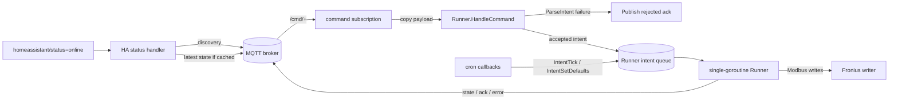

# PLAN: wire MQTT into schedule subcommand

> Feature slug: `88-issue-wire-mqtt-schedule`  
> TASK: [88-issue-wire-mqtt-schedule-TASK.md](88-issue-wire-mqtt-schedule-TASK.md)  
> Issue: https://github.com/atbore-phx/sbam/issues/88  
> Parent issue: https://github.com/atbore-phx/sbam/issues/64  
> Date: 2026-05-13  
> Reconciled against current code: 2026-05-13

## 1. Task Analysis

Goal: finish the remaining #88 `schedule` MQTT wiring by subscribing to command topics, routing messages into the #87 runner, preserving runner-owned execution acknowledgements, and expanding precedence tests for every MQTT key.

Non-goals:

- Do not reimplement the MQTT scaffold, discovery builder, command parser, ack publisher, or runner lifecycle already delivered by #84/#85/#86/#87.
- Do not add `set_reserve` MQTT support in v2.0.0.
- Do not modify Home Assistant add-on service auto-discovery or README release docs; those remain #89/#91.
- Do not change Solcast, Fronius Solar API, or Fronius Modbus register semantics.

Acceptance criteria from the TASK:

- `mqtt_enabled=false` remains a no-connect/no-subscribe/no-Modbus-diff path.
- MQTT-enabled `schedule` subscribes to `<mqtt_topic_prefix>/cmd/+` and publishes state after ticks.
- `trigger_now`, `pause`, `resume`, `force_charge`, and `set_defaults` route through the runner.
- Parser failures publish rejected acks immediately; accepted/error execution acks are published by the runner.
- `homeassistant/status=online` re-publishes discovery and latest state when known.
- `mqtt_password` and `mqtt_tls_client_cert_key` stay redacted.
- All twelve MQTT keys observe flag > env > yaml > default precedence.
- `make test` and `make build` pass.

## 2. Current State

| Area | File | Current behavior |
| --- | --- | --- |
| Schedule flags/config | [pkg/cmd/schedule.go](../../../pkg/cmd/schedule.go) | Registers and reads all twelve MQTT keys, builds `mqtt.Config`, calls `mqtt.InitWithCleanup`, logs startup parameters, constructs `Runner`, starts `Runner.Run`, and uses `crontabSchedule` for cron. |
| Runner lifecycle | [pkg/cmd/schedule.go](../../../pkg/cmd/schedule.go) | `finalizeRunnerMode` stops the runner immediately when MQTT is disabled, and waits for signals when MQTT is enabled. `crontabSchedule` already submits `mqtt.IntentTick` and `mqtt.IntentSetDefaults` instead of running schedule work directly. |
| Runner API | [pkg/cmd/schedule_runner.go](../../../pkg/cmd/schedule_runner.go) | `NewRunner`, `Run`, `Submit`, `HandleCommand`, `Tick`, and `handleIntent` exist. `Submit` is non-blocking with queue size 16. `HandleCommand` parses with `mqtt.ParseIntent`, publishes rejected acks for parser failures or full queue, and submits accepted intents. `handleIntent` publishes accepted/error acks after execution. |
| State/error publishing | [pkg/cmd/schedule_runner.go](../../../pkg/cmd/schedule_runner.go), [pkg/cmd/schedule.go](../../../pkg/cmd/schedule.go) | `Runner.publishState` delegates to `publishStateSnapshot`, which publishes retained `mqtt.StatePayload`. Despite its comment, no latest-state cache currently exists. |
| MQTT init | [pkg/mqtt/init.go](../../../pkg/mqtt/init.go) | `InitWithCleanup` creates/connects the client, falls back to noop on setup/connect failure, and subscribes to `homeassistant/status` to re-publish discovery only. |
| MQTT client API | [pkg/mqtt/client.go](../../../pkg/mqtt/client.go) | `Client` supports `Connect`, `Disconnect`, `Publish`, `Subscribe`, and `IsConnected`. Topic helpers are currently unexported. |
| MQTT parser/ack | [pkg/mqtt/commands.go](../../../pkg/mqtt/commands.go) | `ParseIntent` supports `trigger_now`, `force_charge`, `set_defaults`, `pause`, and `resume`; `pause` accepts empty payload or `{}` as indefinite. `PublishAck` publishes `{ts, command, accepted, error}` to `<cmd-topic>/ack`. |
| Payload types | [pkg/mqtt/types.go](../../../pkg/mqtt/types.go) | `StatePayload`, `ErrorPayload`, `AckPayload`, and `Intent` are already defined. |
| Startup redaction | [src/utils/startup.go](../../../src/utils/startup.go) | `SecretKeys` already includes `mqtt_password` and `mqtt_tls_client_cert_key`. |
| Precedence tests | [pkg/cmd/precedence_test.go](../../../pkg/cmd/precedence_test.go) | Existing tests cover Viper precedence generally and only one MQTT key, `mqtt_ha_discovery_prefix`. |
| Runner tests | [pkg/cmd/schedule_runner_test.go](../../../pkg/cmd/schedule_runner_test.go) | Tests already cover empty pause payloads, command acks, force charge/defaults execution, queue-full rejection, paused rejection, `set_reserve` rejection, and unknown command rejection. |
| MQTT init tests | [pkg/mqtt/init_test.go](../../../pkg/mqtt/init_test.go) | Tests cover connect retries, setup/connect fallback, HA status subscription errors, and discovery re-publication on `online`. |

## 3. Target Architecture



Implementation shape:

- Keep the runner as the only owner of Fronius write operations.
- Use `Runner.HandleCommand(ctx, topic, payload)` as the command entry point instead of duplicating parser/ack logic in `schedule.go`.
- Add command subscription wiring in `schedule.go` after MQTT init and runner construction.
- Add a small latest-state cache in `pkg/cmd` and store snapshots inside `Runner.publishState` before calling `mqtt.PublishState`.
- Extend MQTT HA status handling so `homeassistant/status=online` can publish discovery and also call a schedule-owned latest-state republisher.
- Keep MQTT init fallback behavior: setup/connect failures return a noop client and a non-fatal error to log.

## 4. Dependency Choices

No new Go modules are required.

Continue using existing dependencies:

| Dependency | Purpose | Reference |
| --- | --- | --- |
| `github.com/eclipse/paho.mqtt.golang` | Production MQTT client already wrapped by `pkg/mqtt`. | https://pkg.go.dev/github.com/eclipse/paho.mqtt.golang |
| `github.com/mochi-mqtt/server/v2` | Existing in-process broker tests in `pkg/mqtt`. | https://pkg.go.dev/github.com/mochi-mqtt/server/v2 |
| `github.com/stretchr/testify` | Assertions in existing test style. | https://pkg.go.dev/github.com/stretchr/testify |
| `github.com/spf13/viper` / `github.com/spf13/cobra` | Existing config precedence and CLI flag wiring. | https://pkg.go.dev/github.com/spf13/viper |

## 5. Configuration Changes

No new config keys are planned. Verify and test the existing twelve standalone keys:

| Key / flag | Env | Type | Default | Notes |
| --- | --- | --- | --- | --- |
| `mqtt_enabled` | `MQTT_ENABLED` | bool | `false` | Master switch; disabled path must not connect or subscribe. |
| `mqtt_broker` | `MQTT_BROKER` | string | `""` | Broker URL consumed by Paho. |
| `mqtt_client_id` | `MQTT_CLIENT_ID` | string | `""` | Empty value auto-generates in the MQTT layer. |
| `mqtt_username` | `MQTT_USERNAME` | string | `""` | Optional username. |
| `mqtt_password` | `MQTT_PASSWORD` | string | `""` | Secret; redacted by startup dump. |
| `mqtt_tls_ca_file` | `MQTT_TLS_CA_FILE` | string | `""` | Standalone TLS CA bundle. |
| `mqtt_tls_client_cert` | `MQTT_TLS_CLIENT_CERT` | string | `""` | Standalone client cert. |
| `mqtt_tls_client_cert_key` | `MQTT_TLS_CLIENT_CERT_KEY` | string | `""` | Secret; redacted by startup dump. |
| `mqtt_tls_insecure_skip` | `MQTT_TLS_INSECURE_SKIP` | bool | `false` | Development-only TLS bypass. |
| `mqtt_topic_prefix` | `MQTT_TOPIC_PREFIX` | string | `sbam` | State, error, availability, command, and ack topic prefix. |
| `mqtt_ha_discovery` | `MQTT_HA_DISCOVERY` | bool | `true` | Discovery publish switch. |
| `mqtt_ha_discovery_prefix` | `MQTT_HA_DISCOVERY_PREFIX` | string | `homeassistant` | Discovery config root. |

Precedence remains flag > env > yaml > default through `bindFlags` in [pkg/cmd/root.go](../../../pkg/cmd/root.go).

Home Assistant add-on schema and `run.sh` changes remain #89. This issue should not change add-on option surfaces unless tests reveal a direct regression from #88 wiring.

## 6. Implementation Blueprint

1. Update MQTT HA status init hook in [pkg/mqtt/init.go](../../../pkg/mqtt/init.go).
	 - Add a small extension point while preserving current callers, for example:

		 ```go
		 type HAOnlineHandler func(context.Context, Client)

		 func InitWithCleanup(cfg Config, version string, maxAttempts int, baseBackoff time.Duration, handlers ...HAOnlineHandler) (Client, func(), error)
		 ```

	 - In the existing `homeassistant/status` callback, copy `payload` with `append([]byte(nil), payload...)`, ignore non-`online`, publish discovery as today, then invoke each non-nil handler with the same short-lived context and connected client.
	 - Keep existing behavior when no handler is passed.
	 - Rationale: schedule needs a latest-state republish hook, but `pkg/mqtt` should still own the HA status topic helper and discovery publish behavior it already has.

2. Add command topic filter helper in [pkg/mqtt/client.go](../../../pkg/mqtt/client.go).
	 - Add:

		 ```go
		 func CommandTopicFilter(prefix string) string
		 ```

	 - Return `normalizePrefix(prefix) + "/cmd/+"`.
	 - Rationale: avoid duplicating topic prefix normalization in `pkg/cmd`.

3. Wire MQTT command subscription in [pkg/cmd/schedule.go](../../../pkg/cmd/schedule.go).
	- Call `mqtt.InitWithCleanup` after configuration is prepared.
	- After `runner := NewRunner(...)`, subscribe when `mqttCfg.Enabled && mqttClient != nil && mqttClient.IsConnected()`:

		```go
		func subscribeScheduleCommands(ctx context.Context, client mqtt.Client, cfg mqtt.Config, runner *Runner) error
		```

	- Use `mqtt.CommandTopicFilter(cfg.TopicPrefix)` and QoS 1.
	- In the callback, copy the payload before dispatch:

		```go
		payloadCopy := append([]byte(nil), payload...)
		opCtx, cancel := context.WithTimeout(context.Background(), const_mqtt_op_timeout)
		defer cancel()
		runner.HandleCommand(opCtx, topic, payloadCopy)
		```

	- Treat subscribe failure as non-fatal but visible: return/log the error with `u.HandleError`, because state publication can still work even if command control does not.
	- Do not publish accepted acks in this callback; `Runner.handleIntent` already does that.

5. Tighten/adjust comments in [pkg/cmd/schedule.go](../../../pkg/cmd/schedule.go).
	 - Update the `publishStateSnapshot` comment so it no longer claims to store `latestState` unless the cache is actually passed/stored elsewhere.
	 - Keep comments succinct and tied to concurrency/state behavior.

6. Extend MQTT init tests in [pkg/mqtt/init_test.go](../../../pkg/mqtt/init_test.go).
	 - Expected: existing discovery-on-`online` behavior still publishes discovery.
	 - Expected: a passed `HAOnlineHandler` is called exactly once for `online` and not for `offline`.
	 - Edge: nil handler is ignored.
	 - Failure: subscription failure is still returned as an accumulated error.
	 - Verify payload copying if practical by mutating the original byte slice after callback entry in a focused unit test.

7. Extend command wiring tests in `pkg/cmd`.
	 - Extend the existing fake MQTT client in [pkg/cmd/schedule_test.go](../../../pkg/cmd/schedule_test.go) or create a local recording fake in a new test file under `pkg/cmd`.
	 - Test `subscribeScheduleCommands`:
		 - expected: subscribes to `sbam/cmd/+` for the default prefix.
		 - expected: custom prefix `house/sbam` subscribes to `house/sbam/cmd/+`.
		 - expected: invoking the stored handler with `sbam/cmd/trigger_now` enqueues `mqtt.IntentTriggerNow` through `Runner.HandleCommand`.
		 - failure: invalid payload publishes a rejected ack and leaves the runner queue empty.
		 - failure: subscribe error is returned/loggable and does not panic.
	 - Test latest-state cache:
		 - before any state, HA online handler does not publish `state`.
		 - after `Runner.publishState`, HA online handler publishes the cached state.
		 - mutate original payload pointer values after storing and verify cached state does not change.

8. Extend precedence tests in [pkg/cmd/precedence_test.go](../../../pkg/cmd/precedence_test.go).
	 - Replace the one-off MQTT discovery-prefix test with a table covering all twelve keys.
	 - For each key, cover flag > env > yaml > default. Prefer subtests that reset Viper and reset the shared `scdCmd` flag `Changed` state after each case.
	 - Include bool keys (`mqtt_enabled`, `mqtt_tls_insecure_skip`, `mqtt_ha_discovery`) and string keys.
	 - Keep tests non-parallel because they mutate global Viper and shared Cobra flags.

9. Keep startup redaction as a regression check.
	 - [src/utils/startup.go](../../../src/utils/startup.go) already has both MQTT secrets in `SecretKeys`.
	 - Do not edit it unless tests show a regression; rely on existing [src/utils/startup_test.go](../../../src/utils/startup_test.go) and add only a focused assertion if missing.

## 7. Test Plan

For every changed area, include expected, edge, and failure coverage.

`pkg/mqtt`:

- Expected: `InitWithCleanup` still connects and publishes discovery on `homeassistant/status=online`.
- Expected: optional HA online handler runs after discovery publish.
- Edge: offline/blank/non-`online` HA payloads do not call the handler.
- Failure: setup/connect/subscribe failures continue to fall back or return errors as current tests expect.
- Expected: `CommandTopicFilter("") == "sbam/cmd/+"` and custom prefixes are trimmed/normalized.

`pkg/cmd` runner/schedule wiring:

- Expected: command subscription uses `<mqtt_topic_prefix>/cmd/+` and routes `trigger_now` to the runner.
- Expected: `pause`, `resume`, `force_charge`, and `set_defaults` still get accepted/execution acks from runner tests.
 - Edge: no latest state exists when HA comes online; discovery re-publishes and no empty state is sent.
- Edge: a full runner queue returns `false` from `HandleCommand` and publishes a rejected ack.
- Failure: invalid command topic/payload publishes rejected ack and does not enqueue an intent.
- Failure: command subscription error is surfaced/logged and does not crash `schedule`.

`pkg/cmd` precedence:

- Expected: each MQTT flag value beats env and yaml.
- Expected: each MQTT env var beats yaml.
- Expected: each MQTT yaml value beats the flag default.
- Edge: bool defaults resolve correctly for `mqtt_enabled=false`, `mqtt_tls_insecure_skip=false`, and `mqtt_ha_discovery=true`.

Regression checks:

- Disabled MQTT lifecycle tests in [pkg/cmd/schedule_lifecycle_test.go](../../../pkg/cmd/schedule_lifecycle_test.go) stay green.
- Existing parser/ack tests in [pkg/mqtt/commands_test.go](../../../pkg/mqtt/commands_test.go) stay green.
- Existing runner command tests in [pkg/cmd/schedule_runner_test.go](../../../pkg/cmd/schedule_runner_test.go) stay green.

## 8. Validation Gates

Run and pass:

```bash
go test ./pkg/mqtt -run 'TestInitWithCleanup|TestCommandTopic|TestParseIntent|TestPublishAck' -v
go test ./pkg/cmd -run 'Test.*MQTT|Test.*Runner|Test.*Precedence|Test.*Schedule|TestFinalizeRunnerMode|TestCrontabSchedule' -v
make test
make build
```

If command subscription or latest-state cache introduces goroutine/channel-sensitive tests, also run:

```bash
go test -race ./pkg/cmd
```

No Docker build is required for this issue unless implementation unexpectedly changes Docker or Home Assistant add-on files.

## 9. Rollout / Backward Compatibility

- `mqtt_enabled=false` remains the default and must not attempt any MQTT connection or command subscription.
- Existing schedule cron behavior is already routed through the runner; #88 must preserve that behavior.
- Existing MQTT command topics and ack payload shapes from #86 remain stable.
- Existing `homeassistant/status=online` discovery re-publication remains; #88 adds latest-state re-publication only when a snapshot exists.
- No migration is required for users who do not enable MQTT.
- No Home Assistant add-on schema migration is part of this issue.

## 10. Security Considerations

- MQTT topic payloads are untrusted input. Only `mqtt.ParseIntent` should interpret them, and rejected commands must not reach Fronius write helpers.
- Keep command callbacks non-blocking enough for Paho receive goroutines. Use short contexts and rely on `Runner.Submit` queue-full handling.
- Copy MQTT payload bytes before parsing/dispatch to avoid retaining or racing with broker/client buffers.
- Do not log raw secret config values. `mqtt_password` and `mqtt_tls_client_cert_key` must remain in `utils.SecretKeys`.
- Latest-state cache must deep-copy pointer fields to avoid data races or later mutation changing retained snapshots.
- No command path should execute shell commands, evaluate templates, or call reflection based on MQTT payload content.

## 11. Gotchas

- `InitWithCleanup` currently owns the HA status subscription. Add the latest-state hook there rather than creating two subscriptions to `homeassistant/status` from the same client.
- `Runner.HandleCommand` already publishes parser-failure acks and queue-full rejected acks; duplicating that logic in `schedule.go` would create double acks.
- `Runner.handleIntent` already publishes accepted/error execution acks for command intents; the MQTT callback should stop after `HandleCommand` returns.
- `publishStateSnapshot` currently has a stale comment about latest-state storage. Fix the comment while adding the actual cache.
- Topic helper functions in `pkg/mqtt/client.go` are unexported today, so command subscription should use a small exported helper rather than hand-normalizing prefixes in `pkg/cmd`.
- Shared Cobra command flags and Viper globals make precedence tests order-sensitive. Reset flag values and `Changed` state in `t.Cleanup`.
- `mqtt.New` returns a noop client when disabled; guard subscriptions with both `cfg.Enabled` and `client.IsConnected()` to keep disabled behavior quiet.
- `set_reserve` exists as an intent placeholder but must stay unsupported for v2.0.0.

## 12. Open Questions / Risks

- RESOLVED: runner command API exists as `Runner.HandleCommand(ctx, topic, payload)` and should be used by #88.
- RESOLVED: pause `{}` already parses as indefinite pause in `pkg/mqtt/commands.go`.
- RESOLVED: runner stays alive in no-cron MQTT mode through `finalizeRunnerMode`.
- RISK: adding an HA online hook to `InitWithCleanup` touches `pkg/mqtt` tests; keep the variadic API backward-compatible.
- RISK: latest-state cache cloning can miss a pointer field if `mqtt.StatePayload` grows; keep clone tests strict.
- RISK: command subscription is non-fatal by design; document/log clearly so operators can diagnose missing remote control while state publishing still works.

## 13. Confidence Score

9/10.

The runner, parser, ack publisher, MQTT init, and most lifecycle behavior already exist and have focused tests. The remaining work is narrow. Confidence would rise further after implementation validates the exact latest-state cache shape under `go test -race ./pkg/cmd`.

## 14. Revision History

- 2026-05-10: Initial reconciled PLAN captured command subscription, runner integration, latest state, and precedence tests at a high level.
- 2026-05-13: Rewrote PLAN after reading #64, #88, current `schedule.go`, current `schedule_runner.go`, MQTT init/parser/publisher APIs, and cmd/mqtt tests. Updated blueprint to use existing `Runner.HandleCommand` and current no-cron runner lifecycle.
