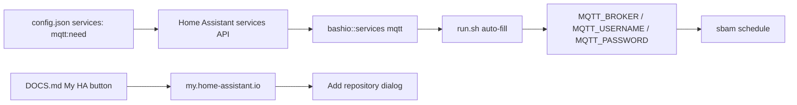

# PLAN: Home Assistant add-on MQTT finish

> Feature slug: `89-issue-ha-addon-mqtt`  
> Date: 2026-05-15  
> TASK: [89-issue-ha-addon-mqtt-TASK.md](89-issue-ha-addon-mqtt-TASK.md)  
> Issue: https://github.com/atbore-phx/sbam/issues/89  
> Parent issue: https://github.com/atbore-phx/sbam/issues/64

## 1. Task Analysis

Goal: finish the Home Assistant add-on MQTT surface for v2.0.0 by adding the missing MQTT service dependency, auto-filling Mosquitto connection settings when safe, cleaning add-on docs, and adding supported Home Assistant installation guidance.

Non-goals:

- Do not expose standalone TLS MQTT options in the add-on UI for v2.0.0.
- Do not change runner or MQTT command wiring handled by #87/#88.
- Do not perform full README release documentation handled by #91.
- Do not create branches, push commits, or update GitHub issues.

Acceptance criteria come from [89-issue-ha-addon-mqtt-TASK.md](89-issue-ha-addon-mqtt-TASK.md#acceptance-criteria). The key observable outcomes are `services: ["mqtt:need"]`, safe Mosquitto auto-fill only when `mqtt_broker` is empty, non-duplicated add-on docs, masked secrets, a feasible Home Assistant repository button, and documented handling for unsupported Info tab toggles.

## 2. Current State

| Concern | File | Current state |
| --- | --- | --- |
| Add-on metadata | [config.json](../../../home-assistant/addons/sbam/config.json) | Version is `2.0.0`; non-TLS MQTT options exist; `services: ["mqtt:need"]` is missing. |
| Add-on runtime | [run.sh](../../../home-assistant/addons/sbam/run.sh) | Existing options are exported as env vars; no Mosquitto service lookup exists. |
| Add-on docs | [DOCS.md](../../../home-assistant/addons/sbam/DOCS.md) | Manual repository installation steps exist; MQTT option bullets are duplicated; Mosquitto auto-fill and topic map need clearer coverage. |
| Changelog | [CHANGELOG.md](../../../home-assistant/addons/sbam/CHANGELOG.md) | `2.0.0` entry exists, but does not mention Mosquitto service auto-discovery or install-button docs. |
| Startup redaction | [startup.go](../../../src/utils/startup.go) | `mqtt_password` and `mqtt_tls_client_cert_key` are already in `SecretKeys`; verify but no change expected. |
| MQTT topics | [client.go](../../../pkg/mqtt/client.go), [discovery.go](../../../pkg/mqtt/discovery.go), [commands.go](../../../pkg/mqtt/commands.go) | State/error/availability topics, command topics, ack topics, and discovery button payloads already exist. |
| Add-on build | [test_local.sh](../../../home-assistant/addons/test_local.sh) | Runs `make build`, copies `bin/sbam`, then builds the add-on image with `docker buildx`. |

Relevant parent-plan context: [64-issue-mqtt-feed-PLAN.md](../64-issue-mqtt-feed/64-issue-mqtt-feed-PLAN.md) says #89 is now limited to add-on Mosquitto service auto-discovery and docs/migration completion because earlier MQTT add-on surfaces already landed.

External research:

- Home Assistant app/add-on config documents `services` as `service:function`, including `need`, and documents `ingress`, `panel_icon`, `panel_title`, and `panel_admin` only for ingress/web UI panels: https://developers.home-assistant.io/docs/add-ons/configuration/
- Home Assistant app communication documents the services API and Bashio usage: `bashio::services mqtt "host"`, `"username"`, and `"password"`: https://developers.home-assistant.io/docs/add-ons/communication/
- Bashio exposes `bashio::services.available <service>` and `bashio::services <service> <key>`: https://raw.githubusercontent.com/hassio-addons/bashio/main/lib/services.sh
- Supervisor service constants include `host`, `port`, `protocol`, `ssl`, `username`, and `password`: https://raw.githubusercontent.com/home-assistant/supervisor/main/supervisor/services/const.py
- My Home Assistant supports `supervisor_add_addon_repository` with `repository_url`: https://raw.githubusercontent.com/home-assistant/my.home-assistant.io/main/redirect.json

## 3. Target Architecture



The add-on remains a CLI/service add-on, not an ingress add-on. Mosquitto discovery happens once at startup in `run.sh`; the Go application continues to consume normal env vars through Viper with the existing flag > env > yaml > default precedence.

## 4. Dependency Choices

No new Go modules are needed.

Use existing runtime dependencies and platform facilities:

- Home Assistant Bashio, already available in the add-on base image through `#!/usr/bin/with-contenv bashio`.
- Home Assistant Supervisor services API through Bashio, no extra `hassio_api` permission required for `/services*` according to the communication docs.
- My Home Assistant redirect service for the repository button, no package dependency.

Do not add shell libraries, Node tooling, or Python dependencies for this feature.

## 5. Configuration Changes

Add-on `config.json`:

- Add top-level `"services": ["mqtt:need"]` near the existing metadata fields.
- Preserve existing `options` defaults: `mqtt_enabled: false`, `mqtt_broker: ""`, `mqtt_client_id: ""`, `mqtt_username: ""`, `mqtt_password: ""`, `mqtt_topic_prefix: "sbam"`, `mqtt_ha_discovery: true`, `mqtt_ha_discovery_prefix: "homeassistant"`.
- Preserve existing schema entries and keep `mqtt_password` as `password`.
- Do not add `mqtt_tls_*` add-on options.
- Do not add `ingress`, `panel_icon`, `panel_title`, `panel_admin`, or `webui` only to influence `Show in sidebar`; those fields are for real web UI/ingress add-ons.
- Do not add `auto_update`; no official Home Assistant add-on config field for defaulting the Info tab auto-update toggle is documented as of 2026-05-15.

Add-on `run.sh` env behavior:

- Keep exporting every current option as the uppercase env var consumed by `sbam`.
- Add a startup helper that only runs when `MQTT_ENABLED=true` and `MQTT_BROKER` is empty.
- Use `bashio::services.available 'mqtt'` as the guard.
- Use `bashio::services 'mqtt' 'host'`, `'port'`, `'username'`, and `'password'`.
- Set `MQTT_BROKER="tcp://${host}:${port}"` only when host and port are both non-empty.
- Set `MQTT_USERNAME` and `MQTT_PASSWORD` from service data only when each env var is still empty.
- Leave manual broker, username, and password values untouched.

Precedence remains: CLI flag > environment > config.yaml/default. The Home Assistant add-on only influences env vars before invoking `sbam schedule`.

## 6. Implementation Blueprint

1. Update [config.json](../../../home-assistant/addons/sbam/config.json).
    - Add top-level `"services": ["mqtt:need"]` after stable metadata such as `init` or `description`.
    - Keep JSON formatting consistent with the existing file.
    - Public surface: Home Assistant add-on manifest field `services`.
    - Rationale: grants the add-on declared access to the MQTT service object and lets Home Assistant know Mosquitto is required for MQTT-on use.

2. Update [run.sh](../../../home-assistant/addons/sbam/run.sh).
    - Add a small shell helper before the reset/configure block, for example `mqtt_autofill_from_ha_service()`.
    - Suggested behavior:

       ```bash
       mqtt_autofill_from_ha_service() {
          [ "${MQTT_ENABLED}" = "true" ] || return 0
          [ -z "${MQTT_BROKER}" ] || return 0
          bashio::services.available 'mqtt' || return 0

          local mqtt_host mqtt_port mqtt_username mqtt_password
          mqtt_host=$(bashio::services 'mqtt' 'host')
          mqtt_port=$(bashio::services 'mqtt' 'port')
          mqtt_username=$(bashio::services 'mqtt' 'username')
          mqtt_password=$(bashio::services 'mqtt' 'password')

          if [ -n "${mqtt_host}" ] && [ -n "${mqtt_port}" ]; then
             export MQTT_BROKER="tcp://${mqtt_host}:${mqtt_port}"
          fi
          [ -n "${MQTT_USERNAME}" ] || export MQTT_USERNAME="${mqtt_username}"
          [ -n "${MQTT_PASSWORD}" ] || export MQTT_PASSWORD="${mqtt_password}"
       }
       ```

    - Call the helper after all MQTT env exports and before `[ "$RESET" = "true" ] && sbam configure -d`.
    - Do not log passwords or expanded service JSON.
    - Public surface: env vars `MQTT_BROKER`, `MQTT_USERNAME`, `MQTT_PASSWORD` passed to `sbam schedule`.
    - Rationale: keeps auto-discovery local to the add-on wrapper and avoids changing Go configuration code.

3. Review [startup.go](../../../src/utils/startup.go).
    - Confirm `SecretKeys` includes `mqtt_password` and `mqtt_tls_client_cert_key`.
    - No edit is expected in the current codebase; add missing entries only if the implementation branch differs.
    - Public surface: `utils.SecretKeys`.
    - Rationale: the issue explicitly requires MQTT secret redaction.

4. Update [DOCS.md](../../../home-assistant/addons/sbam/DOCS.md).
    - Add a My Home Assistant repository button near the manual repository instructions:

       ```markdown
       [](https://my.home-assistant.io/redirect/supervisor_add_addon_repository/?repository_url=https%3A%2F%2Fgithub.com%2Fatbore-phx%2Fsbam)
       ```

    - Explain that the button pre-fills the repository dialog; Home Assistant still asks the user to confirm repository/add-on installation.
    - Keep the existing manual installation path as fallback.
    - Remove the duplicated MQTT option bullets after the TLS note.
    - Add a short Mosquitto section: recommended broker is the Mosquitto add-on; when `mqtt_enabled` is true and `mqtt_broker` is blank, sbam uses Home Assistant service credentials; manual broker/username/password values override auto-fill.
    - Add a topic map:
       - State: `<mqtt_topic_prefix>/state`
       - Errors: `<mqtt_topic_prefix>/error`
       - Availability: `<mqtt_topic_prefix>/availability` retained `online`/`offline`
       - Commands: `<mqtt_topic_prefix>/cmd/trigger_now`, `/force_charge`, `/set_defaults`, `/pause`, `/resume`
       - Acks: `<mqtt_topic_prefix>/cmd/<command>/ack`
       - Discovery: `<mqtt_ha_discovery_prefix>/.../config`
    - Add short examples using placeholders, not real secrets:

       ```bash
       mosquitto_sub -h <broker-host> -t 'sbam/state' -v
       mosquitto_pub -h <broker-host> -t 'sbam/cmd/force_charge' -m '{"target_pct":100,"duration_s":3600}'
       ```

    - Document `Show in sidebar` / `Auto update`: do not add config fields for them. State that sbam has no ingress/web UI, so there is no sidebar panel to show; auto-update is controlled by Home Assistant per installation, not by this add-on manifest.
    - Public surface: add-on user documentation.
    - Rationale: satisfies #89 docs requirements and answers the install-button question with the supported Home Assistant mechanism.

5. Update [CHANGELOG.md](../../../home-assistant/addons/sbam/CHANGELOG.md).
    - Keep the existing `2.0.0` heading date unless release policy requires changing it.
    - Add bullets for Home Assistant MQTT service dependency/auto-discovery and the My Home Assistant repository button documentation.
    - Public surface: add-on release notes.
    - Rationale: users installing/updating the add-on can see the MQTT UX changes.

6. Add focused validation coverage only if practical in this repo.
    - If adding shell tests, prefer a tiny script under `home-assistant/addons/sbam/` that stubs `bashio::config`, `bashio::services.available`, `bashio::services`, and `sbam`, then executes `run.sh` in expected, manual-override, and unavailable-service cases.
    - If a shell harness becomes too invasive, rely on the validation commands in section 9 and document the limitation.
    - If a new non-doc file is added, update the Project Structure list in [.github/copilot-instructions.md](../../../.github/copilot-instructions.md) during implementation.

## 7. Test Plan

Modified surface: [config.json](../../../home-assistant/addons/sbam/config.json)

- Expected: JSON parses and `.services == ["mqtt:need"]`.
- Edge: existing MQTT defaults are unchanged, especially `mqtt_enabled == false` and `mqtt_broker == ""`.
- Failure: schema does not expose TLS UI fields and `mqtt_password` remains `password`.

Modified surface: [run.sh](../../../home-assistant/addons/sbam/run.sh)

- Expected: with `MQTT_ENABLED=true`, empty `MQTT_BROKER`, and available service data, env vars become `MQTT_BROKER=tcp://<host>:<port>`, service username, and service password.
- Edge: with manual `MQTT_BROKER`, `MQTT_USERNAME`, or `MQTT_PASSWORD`, manual values remain unchanged.
- Failure: with unavailable service or missing host/port, startup does not crash and does not invent broker details.

Modified surface: [DOCS.md](../../../home-assistant/addons/sbam/DOCS.md)

- Expected: contains the My Home Assistant `supervisor_add_addon_repository` button and the Mosquitto auto-fill behavior.
- Edge: manual install steps remain available below/near the button.
- Failure: no duplicated MQTT option bullets; docs do not claim automatic install without user confirmation.

Modified surface: [CHANGELOG.md](../../../home-assistant/addons/sbam/CHANGELOG.md)

- Expected: `2.0.0` mentions MQTT service auto-discovery/docs.
- Edge: existing MQTT bullets remain accurate.
- Failure: no misleading claim that TLS add-on UI was added.

Verification surface: [startup.go](../../../src/utils/startup.go)

- Expected: `mqtt_password` and `mqtt_tls_client_cert_key` are redacted.
- Edge: no new secret-bearing key is introduced by this feature.
- Failure: startup dumps must never print MQTT passwords or TLS private key material.

Mocks/stubs:

- For shell validation, stub Bashio functions instead of requiring a live Home Assistant Supervisor.
- No `httptest.NewServer` or `mbserver` is needed; this feature does not touch Solcast, Fronius Solar API, or Fronius Modbus.

## 8. Validation Gates

Run these from the repository root:

```bash
make test
make build
go test ./src/utils -run 'Test.*Startup|Test.*Secret' -count=1
bash -n home-assistant/addons/sbam/run.sh
jq -e '.services == ["mqtt:need"] and .schema.mqtt_password == "password" and (.options.mqtt_enabled == false) and (.options.mqtt_broker == "")' home-assistant/addons/sbam/config.json
jq -e '(.options | has("mqtt_tls_ca_file") | not) and (.schema | has("mqtt_tls_ca_file") | not) and (.options | has("mqtt_tls_client_cert_key") | not) and (.schema | has("mqtt_tls_client_cert_key") | not)' home-assistant/addons/sbam/config.json
rg -n 'supervisor_add_addon_repository|bashio::services|MQTT_BROKER|cmd/force_charge|sbam/state' home-assistant/addons/sbam/DOCS.md home-assistant/addons/sbam/run.sh
```

Run the add-on build when Docker/buildx and the Home Assistant base image are available:

```bash
home-assistant/addons/test_local.sh
```

If Docker or Home Assistant build tooling is unavailable, record that limitation and include the focused checks above in the implementation summary.

`docker build` is covered by `home-assistant/addons/test_local.sh`; no standalone Dockerfile change is planned.

## 9. Rollout / Backward Compatibility

- MQTT remains disabled by default.
- Existing add-on users with manual broker settings keep those settings.
- Users who enable MQTT and leave `mqtt_broker` empty get Home Assistant Mosquitto service values when available.
- Users without Mosquitto or without a service object should see unchanged behavior rather than a fabricated broker URL.
- TLS remains available only to standalone `sbam` users through CLI/env/YAML; do not expose TLS add-on fields in v2.0.0.
- Add-on docs should keep manual repository installation steps even after adding the My Home Assistant button.
- Add a `CHANGELOG.md` note for service auto-discovery and the install-button documentation.

## 10. Security Considerations

- Do not log `MQTT_PASSWORD` or raw `bashio::services mqtt` JSON.
- Preserve `mqtt_password` schema type `password` so Home Assistant masks it.
- Verify startup parameter redaction in `src/utils.SecretKeys`.
- Do not instruct users to put real passwords in `mosquitto_pub` examples; use placeholders and prefer local broker credentials from HA UI.
- Do not add unsupported manifest fields to manipulate Supervisor UI controls.
- Do not broaden add-on permissions; `/services*` access is allowed without enabling broad `hassio_api` according to Home Assistant docs.

## 11. Gotchas

- Home Assistant docs now refer to add-ons as apps in some URLs/text; keep repository filenames as `config.json`, `DOCS.md`, and `CHANGELOG.md` because this repo already uses JSON and Home Assistant supports it.
- `services: ["mqtt:need"]` declares a service dependency but does not by itself populate `mqtt_broker`; `run.sh` must do that.
- `bashio::services.available 'mqtt'` can fail if Mosquitto is not installed/configured; that path must not abort startup.
- `bashio::services 'mqtt' 'password'` may return empty if no credentials are configured; preserve manual password if set.
- The My Home Assistant button opens a pre-filled repository dialog; it is not a one-click unattended install.
- `Show in sidebar` requires a real ingress/web UI panel to be meaningful; sbam currently runs as a background CLI add-on.
- Auto-update is a Home Assistant Supervisor per-installation setting; no documented add-on config field exists to force its default unchecked state.

## 12. Open Questions / Risks

- RESOLVED: Bashio provides `bashio::services.available` and `bashio::services <service> <key>`.
- RESOLVED: Supervisor service constants include `host`, `port`, `username`, and `password` keys.
- RESOLVED: My Home Assistant supports `supervisor_add_addon_repository` with `repository_url`, so a repository button can be documented.
- DEFERRED: `Show in sidebar` should not be implemented for sbam unless a real ingress/web UI is introduced.
- DEFERRED: `Auto update` cannot be defaulted by current documented add-on metadata; document it as user/Supervisor controlled.
- RISK: Full visual confirmation of masked options and Info tab toggles requires a live Home Assistant environment.

## 13. Confidence Score

Confidence: 9/10.

The remaining work is small and localized to Home Assistant add-on metadata, shell startup, and docs. Confidence is not 10 because the final rendered Home Assistant UI and service payload shape should still be verified in a real Supervisor environment.

## 14. Revision History

- 2026-05-10: Initial reconciled PLAN created from the #64 sync; identified `services`, Mosquitto auto-discovery, and DOCS cleanup as remaining #89 work.
- 2026-05-15: Expanded to the current prompt-required PLAN structure; incorporated My Home Assistant repository button research and documented `Show in sidebar` / `Auto update` feasibility decisions.
