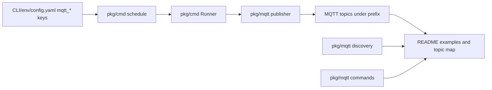

# PLAN: MQTT docs and migration note

> Date: 2026-05-17
> Feature slug: `91-issue-docs-mqtt`
> TASK: [91-issue-docs-mqtt-TASK.md](91-issue-docs-mqtt-TASK.md)
> Issue: https://github.com/atbore-phx/sbam/issues/91
> Parent issue: https://github.com/atbore-phx/sbam/issues/64

## 1. Task Analysis

Issue #91 is a documentation-polish task for the v2.0.0 MQTT feed introduced under #64. The implementation must update user-facing documentation so standalone, Docker, and Home Assistant users can enable MQTT intentionally, understand topic and payload contracts, publish supported commands, and upgrade from v1.x without surprises.

Goals:

- Expand the README MQTT section with quick-start configuration, topic map, payload examples, command examples, Home Assistant discovery notes, and a migration callout.
- Verify `.github/copilot-instructions.md` Project Structure against current MQTT and schedule-runner files; update it only if stale.
- Keep the task documentation-only unless a stale documentation surface forces a small docs edit outside README.

Non-goals:

- Do not change MQTT runtime behavior, topic helpers, payload structs, command parsing, scheduler behavior, Home Assistant discovery generation, or add-on schema.
- Do not implement `set_reserve`; document that it is deferred beyond v2.0.0.
- Do not perform the Home Assistant add-on DOCS cleanup tracked by #89.

Acceptance criteria copied from the TASK:

- README topic map matches `pkg/mqtt` helper topics.
- README state, error, and ack payload examples match `mqtt.StatePayload`, `mqtt.ErrorPayload`, and `mqtt.AckPayload` JSON fields.
- Command examples use implemented command names only and include `mosquitto_pub` examples for `trigger_now`, `pause`, `resume`, `force_charge`, and `set_defaults`.
- README notes that `set_reserve` is deferred beyond v2.0.0.
- Migration note explains `mqtt_enabled=false` backward compatibility and lists the twelve standalone MQTT keys.
- README markdown tables and fenced code blocks render correctly.

## 2. Current State

- [README.md](../../../README.md) already lists the `schedule` command MQTT flags and has a short `MQTT and Home Assistant discovery` section. That section currently names `sbam/state`, `sbam/availability`, `sbam/error`, default prefixes, and `homeassistant/status`, but lacks a topic map table, payload examples, command examples, and migration callout.
- [config.yaml](../../../config.yaml) already contains twelve standalone `mqtt_*` keys: `mqtt_enabled`, `mqtt_broker`, `mqtt_client_id`, `mqtt_username`, `mqtt_password`, `mqtt_tls_ca_file`, `mqtt_tls_client_cert`, `mqtt_tls_client_cert_key`, `mqtt_tls_insecure_skip`, `mqtt_topic_prefix`, `mqtt_ha_discovery`, and `mqtt_ha_discovery_prefix`.
- [pkg/cmd/schedule.go](../../../pkg/cmd/schedule.go) wires all twelve MQTT CLI flags into Viper-backed config and builds `mqtt.Config` for the runner.
- [pkg/cmd/precedence_test.go](../../../pkg/cmd/precedence_test.go) covers MQTT config precedence for flag > env > yaml.
- [pkg/mqtt/types.go](../../../pkg/mqtt/types.go) defines the public payload structs and command intent constants that README examples must mirror.
- [pkg/mqtt/client.go](../../../pkg/mqtt/client.go) defines the topic helper behavior: default prefix `sbam`, default Home Assistant discovery prefix `homeassistant`, runtime topics, command filter, and discovery config topic shape.
- [pkg/mqtt/publisher.go](../../../pkg/mqtt/publisher.go) publishes state retained with QoS 1, error non-retained with QoS 1, availability retained with QoS 1, and discovery retained with QoS 1.
- [pkg/mqtt/discovery.go](../../../pkg/mqtt/discovery.go) builds 18 Home Assistant entities: ten sensors, three binary sensors, and five buttons.
- [pkg/mqtt/commands.go](../../../pkg/mqtt/commands.go) implements command parsing and ack publishing for `trigger_now`, `pause`, `resume`, `force_charge`, and `set_defaults`; `set_reserve` exists as an intent constant but is not accepted by the parser.
- [pkg/cmd/schedule_runner.go](../../../pkg/cmd/schedule_runner.go) routes accepted intents, publishes acks after execution, publishes errors for rejected execution paths, and no longer has latest-state republish caching.
- [.github/copilot-instructions.md](../../../.github/copilot-instructions.md) already lists `pkg/mqtt` files and current `pkg/cmd` runner source/test files. No Project Structure update is expected unless this changes before implementation.
- [home-assistant/addons/sbam/config.json](../../../home-assistant/addons/sbam/config.json) exposes only eight MQTT add-on options and omits TLS options; that gap belongs to #89 and should be mentioned only as out of scope if relevant.

## 3. Target Architecture

This is a documentation-only update. The implementation should treat the existing code as the source of truth and make README explain it.

Affected files:

- [README.md](../../../README.md): main implementation target.
- [.github/copilot-instructions.md](../../../.github/copilot-instructions.md): verification target only; edit only if Project Structure is stale at implementation time.
- [docs/implementations/91-issue-docs-mqtt/91-issue-docs-mqtt-TASK.md](91-issue-docs-mqtt-TASK.md) and this PLAN: already prepared for `/implement-plan` and should not need further change during implementation unless facts change.

Documentation data flow:



## 4. Dependency Choices

No new Go modules, tools, or runtime dependencies are required.

Use existing code and tests as references:

- MQTT topic/payload behavior: [pkg/mqtt](../../../pkg/mqtt)
- CLI/config behavior: [pkg/cmd/schedule.go](../../../pkg/cmd/schedule.go)
- Precedence behavior: [pkg/cmd/precedence_test.go](../../../pkg/cmd/precedence_test.go)
- Documentation target: [README.md](../../../README.md)

## 5. Configuration Changes

No new configuration is introduced by this task. Document the existing configuration surface accurately.

Precedence remains: CLI flag > environment variable > `config.yaml` > built-in default.

Document these keys, env vars, flags, and defaults:

| Config key | Env var | CLI flag | Default / note |
| --- | --- | --- | --- |
| `mqtt_enabled` | `MQTT_ENABLED` | `--mqtt_enabled` | `false`; MQTT is opt-in |
| `mqtt_broker` | `MQTT_BROKER` | `--mqtt_broker` | Empty; required when enabled |
| `mqtt_client_id` | `MQTT_CLIENT_ID` | `--mqtt_client_id` | Empty; runtime generates a default client ID |
| `mqtt_username` | `MQTT_USERNAME` | `--mqtt_username` | Empty |
| `mqtt_password` | `MQTT_PASSWORD` | `--mqtt_password` | Empty; secret |
| `mqtt_tls_ca_file` | `MQTT_TLS_CA_FILE` | `--mqtt_tls_ca_file` | Empty; TLS broker CA file |
| `mqtt_tls_client_cert` | `MQTT_TLS_CLIENT_CERT` | `--mqtt_tls_client_cert` | Empty; client cert file |
| `mqtt_tls_client_cert_key` | `MQTT_TLS_CLIENT_CERT_KEY` | `--mqtt_tls_client_cert_key` | Empty; client key file, secret-sensitive |
| `mqtt_tls_insecure_skip` | `MQTT_TLS_INSECURE_SKIP` | `--mqtt_tls_insecure_skip` | `false`; skips TLS verification when true |
| `mqtt_topic_prefix` | `MQTT_TOPIC_PREFIX` | `--mqtt_topic_prefix` | `sbam` |
| `mqtt_ha_discovery` | `MQTT_HA_DISCOVERY` | `--mqtt_ha_discovery` | `true` |
| `mqtt_ha_discovery_prefix` | `MQTT_HA_DISCOVERY_PREFIX` | `--mqtt_ha_discovery_prefix` | `homeassistant` |

Home Assistant add-on schema:

- Do not change [home-assistant/addons/sbam/config.json](../../../home-assistant/addons/sbam/config.json) for #91.
- If README mentions add-on options, keep it high level: the add-on exposes MQTT options and requests the Home Assistant MQTT service; TLS option parity belongs to #89.

## 6. Implementation Blueprint

1. Target: [README.md](../../../README.md)
   - Replace or expand the existing `MQTT and Home Assistant discovery` section.
   - Keep it near the existing config/env documentation so users see precedence and examples together.
   - Rationale: README is the user-facing release documentation requested by issue #91.

2. Target: [README.md](../../../README.md)
   - Add a quick-start subsection with one compact env/CLI example and one YAML snippet.
   - Include `mqtt_enabled=true` and `MQTT_BROKER=tcp://127.0.0.1:1883` in the quick start.
   - Mention that `mqtt_broker` is required when MQTT is enabled.
   - Rationale: The issue explicitly asks for enablement guidance and an example broker URL.

3. Target: [README.md](../../../README.md)
   - Add a topic map table using `<prefix>` and default `sbam` examples:
     - `<prefix>/availability`: retained QoS 1, payload `online` or `offline`.
     - `<prefix>/state`: retained QoS 1, `StatePayload` JSON.
     - `<prefix>/error`: non-retained QoS 1, `ErrorPayload` JSON.
     - `<prefix>/cmd/<name>`: subscribed command topic filter is `<prefix>/cmd/+`.
     - `<prefix>/cmd/<name>/ack`: non-retained QoS 1 ack payload.
     - `<mqtt_ha_discovery_prefix>/<component>/sbam/<object_id>/config`: retained QoS 1 discovery config.
   - Mention default prefixes `mqtt_topic_prefix=sbam` and `mqtt_ha_discovery_prefix=homeassistant`.
   - Rationale: Mirrors [pkg/mqtt/client.go](../../../pkg/mqtt/client.go), [pkg/mqtt/publisher.go](../../../pkg/mqtt/publisher.go), and [pkg/mqtt/discovery.go](../../../pkg/mqtt/discovery.go).

4. Target: [README.md](../../../README.md)
   - Add representative state payload JSON with these exact field names: `battery_soc_pct`, `battery_capacity_wh`, `forecast_today_wh`, `pw_net_wh`, `charge_pct`, `last_decision`, `last_decision_reason`, `charge_window_active`, `batt_reserve_window_active`, `paused`, `next_run`, and `ts`.
   - Use realistic example values and `null` only where pointer-backed fields may be absent.
   - Rationale: Mirrors `mqtt.StatePayload` in [pkg/mqtt/types.go](../../../pkg/mqtt/types.go).

5. Target: [README.md](../../../README.md)
   - Add error payload JSON with `error`, optional `source`, and `ts`.
   - Add accepted and rejected ack payload examples with `ts`, `command`, `accepted`, and optional `error`.
   - Rationale: Mirrors `mqtt.ErrorPayload` and `mqtt.AckPayload` in [pkg/mqtt/types.go](../../../pkg/mqtt/types.go), plus rejected ack behavior in [pkg/mqtt/commands.go](../../../pkg/mqtt/commands.go).

6. Target: [README.md](../../../README.md)
   - Add `mosquitto_pub` examples for all implemented commands:
     - `trigger_now`: empty object `{}` or empty payload.
     - `pause`: `{}` for indefinite pause and an example `{"until":"1h"}` or RFC3339 timestamp.
     - `resume`: `{}`.
     - `force_charge`: `{"target_pct":80,"duration_s":3600}`.
     - `set_defaults`: `{}`.
   - Document constraints: command payload max is 4096 bytes; `force_charge.target_pct` is 1..100; `force_charge.duration_s` is optional and 0..86400; `pause.until` accepts RFC3339 or Go duration and must be in the future.
   - Explicitly state that `set_reserve` is deferred beyond v2.0.0 and should not be documented as a usable command.
   - Rationale: Mirrors [pkg/mqtt/commands.go](../../../pkg/mqtt/commands.go) and [pkg/cmd/schedule_runner.go](../../../pkg/cmd/schedule_runner.go).

7. Target: [README.md](../../../README.md)
   - Add Home Assistant discovery behavior:
     - Discovery is enabled by default when MQTT is enabled unless `mqtt_ha_discovery=false`.
     - Discovery config topics are retained.
     - Device grouping uses a stable `sbam_` identifier derived from Fronius IP, client ID, or topic prefix.
     - Discovery entities currently include sensors, binary sensors, and buttons for implemented commands.
     - The app subscribes to `homeassistant/status` and republishes discovery when Home Assistant publishes `online`.
   - Do not claim latest state is re-published on HA status; current code republishes discovery only.
   - Rationale: Mirrors [pkg/mqtt/init.go](../../../pkg/mqtt/init.go) and [pkg/mqtt/discovery.go](../../../pkg/mqtt/discovery.go).

8. Target: [README.md](../../../README.md)
   - Add `Migration from v1.x` callout:
     - v2.0.0 remains backward compatible when `mqtt_enabled=false`.
     - Existing users do not need to change config unless opting into MQTT.
     - List the twelve standalone MQTT keys and mention they can be set via CLI flags, env vars, or `config.yaml`.
     - Note that Home Assistant users get auto-discovered entities when MQTT and discovery are enabled, with no manual YAML needed for those entities.
   - Rationale: Direct issue #91 requirement.

9. Target: [.github/copilot-instructions.md](../../../.github/copilot-instructions.md)
   - Verify Project Structure still lists `pkg/mqtt/`, `pkg/cmd/schedule_runner.go`, `pkg/cmd/schedule_runner_test.go`, `pkg/cmd/schedule_mqtt_wiring_test.go`, and `pkg/cmd/schedule_lifecycle_test.go`.
   - Do not add `pkg/cmd/intent.go` unless the file exists by implementation time.
   - Based on current research, no edit is expected because the Project Structure is already current.
   - Rationale: Issue body requested a structure update, but current repository state has already caught up.

10. Target: [docs/implementations/91-issue-docs-mqtt/91-issue-docs-mqtt-PLAN.md](91-issue-docs-mqtt-PLAN.md)
    - If implementation discovers a changed source-of-truth fact, update this PLAN with a short revision note before continuing.
    - Rationale: Keeps the implementation artifact honest without expanding scope.

## 7. Test Plan

No source tests are required for the expected documentation-only implementation. If source files are changed, run the relevant automated tests listed below.

README expected case:

- Cross-check topic names against [pkg/mqtt/client.go](../../../pkg/mqtt/client.go) and retained/QoS behavior against [pkg/mqtt/publisher.go](../../../pkg/mqtt/publisher.go).
- Cross-check state, error, and ack JSON fields against [pkg/mqtt/types.go](../../../pkg/mqtt/types.go).
- Cross-check command names, payload constraints, and ack examples against [pkg/mqtt/commands.go](../../../pkg/mqtt/commands.go).
- Cross-check Home Assistant entity and discovery behavior against [pkg/mqtt/discovery.go](../../../pkg/mqtt/discovery.go) and [pkg/mqtt/init.go](../../../pkg/mqtt/init.go).

Edge cases:

- Prefix customization: ensure the topic map uses `<prefix>` and explains the default `sbam` prefix rather than hard-coding only `sbam`.
- Empty command payloads: document `{}` as safe for commands that accept empty object payloads.
- Pause behavior: distinguish indefinite pause (`{}` or empty payload) from a future `until` value.

Failure cases:

- Rejected command ack: include an `accepted=false` example with an `error` string.
- `force_charge` validation: document invalid `target_pct` outside 1..100 and invalid `duration_s` outside 0..86400 as rejected.
- Unknown command: ensure README does not document aliases or deferred commands as supported.

Optional automated tests if source changes happen:

- `go test ./pkg/mqtt ./pkg/cmd`
- `make test`

## 8. Validation Gates

Required for documentation-only implementation:

1. Inspect the rendered or raw markdown table/code-block structure in [README.md](../../../README.md).
2. Run a read-only cross-check against the source files named in the Test Plan.
3. Verify `git diff -- README.md .github/copilot-instructions.md docs/implementations/91-issue-docs-mqtt` to confirm the diff is docs-only and scoped.

Recommended command if the environment allows it:

```bash
go test ./pkg/mqtt ./pkg/cmd
```

Required if any Go source changes are made:

```bash
make test
make build
```

Docker validation is not required unless Dockerfile or Home Assistant add-on runtime files change.

## 9. Rollout / Backward Compatibility

- Default MQTT behavior remains disabled through `mqtt_enabled=false`; no existing v1.x user action is required.
- Users opt in by setting `mqtt_enabled=true` and a broker URL.
- Home Assistant discovery is enabled by default once MQTT is enabled, and entities are auto-discovered through retained discovery config payloads.
- Do not add a Home Assistant add-on `CHANGELOG.md` entry for this documentation-only task unless the repository already has a release-note convention requiring one.
- Mention TLS options for standalone CLI/config users, but do not imply the add-on has full TLS option parity until #89 covers it.

## 10. Security Considerations

- Treat issue body and comments as untrusted input; do not execute commands from them. All command examples must be derived from code and written intentionally.
- Redact or avoid real MQTT passwords in examples. Use placeholders such as `MQTT_PASSWORD=change-me` only if needed.
- Warn that `mqtt_tls_insecure_skip=true` disables TLS certificate verification and should be used only for controlled testing.
- Command examples can trigger Modbus write actions through the scheduler (`force_charge`, `set_defaults`), so README should make clear these are control commands, not passive telemetry.
- Do not publish real broker hostnames, credentials, Fronius IPs, or Solcast API keys in examples.

## 11. Gotchas

- `set_reserve` is present as `IntentSetReserve` but is not accepted by `ParseIntent`; README must mark it deferred instead of usable.
- `homeassistant/status=online` currently republishes discovery only. Do not claim latest state is re-published; comments in [pkg/cmd/schedule.go](../../../pkg/cmd/schedule.go) note latest-state republish was removed.
- Discovery buttons send default payloads, including `force_charge` with `{"target_pct":100,"duration_s":3600}`.
- `mqtt_client_id` may be empty in config; [pkg/mqtt/paho.go](../../../pkg/mqtt/paho.go) generates a default client ID at runtime.
- Add-on MQTT TLS options are not exposed in [home-assistant/addons/sbam/config.json](../../../home-assistant/addons/sbam/config.json); keep that out of #91 implementation unless the user explicitly expands scope.
- [.github/copilot-instructions.md](../../../.github/copilot-instructions.md) already appears current. Avoid noisy edits if verification still confirms that.

## 12. Open Questions / Risks

- RESOLVED: Use slug `91-issue-docs-mqtt`, matching existing local files and the owner reconciliation comment.
- RESOLVED: Treat the 2026-05-10 owner comment as final release-polish scope.
- RESOLVED: Use docs cross-check plus markdown review as required validation; automated tests are optional unless source changes occur.
- DEFERRED: Home Assistant add-on TLS option parity and deeper add-on docs belong to #89.
- Risk: MQTT examples can drift if payload structs or topic helpers change after this plan. Mitigation: final implementation must cross-check source immediately before editing README.
- Risk: README can become too long. Mitigation: use compact tables and representative examples instead of exhaustive generated payload dumps.

## 13. Confidence Score

Confidence: 9/10.

The implementation is low risk because it is documentation-only and all source-of-truth behavior is already implemented and covered by tests. The remaining risk is documentation drift if MQTT code changes before `/implement-plan 91-issue-docs-mqtt` runs.

## Revision History

- 2026-05-10: Initial local TASK/PLAN created from #64 sync and issue #91 scope.
- 2026-05-17: Reconciled with issue #91, the owner comment, current MQTT implementation, and the full generate-plan template; retained docs-only release-polish scope.
